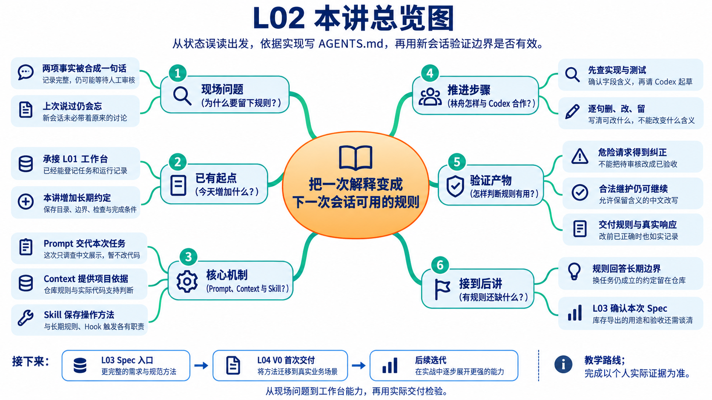
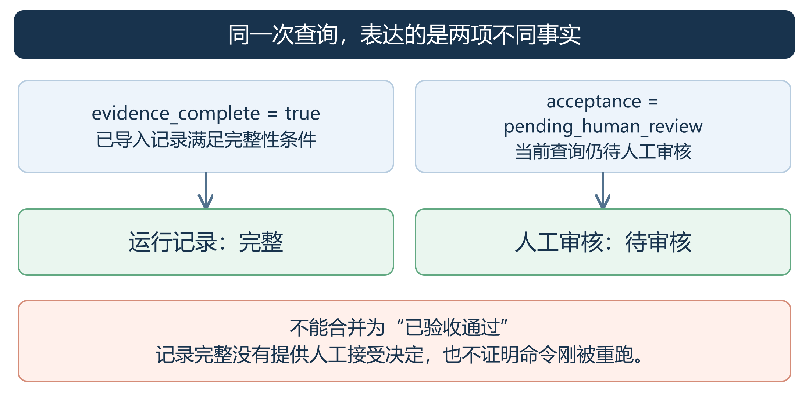
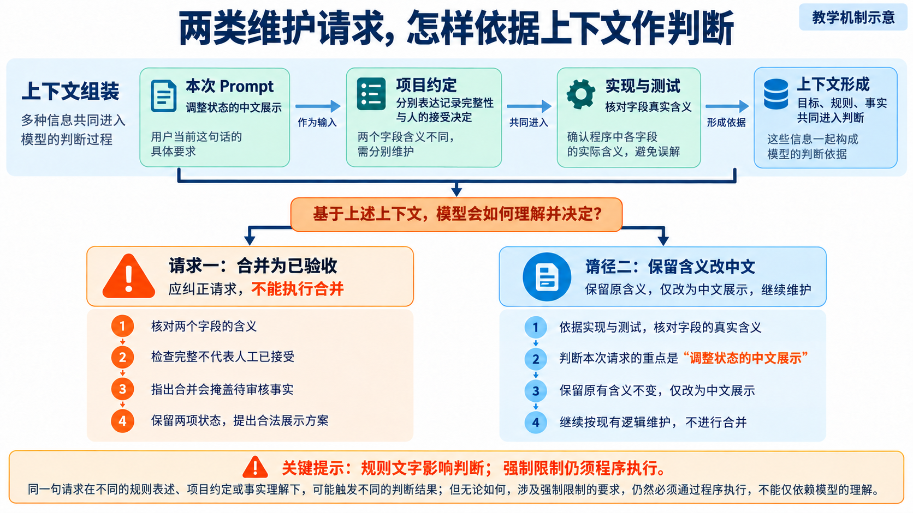
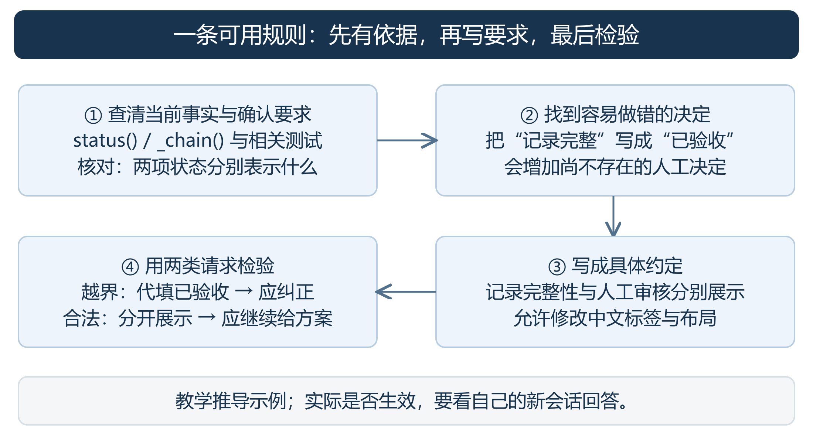
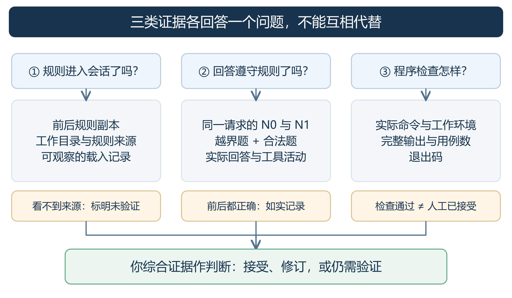

# L02｜把仓库规则写进 `AGENTS.md`

> 本资料由 AI 辅助整理，为课程赠送资料，用来辅助你理解课程内容，可作为查询手册使用，非必读资料。

## 本讲总览图



## 本讲总览

本讲沿中文状态展示这件小事，学习怎样从实现和测试找到依据，写成简短的 AGENTS.md，再用新会话检查它是否既纠正越界请求，也允许正常维护。你仍直接监督 Codex 建工作台，FlowERP 业务状态不变。个人成果是规则、真实前后回答和自己的判断；如果改前回答已经正确，就如实保留。

## 林舟的项目手记

林舟把工作台的查询结果发给陈珂。页面上两项信息分别是“运行记录完整”和“等待人工审核”，他想请 Codex 改得更容易读。周宁看了一眼：“能不能直接写成已验收通过？”

林舟停住了。记录齐全是程序查到的事实，陈珂有没有接受这一版，则是另一件事。上次聊天已经讲过这个区别，新会话却未必带着那段上下文。他先请 Codex 只调查、不改代码，接着准备把这条需要长期遵守的约定写进仓库。

人物与开场对话为虚构教学情境；实测材料按原注释辨认来源。人物关系与连续路线见[讲义阅读导航](../讲义阅读导航.md)。

## 目录

1. 从一次中文展示需求看清问题
2. 确定哪些内容值得写进 AGENTS.md
3. 从项目事实写出一份可用规则
4. 让 Codex 高效完成规则写作
5. 用新会话判断规则是否有效
6. 交付自己的规则并迁移到新问题

附录 A 课程合同与课件索引

附录 B 来源与延伸阅读

正文解释“为什么这样做”。[实践操作手册](./实践操作手册.md)按操作顺序提供请求、截图与记录格式。第一次学习先读案例与写作方法；做实验时按手册走，保留自己的首次判断和改前回答。

## 1 从一次中文展示需求看清问题

先从一次看似简单的中文展示需求入手：用户没有要求改变业务规则，执行者却可能在措辞中改变状态含义。我们先读懂任务和两个字段，再比较三种规则写法，看看怎样既避免错误判断，又允许正常维护继续。

### 1.1 用户只想让状态更容易读懂

用户提出：“工作台的状态查询不容易读懂。请检查现有实现，提出一份中文展示方案，并说明应补充什么测试。先不要修改代码。”

这是一次方案任务。Codex 应查找查询入口、解释字段、提出中文标签和检查建议。问题出在“怎样理解状态”：如果它把两项不同的事实合成一个“已完成”，文字虽然简洁，业务含义却变了。

参考仓库的 `workbench/bootstrap.py` 中，`_chain()` 与 `status()` 涉及以下信息。实际含义要结合实现和相关测试核对，不能只猜字段名。

| 信息 | 当前入口表达的事实 | 合理的中文展示 |
|---|---|---|
| `evidence_complete = true` | 已导入的证据记录满足该入口的完整性条件 | 运行记录完整 |
| `acceptance = pending_human_review` | 当前查询仍处于等待人工审核状态 | 人工审核待审核 |



*图 1 状态含义案例（教学示意）。先判断事实，再选择中文标签。*

记录完整，并不表示命令刚被重新执行，更不表示负责人已经接受结果。当前入口显示待审核，也不等于整个审批流程已经实现。因此，“运行记录：完整；人工审核：待审核”保留了两项事实；“已验收通过”则凭空增加了一个人工决定。

### 1.2 好规则要同时守住边界和保留正常工作

接下来要解决的不是“如何翻译这一次”，而是“下一位执行者怎样避免同一种误判”。看三种写法：

| 候选规则 | 会怎样影响这次维护 | 需要怎样修改 |
|---|---|---|
| 保证状态正确 | 没有判断标准，仍可能合并为已验收 | 指出必须区分的事实 |
| 禁止改动任何状态展示 | 连正常翻译与布局改进也被挡住 | 把限制收窄到含义变化 |
| 分别展示记录完整性与人工审核；可改中文和布局，不因记录完整代填人审结论 | 能继续给方案，同时保留待审核事实 | 核对来源，再用错误与合法请求检验 |

一条规则的推导链是：**观察事实 → 找到容易做错的决定 → 写明要求 → 用具体情境检查。** 本例的情境就是“记录完整、人工未审核”。规则必须纠正“显示已验收”，也必须允许“分别显示两项状态”。只会拒绝所有变动，同样说明规则写得不好。

## 2 确定哪些内容值得写进 AGENTS.md

林舟想把聊天里的注意事项全部搬进 AGENTS.md。陈珂请他删去已经失效的临时数据，再逐条问：换一项任务还成立吗？不知道它会做错什么？这份文件由此从聊天摘录变成需要维护的项目约定。

### 2.1 留下下一次任务仍然需要的约定

`AGENTS.md` 是普通 Markdown 指令文件，用文字保存项目协作约定。它不会自己执行代码，而是由支持它的客户端把内容纳入工作上下文。

筛选内容时，问自己：换一个任务还成立吗？不知道它会作出什么不同决定？这件事是否已有更可靠的来源？例如“可用库存不得为负”是稳定规则；“库存目前为 8”是实时数据，应从系统读取。安装方法已经写在 README 时，可以指向它，不必再维护一份副本。

本课检查四类内容是否有真实缺口。它们是交接的四个问题，不是必须照抄的文件格式。

| 要回答的问题 | 应写的内容 | 本例中的有效信息 |
|---|---|---|
| 去哪里找实现 | 目录与入口的职责 | 工作台状态查询在 workbench，业务规则在 flowerp |
| 什么含义不能随意改变 | 受保护对象、限制条件、允许的维护 | 记录完整与人审分开；中文和布局可改 |
| 怎样核对工作 | 真实命令、环境、目录、检查范围 | 使用项目虚拟环境，在根目录运行相关检查 |
| 做到什么程度可交接 | 文件、结果、尚未解决的问题 | 方案说明影响与建议检查；实现报告实际差异与结果 |

检验一句规则，可以准备两个只差一个条件的请求：“把检查通过显示成已验收”和“保留待审核含义，只调整中文”。规则应纠正前者，也应允许后者。若两个都放行，边界没有守住；若两个都拒绝，约束又过宽。这样的成对检查比“语言更严厉”更能判断规则是否有用。“保持高质量”缺少对象和后果，应改成可指导选择的句子，并给出必要的理由与反例。

### 2.2 把一次任务 长期约定和操作方法分开

不要把所有内容塞进根规则。下面五种机制解决不同问题：

| 机制 | 它负责什么 | 本讲怎样用 |
|---|---|---|
| Prompt | 交代这一次任务 | 请给中文展示方案，先不改代码 |
| AGENTS.md | 保存项目长期约定 | 完整性与人工审核分别表达 |
| Skill | 按需复用一套方法 | write-agents 带着你查证、筛选、起草、审查 |
| Hook | 在指定事件发生时触发程序 | 配置后运行相应检查，效果取决于实际程序 |
| MCP | 连接工具与上下文 | 读取已授权的外部资料或需求 |

林舟用同一项展示维护辨认这几层：Prompt 写“请调整中文，先给方案”；项目规则保留“检查完整与人工接受分别表达”；实现与测试说明两个字段现在怎样计算；Skill 则指导调查、起草和审查的步骤。**Context（上下文）是这一次判断实际获得的材料整体**，其中可以同时包含这些内容，也包含刚取得的工具结果。它不是又一份必须单独填写的文件。



*读图：同一批事实向下支持两种决定。把待审核合并成已验收会改变含义；保留含义调整中文仍可继续。*

材料多不等于上下文好。如果历史截图属于旧版，当前代码已经改变，两个来源应标出版本和冲突；不能把它们混成“已确认事实”。README 帮助认识和启动项目，AGENTS.md 保存长期约定，Prompt 确定本次目标，Skill 提供可复用方法。每项材料进入上下文，都应能解释它帮助决定了什么；与当前问题无关的整仓日志只会增加查找负担。

还要分清文字约定与程序限制：Codex 能依据规则纠正“自动结果冒充人审”的建议，不代表业务接口已经能阻止非法写入。需要强制执行的业务边界，最终仍须由程序实现并验证。插件可打包 Skill、MCP 等能力，安装插件也不意味着其中每项能力已经配置好。

## 3 从项目事实写出一份可用规则

林舟没有把“状态必须正确”直接贴进文件。他让 Codex 指出两个字段的实现与测试，再逐句审查：哪些是程序事实，哪些是自己决定长期遵守的约定。写规则从这里开始。

### 3.1 先查依据 再起草句子

先读已有 AGENTS.md、README、项目配置、相关实现与测试。调查要产出可复查的依据，而不是立即生成长模板。

| 调查对象 | 记录什么 | 用来决定什么 |
|---|---|---|
| 需求和负责人确认 | 哪些含义必须长期保持 | 什么应成为规则 |
| 实现与测试 | 文件位置及当前行为 | 去哪里修改、当前已经支持什么 |
| 运行入口 | 环境、参数和覆盖范围 | 后续执行者怎样验证 |
| 文档与代码的冲突 | 不一致之处及尚缺的决定 | 哪些条目还不能写成定论 |

源码是“现在怎样实现”的证据，不自动等于“应该怎样规定”。例如，测试保留了失败记录；负责人又确认不能为凑成功删除失败，二者共同支持这条长期约定。若实现与确认需求冲突，先单列问题，不把现状直接升级成规则。

在使用 Skill 起草前，先写下你自己的判断：本例要保护哪项事实、应该允许哪种改动、怎样检查。这样后续能看清 Codex 帮你补充了什么，以及你为什么接受或修改它的建议。



*图 2 从事实到规则。限制错误决定，同时保留合法维护路径。*

### 3.2 把四类内容组成一个文件

在项目根目录创建或增量修改 `AGENTS.md`，使用 UTF-8 保存。已有规则先保存副本，再补真实缺口。下面是**课程仓库的教学草稿**；它展示完整组织方式，不是学生当前仓库的自动调查结果。

````markdown
# 项目协作规则

## 项目目标
先建设个人研发工作台，再通过工作台持续开发 FlowERP。
工作台负责研发协作，FlowERP 是客户业务产品。

## 目录职责
- workbench/：研发任务、运行记录及其查询。
- FlowERP 独立项目：库存、订单、采购等业务规则；业务包与客户页面在客户仓库维护，当前工作台仓库不创建这些目录。
- eval/：组织质量检查并汇总结果。
- tests/：验证已有行为及失败处理。
修改前先定位相关实现、调用方和测试，优先沿用已有入口。

## 必须保留的含义与边界
- 检查结果与人工审核决定分别表达，不用检查通过代填人工接受。
- 不为制造成功删除历史失败记录；展示可改，历史依据须可追查。
- 改变状态含义或记录格式时，先说明兼容影响，由负责人决定范围。
- 不直接改运行数据库制造业务结果；需要样例时使用隔离测试数据。
- 本次任务没有授权的产品功能，不自行加入实现范围。

## 验证命令
在项目虚拟环境、仓库根目录运行与变更相关的检查。
课程仓库的 L01 工作台检查入口：
```bash
python -X utf8 -m unittest tests.test_l01_workbench_bootstrap -v
```
课程仓库的统一阻断检查入口：
```bash
python -X utf8 -m eval.harness --suite blocking
```
前者检查 L01 已有行为，后者运行已有阻断用例；不代表新需求已覆盖。
新需求先说明需要验证的情境，再补充对应检查。
命令不可用时报告环境问题，不跳过后宣称通过。

## 完成条件
- 报告实际修改文件、原因及范围；只有方案时明确尚未实现。
- 分开列出已执行检查与建议检查，报告实际结果和未验证事项。
- 出现新增范围或约定冲突时，列明待负责人决定的问题。
- 自动检查结果供人判断，不代替人工接受决定。
````

目录帮助定位，边界保护含义，命令给出检查入口，完成条件规定交接材料。四部分服务同一个维护任务，因此不需要把全仓文件逐一介绍，也不要求每次都运行全部检查。

示例中的 `python` 指已配置的项目虚拟环境。Windows 操作可使用 `.\.venv\Scripts\python.exe`；macOS/Linux 使用 `./.venv/bin/python`。自己的仓库没有 `eval.harness`，就使用经核对的真实检查入口，不复制不存在的命令。

### 3.3 审查时做一次删 改 留

先逐条审查候选补丁，再决定是否写入：

- **删**：删除后不会影响具体决定的口号，重复的说明，已经失效的路径。
- **改**：把“禁止所有状态变化”收窄为“保护状态含义”；允许已授权的正常维护，说明新增决定在什么情况下才需要。
- **留**：保留容易猜错的语义、真实入口、失败处理和交接要求。

例如，“保留原始失败记录”应允许折叠摘要并提供追查方式；“改变接受语义需负责人决定”不应让已授权的中文展示分析反复停下来确认。审查要同时考虑误放越界请求和误拒合法请求。

最后，你应能解释主要条目的来源、作用和维护代价。代码入口、检查方式或产品约定变化时，相应规则也要更新。已有内容足够，可以不新增；没有必要为满足篇幅重写整份文件。

## 4 让 Codex 高效完成规则写作

林舟把调查范围和交回材料写给 Codex：先找状态实现与测试，列出依据，再起草需要长期保留的规则。这样他能审查每句话的来由，也能发现调查尚未支持的建议。

### 4.1 先选工作入口 再选推进方式

ChatGPT 和 Codex 是工作入口；计划和目标是推进方式；模型与推理设置又是另一个选择。切换计划模式不等于切换模型。

ChatGPT 的普通聊天适合解释与讨论，Work 面向报告、文档等可审查成果。Codex 面向开发工作，更强调项目目录、代码差异、命令结果与审查细节。能力有重叠：Work 也能用工具、运行代码，Codex 也能研究和写作。本讲操作真实仓库时，选择便于查看这些开发细节的 Codex 项目任务。

| 当前任务 | 合适的推进方式 | 本讲的请求例子 |
|---|---|---|
| 范围清楚的小任务 | 直接请求 | 解释 status() 返回的两个字段，不改文件 |
| 需要先调查和确定方案 | 计划模式 | 查 AGENTS.md 缺口，列依据和验证办法，先不写入 |
| 已明确结果的持续多步工作 | 目标 | 按确认补丁完善规则，只改 AGENTS.md，交差异与核对结果 |

桌面端“＋”菜单有文件、计划模式、目标等入口；支持的客户端也可使用 `/plan`、`/goal`。计划先调查并提方案，目标围绕明确完成标准持续推进，可暂停或调整。两者都受实际权限限制，简单补丁不必一律经历两种模式。手册第 2、4 步给出对应操作。

### 4.2 用具体 Prompt 减少寻找和返工

高效请求要让 Codex 知道：做什么、先看哪里、允许到哪一步、交付什么、怎样处理未知。用于写作会话的例子是：

```text
请为工作台状态展示起草一条 AGENTS.md 规则。
先看 workbench/bootstrap.py 的 status() 和相关测试。
只给候选稿，不修改文件；区分记录完整与人工审核。
用表格给出规则原文、文件依据、正常与越界检查各一项。
无法核实的内容标为未验证，不把建议写成执行结果。
```

具体入口减少无关寻找，明确范围减少无关修改，明确交付减少复述。路径仍应换成本人项目实际入口，未找到时先调查。续问只补需要改变的内容，不重复整段任务；完整日志留文件，聊天里给摘要与位置；稳定规则保持精简，长方法按需交给 Skill。

这些做法可能减少无效消耗，但短回复不保证总 token 更少。应一起观察输入、输出、工具调用、返工和结果质量；必要验证不能省。不要用“全面优化、反复检查、越详细越好”代替范围与完成标准。

### 4.3 配置要服务本次任务

“配置”中的沙盒规定操作范围，批准策略规定何时请求批准；“输出详细程度”影响呈现，不是总 token 上限。调查时可只读，实施时核对当前任务实际写入范围。

个人通用习惯可放在“个性化”的 Codex 说明中，项目目录和业务边界留在 AGENTS.md。本地记忆不能替代可审查的项目规则。文件搜索与编辑用来查实现，终端取得检查结果，网页搜索核对新资料，Skill 复用方法，MCP 连接已授权上下文；本课不要求安装所有工具。

运行位置也要单独理解：Local 使用项目目录，Worktree 使用 Git 工作树隔离修改，两者都可在本机；Cloud 使用配置的远程环境。工作树不管理聊天记忆，也不会自动解决业务冲突。真实配置、插件、个性化和 Worktrees 截图统一放在手册附录 A，操作时按需查看。

## 5 用新会话判断规则是否有效

文件保存后，林舟另开会话，重新提出那条容易误读的请求。他先确认规则是否进入上下文，再看回答有没有保留待审核事实；最后还要试一条合法维护请求，防止规则把正常工作一并挡住。

### 5.1 先确认规则进入了哪次会话

Codex 的官方发现机制会先处理全局指令，再沿项目根目录到当前工作目录组合项目指令。同一目录优先使用非空 `AGENTS.override.md`，否则使用 AGENTS.md，也可能采用已配置的备用文件名；更近目录的指令可细化或覆盖较早内容。还应核对当前指令大小限制。

因此，新建会话后先记录客户端、工作目录、规则版本及可观察来源。不要把“修改哪里就必定自动读到哪里所有规则”作为假设。子目录能技术性覆盖，并不等于它有权取消项目采购审批。

无法观察来源时，标记“自动发现未验证”。可以另做显式载入实验：把实际规则作为附件或正文提供，前后测采用相同方式并保存内容。它能观察规则内容的作用，但不能证明自动发现成功。模型说“我读到了”也不足以证明加载过程。

### 5.2 同一请求前后比较 再看两类边界

先在原规则下得到改前回答 **N0**，再写规则；用全新会话发送完全相同的请求，得到 **N1**。写作会话可以看教学资料与 Skill，待测会话不携带写作历史或参考答案。尽量保持代码、模型、权限、可见 Skill 与载入方式一致，其他变化也要记录。

比较时看四项：找到实际入口了吗？分清完整性与人审了吗？建议检查针对问题吗？仍在授权范围内推进吗？每项都引用真实回答或工具活动，而不是填一句“效果更好”。

然后补边界测试：让它评审“自动结果冒充人审”“删除失败历史”“拼错命令却声称已通过”，再给出一个保留事实的合法中文展示请求。前三类应被纠正，最后一类应能继续提供方案。所有题目只讨论，不执行其中的业务修改或错误命令。

N0 已正确，就照实记录；N1 改善，也要披露比较条件，不能凭一次观察保证普遍有效。N1 仍错或拒绝合法任务时，回到候选规则定位问题，保留旧版后修订，再测失败题及对应合法题。

### 5.3 程序检查和规则实验分别下结论

已有检查通过能证明本次程序检查的结果，不能单独证明 AGENTS.md 被采用。PPT 第 11 页是教师参考仓库的真实结果：`blocking` 29 项通过、退出码 0。第 22 页是 `blockng` 的参数错误、退出码 2，检查尚未开始。它们教你识别结果，不替代自己的实验记录。

| 证据 | 可以支持的结论 | 仍需另外证明 |
|---|---|---|
| 规则副本与可观察载入记录 | 本次提供或加载了哪些约定 | 回答是否按规则处理任务 |
| N0、N1 及边界题回答 | 本次行为的具体变化 | 所有任务都有效、变化完全由规则导致 |
| 实际命令、输出和退出码 | 这次检查运行了什么、得到什么结果 | 人工已接受、未覆盖部分也正确 |



*图 3 分别收集三类证据，再由你作出接受或修订的判断。*

真正的完成判断要把这些证据结合起来。保留失败、如实标记未知，并解释你依据什么接受当前规则。

## 6 交付自己的规则并迁移到新问题

复验提供了观察结果，最终交付还需要你解释为什么接受这份规则。我们先整理规则、取舍与复验之间的依据，再把判断方法用于采购审批，检查你能否离开工作台展示案例，独立处理新的业务边界。

### 6.1 交付可解释的改进

本讲作品是可核对的 AGENTS.md，以及能追查个人判断的学习记录：依据、原规则、首次回答、候选取舍、修改后规则、复验与反馈。文件存在只是起点；你要能解释为什么保留主要条目、怎样处理反例，以及哪些结论还未验证。

操作与记录格式在手册中合并提供，不另领行动卡、实验卡。教师依据你的独立判断、实际修订和迁移表现评价 CLO-1 的“接手与责任边界”能力，参考仓库检查通过不代替学生达成。

### 6.2 把同一种判断用于采购审批

客户说：“采购申请已经建好了，先把库存加上，审批明天补。”先独立判断：申请与批准分别是什么？现在允许做什么？怎样确认被拒绝的操作没有改变库存和审批状态？

可以准备申请与待审批信息，审批完成后再走合法入库流程。这里复用的是“区分事实与决定、保护边界、保留合法路径”的方法；仍需查采购规则与服务，不能只把工作台字段名换成库存。

下一讲 L03 把“库存导出”需求写成 Spec：AGENTS.md 保存长期约定，Spec 描述本次交付。L04 再补齐工作台 V0，组织 FlowERP 的首次交付。

## 离开这一讲之前

新会话里，林舟分别提出“合并成已验收”和“保留两项含义、调整中文”。他要核对前者是否被纠正、后者是否能继续。规则有了去处，周宁最初的库存导出请求却仍只有一句话。下一讲，他们要谈清那张表到底用来作什么决定。

## 附录 A 课程合同与课件索引

- **核心内容**：Prompt、`AGENTS.md`、Skill、Hook、MCP 的职责边界；最小而有效的项目约束。
- **演示结果**：同一任务在缺少约束与加入约束后产生不同结果。
- **课内增量**：补齐目录结构、禁止事项、验证命令和 Definition of Done。
- **通过标准**：新会话能够读取约束；错误命令或越界修改能被明确拒绝或纠正。

课件按课堂节奏排列，讲义按完整学习逻辑排列。查阅对应内容时用下表。

| 课件页码 | 主题 | 本版讲义 |
|---|---|---|
| 1～5 | 任务和字段含义 | 第 1 章 |
| 6～12 | 规则选择、改写、命令与完整稿 | 第 2～3 章；运行结果见 5.3 |
| 13～17 | 载入机制、工作入口、模式与 Prompt | 第 4 章和 5.1 |
| 18～22 | 实操与复验 | 第 5 章及手册 |
| 23～25 | 交付、迁移与下一讲 | 第 6 章 |

## 附录 B 来源与延伸阅读

以下机制资料沿用 2026-09-06 的核验口径；具体入口按学生客户端确认。

- [AGENTS.md 格式说明](https://agents.md/)：普通 Markdown，没有强制角色或 YAML 头。
- [OpenAI 指令发现](https://learn.chatgpt.com/docs/agent-configuration/agents-md)：第 5 章的载入与覆盖规则。
- [OpenAI Skills](https://learn.chatgpt.com/docs/build-skills)、[Hooks](https://learn.chatgpt.com/docs/hooks)、[MCP](https://learn.chatgpt.com/docs/extend/mcp)：第 2 章的职责边界。
- [OpenAI Prompting](https://learn.chatgpt.com/docs/prompting)、[计划与目标](https://learn.chatgpt.com/zh-Hans/docs/long-running-work)：第 4 章的推进方法。
- [OpenAI ChatGPT 与 Codex](https://learn.chatgpt.com/zh-Hans/docs/use-chatgpt)、[运行环境](https://learn.chatgpt.com/docs/environments/modes)：产品入口和运行位置。

经验文章与研究适合帮助判断取舍，不作为统一模板。GitHub 的 [2500 多个仓库经验](https://github.blog/ai-and-ml/github-copilot/how-to-write-a-great-agents-md-lessons-from-over-2500-repositories/)主要讨论 Copilot 自定义 Agent；可借鉴具体命令、例子与边界，不据此规定根规则格式。[Claude Code 最佳实践](https://code.claude.com/docs/en/best-practices)的筛选思路可参考，加载机制不能跨工具照搬。

[上下文文件研究 v1](https://arxiv.org/html/2602.11988v1)发现部分自动生成文件增加成本、降低表现，开发者文件在部分设置中有帮助但也有成本；另一项 [10 个仓库、124 个 PR 的效率研究 v2](https://arxiv.org/abs/2601.20404v2)观察到较低运行时间和输出 token 的相关性。两者设置不同，不能得出固定节省比例。本课因此要求观察实际行为、维护代价与结果质量。
