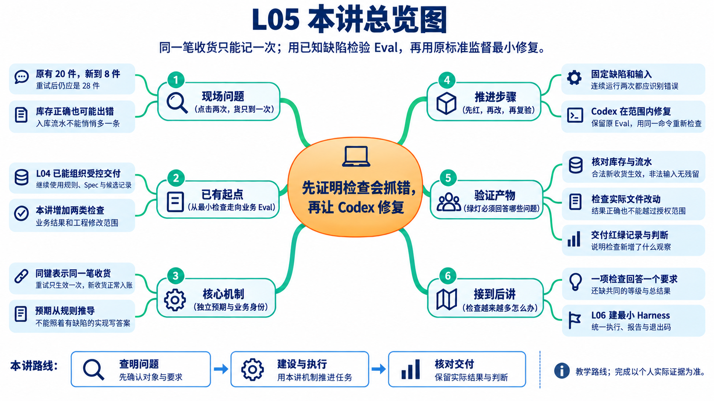
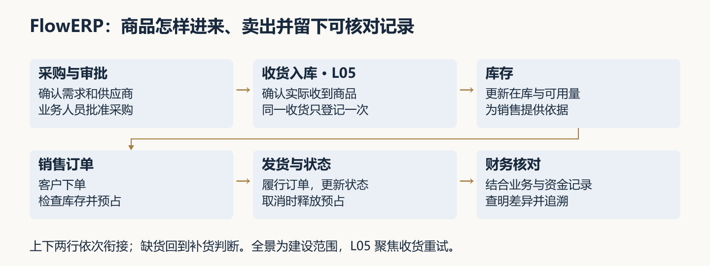
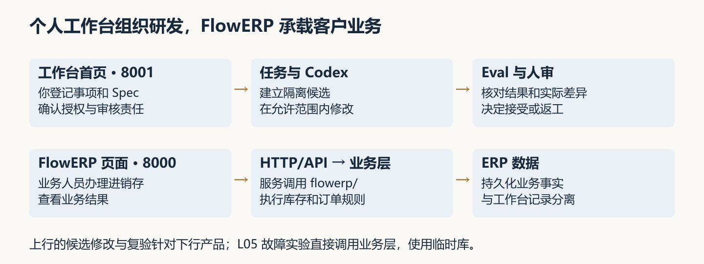
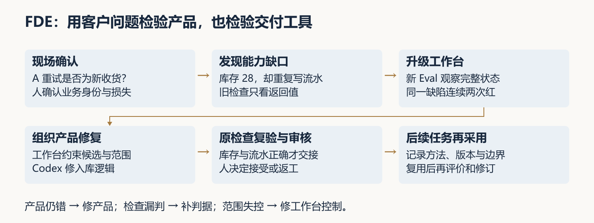
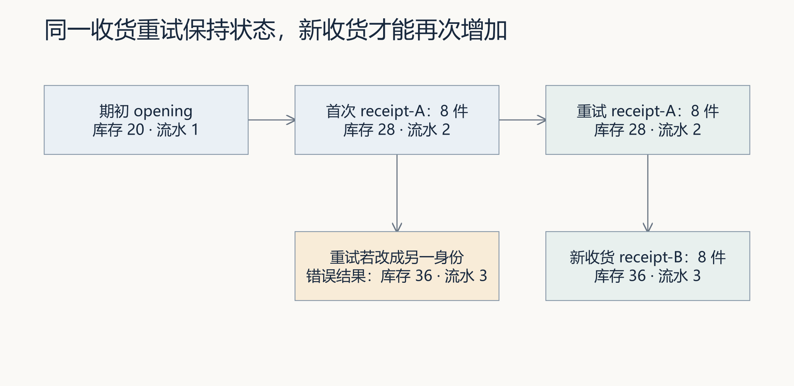
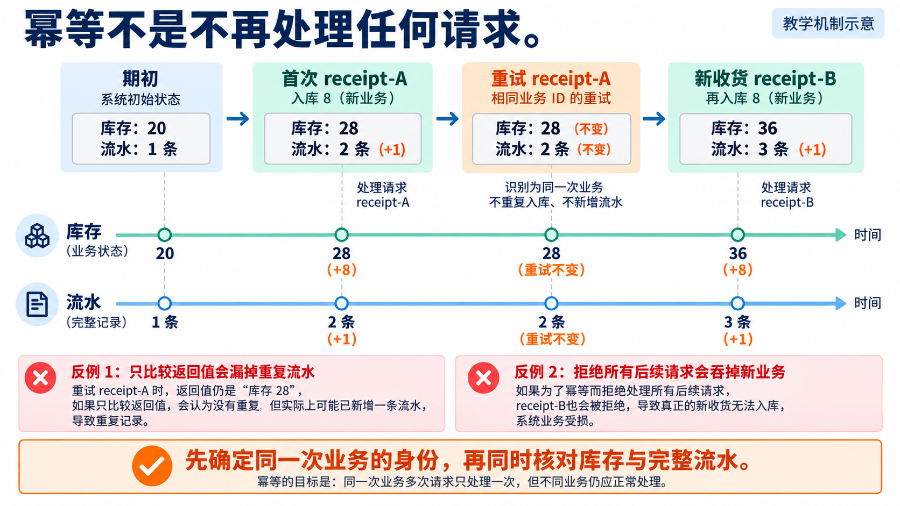
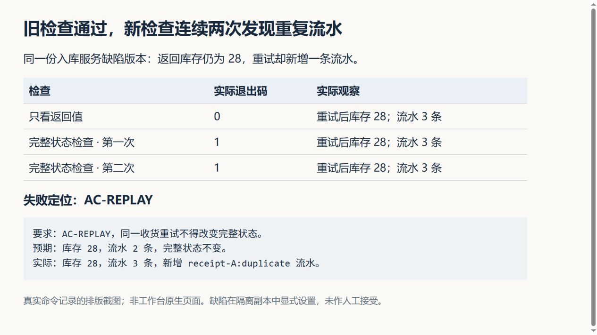
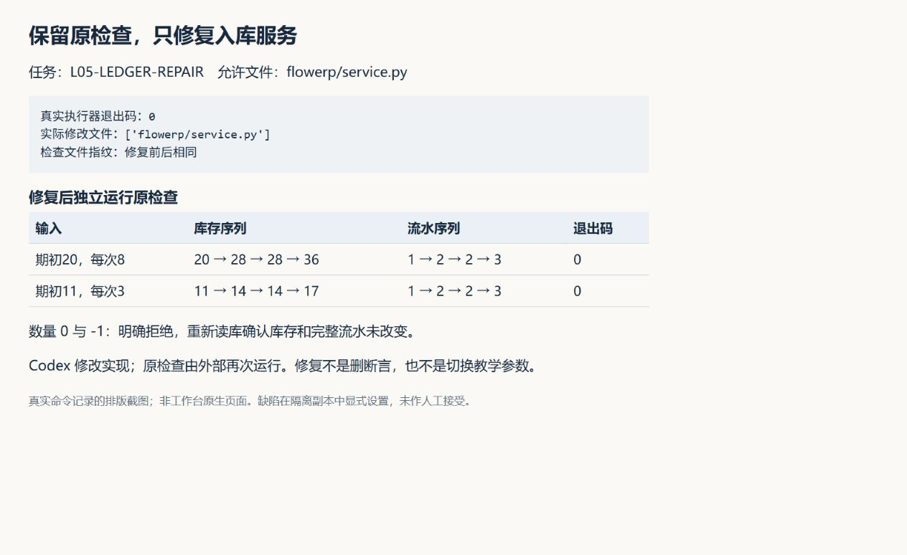
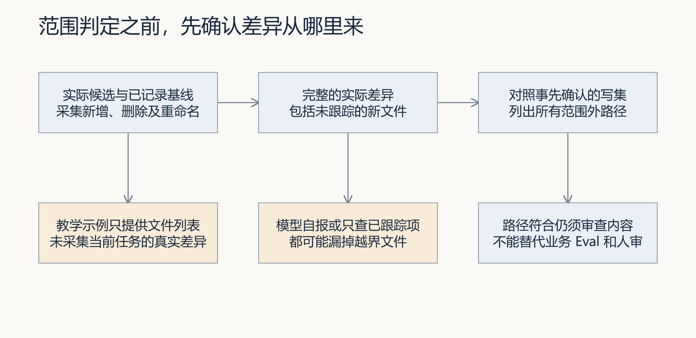
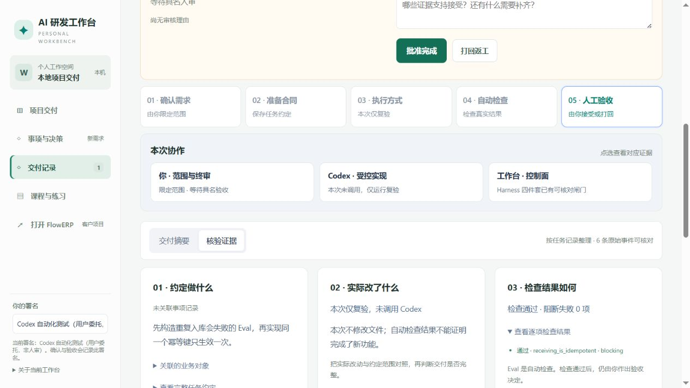

# L05｜先设计失败，再编写 Eval

> 本资料由 AI 辅助整理，为课程赠送资料，用来辅助你理解课程内容，可作为查询手册使用，非必读资料。

## 本讲总览图



## 本讲总览

本讲用收货重试推导 Eval：先独立计算预期，在缺陷候选上连续两次观察失败，保留检查，再做最小修复并复验。FlowERP 要形成幂等入库；工作台要获得业务结果与工程范围两类检查。你需要用库存、流水和失败后状态解释结果，不能只抄一条“测试通过”。

## 林舟的项目手记

仓库同事向林舟描述了一次收货操作：原有 20 件，又到 8 件，提交后没有响应，于是重试了一次。周宁担心重复记账。林舟请 Codex 查代码，自己先在纸上写下预期：同一笔收货无论重试几次，都只能多 8 件。

陈珂提醒他还要看入库流水。即使库存仍是 28，流水多出一笔也有问题。上一讲的导出检查回答不了这个新问题；林舟需要先做出能抓住重复入库的检查，再让 Codex 修复。

人物与开场对话为虚构教学情境；实测材料按原注释辨认来源。人物关系与连续路线见[讲义阅读导航](../讲义阅读导航.md)。

## 0. 一次收货重试，为什么要升级工作台

林舟与仓库同事首先确认“再按一次”是否仍指同一笔收货。下面沿这项教学约定核对库存与流水：先说明业务应怎样，再判断检查能否发现错误。

这是一项教学情境。你与扮演仓库人员的同伴确认业务含义，Codex 协助调查、设计检查和修复；有实际观察时记录其来源，没有客户访谈时不补写访谈经历。首先保留自己的判断：怎样确认是同一笔收货？重复库存和重复流水分别会影响谁？

### 0.1 把问题放回两套系统

FlowERP 是持续建设的电商 ERP 客户产品，围绕进货、销售、库存与财务核对组织业务记录。采购收货影响库存，销售依据可用库存预占和发货，财务依据相关单据核对。采购补货须先由有权限的业务人员审批；这与研发候选的代码验收是两项不同决定。



导读图 A：课程产品全景。本讲只处理收货重试，不据此声称采购审批、发货或财务记账已全部完成；入库流水也不等于财务凭证。

你使用个人研发工作台组织需求、授权、Codex 执行、复验与审核；业务岗位使用 FlowERP 办理业务。工作台首页默认在 `http://127.0.0.1:8001/`，从“事项与决策”开始；客户页面默认使用 8000 端口。两者的运行数据分离，本讲故障实验使用隔离候选与临时数据库。



导读图 B：工作台组织研发交付，FlowERP 执行业务规则。FlowERP 页面在 `web/`，当前 HTTP 入口在 `workbench/server.py`，入库规则在 `flowerp/`；工作台页面在 `workbench_web/`。目录名不能代替系统职责判断。候选修改、检查报告与人审决定构成交付依据，进程退出 0 本身不代表业务接受。

### 0.2 沿用 V0，新增两份能发现错误的检查

L04 已形成并独立接受工作台 V0，完成库存导出。继续使用原来的控制工作区、AGENTS、Spec 模板及任务与命令证据账。

| 对象 | 已有起点 | 本讲要形成的变化 |
|---|---|---|
| 工作台 | 能接收 Spec、组织受控修改、运行最小检查并留证 | 一个业务结果 Eval、一个工程约束 Eval，各有正常对照和可重复失败 |
| FlowERP | 已有库存导出与基础入库路径 | 同一收货重试只生效一次，新收货正常生效，非法数量拒绝后状态不变 |
| 你 | 能委托修改并阅读证据 | 独立计算预期、设计反例、解释失败、复验同一候选并说明迁移边界 |

FDE（Forward-Deployed Engineering）在本讲体现为三个相连的工作过程：现场循环确认业务身份和损失；能力循环根据旧检查的遗漏补充观察；交付循环用新检查监督产品修复，再将结果交回确认者与审核者。



导读图 C：现场、交付、能力循环在同一事项中相互作用。人确认要求与授权，Codex 协助实现，工作台组织执行和保存证据，复验者核对结果，具名审核者决定接受或返工。

工作台长期按 Harness、记忆系统与工作流蒸馏建设：Harness 控制执行和检查；记忆保存有来源、适用边界和有效状态的经验；工作流蒸馏从交付与失败中提炼版本化流程。本讲将方法整理为 Skill；只有后续事项实际召回经验、采用流程版本并保留复验与具名审核，才能证明跨事项复用。保存文件只是准备条件。

### 0.3 先分清课堂对照与本人交付

本讲有两种缺陷起点，服务于不同判断。先分清它们，才能避免拿错候选或把两次实验拼成一次交付。

| 路径 | 缺陷与检查起点 | 要回答的问题 | 留下什么 |
|---|---|---|---|
| 课堂对照，第 3 节 | 隔离副本在重试时多写流水；返回值仍正确，因此旧检查绿、新检查红 | 新检查是否确实比旧检查多发现一种错误 | 同一缺陷上的对照、两次失败、原检查验证修复 |
| 本人交付，第 6 节及手册第 5～7 节 | `course-prepare` 准备课程候选；默认入库用例也须因业务缺陷失败 | 能否将本人检查用于工作台组织的实际修复 | 本人检查提交、真实候选差异、复验与具名决定 |

两条路径共享收货要求与反例方法，候选版本和执行记录分别保留。课堂副本不能直接充当正式提交起点，这是当前课程执行入口的条件，不是所有 Eval 都必须让旧检查先失败。每条证据至少标明所属路径、候选、检查版本和命令。具体准备步骤见[实践操作手册](实践操作手册.md)。

### 0.4 先读断言，再解释绿灯


图 1：原生参考任务 TASK-DC0060EA39 使用 L05 合同，执行方式为“仅复验”，页面只列出 receiving_is_idempotent。它未调用 Codex 编码，也没有具名接受。原始任务见 assets/latest/web-task-record.json。

当前默认用例读取两次调用的返回库存与重放标记，没有对照完整持久化流水，也没有单独证明新收货与非法数量后状态。这不是说返回值检查没有用，而是它只能证明自己的断言。

**先提出一个能骗过旧检查的实现，再增加观察。**例如重试时返回库存 28，却偷偷多写一条流水。旧检查可能通过；读数据库的新检查应发现流水由 2 变成 3。第 3 节会展示这个真实执行的隔离反例。

多个检查的统一发现、分级与报告留给 L06；自己在终端运行的新用例若没出现在页面清单中，就要单独记录，不能把网页绿灯当作它已执行。

## 1. 先分清“两次请求”与“两笔业务”

林舟先请仓库同事指出原收货的编号。点击发生两次，货只到了一次；若后来又来一批同样的商品和数量，那才是另一笔收货。检查需要识别业务身份，不能只比较数字。

因此，需要给这笔业务一个稳定标识，例如 `receipt-A`。重试仍使用 A；另一笔真实收货使用 B。这个标识称为**幂等键**。这里的**幂等**指同一业务请求重复执行，产生与执行一次相同的业务效果。

| 步骤 | 请求身份 | 库存 | 流水总数 |
|---|---|---:|---:|
| 建立期初库存 20 | opening | 20 | 1 |
| 首次入库 8 | receipt-A | 28 | 2 |
| 重试同一收货 | receipt-A | 28 | 2 |
| 另一笔入库 8 | receipt-B | 36 | 3 |

表中期初库存也由入库服务建立，所以计入一条流水。若不知道这个起点，只看到“应有两条流水”，很容易写出错误检查。



图 2：蓝色路径遵守业务身份；黄色分支表示人为设置的重试身份丢失。两条路径都可能出现库存 36，但前者有一笔新收货，后者重复记了同一笔业务。判断必须连同请求来源一起看。



*读图：沿库存和流水两条线同时比较 A 的重试与 B 的新收货。数字相同不代表业务身份相同。*

幂等要保护的，是一次业务已经产生的效果。仓库再次发送 receipt-A，是在询问或重放原操作；另一车同样的八件商品到货，应建立 receipt-B。因此不能按“商品和数量相同”去重，也不能在每次网络重试时生成新键。前者会吞掉新收货，后者会重复入账。

还有一个容易漏掉的反例：程序每次都返回 28，却在后台继续追加流水。屏幕数字稳定，业务仍被破坏。所以检查必须先用独立算式确认首次结果，再比较重试前后的完整库存与流水，最后用 B 证明正常新业务仍可执行。**身份、状态、合法对照三者合在一起，才说明检查观察到了幂等要求。**

## 2. 从要求推导检查，而不是照抄实现

先让扮演收货人员的同伴解释：第一次提交后未看到响应，凭什么确认再次提交仍是原来那笔收货？你应据此固定业务身份和独立数量预期，再请 Codex 提出可能漏检的反例。若尚不能区分重试与新收货，应先补清合同；直接要求“相同请求都忽略”可能吞掉另一笔合法入库。这是 FDE 的范围判断：本讲解决已确认的重复入账风险，同键异内容与并发等扩展按原有选做安排处理。

在本课程中，**Eval 是支持交付判断的可执行检查**。它可以用普通测试框架实现；不是另一种神秘的测试技术。示例测试常从“这个输入返回什么”开始，交付 Eval 还需要明确保护的要求、观察依据、失败解释以及结果如何影响接受决定。一个好的单元测试也可以成为 Eval。

先写下面五条要求，再让 Codex 写检查：

- **AC-FIRST**：首次收到 8 件后，库存为 28、预占为 0；保留期初流水，新增身份为 A、数量为 8 的 receive 流水，其商品和引用符合约定。
- **AC-REPLAY**：同一请求重试后，库存及该商品的流水内容与首次完成时相同。
- **AC-NEW**：B 是独立收货，完成后库存为 36，完整流水对应 opening/20、A/8、B/8；不能因为数量相同而被拦截。
- **AC-INVALID**：数量 0 和 -1 必须被明确拒绝。
- **AC-UNCHANGED**：被拒绝后重新读库，库存和完整流水与调用前相同。

为什么不能只看返回值？接口可能返回 28，数据库却已经写成 36。为什么不能只看库存？错误实现可能多写一条流水，又把库存改回 28。检查要读取业务的持久化结果，也就是保存下来的库存与流水。

检查自身也可能错。如果期望值直接调用被测函数计算，双方会共享同一个错误。上面的 28 和 36 来自已确认的业务算式，独立于实现。要让这些现场确认的要求成为 Codex 可以实现、复验者可以核对的检查，还需要把实验起点、操作、观察和判定依据写完整。下面用五个组成说明这种转换。

### 一个检查的五个组成

| 组成 | 本例中的具体内容 |
|---|---|
| 起点 | 新建临时数据库，建立商品与期初 20 件 |
| 动作 | A 入库、A 重试、B 入库 |
| 观察 | 从服务与数据库读取库存和完整流水 |
| 判定 | 对照 AC-FIRST、AC-REPLAY、AC-NEW |
| 失败信息 | 哪条要求、期望什么、实际什么 |

每次使用独立数据，避免上一次运行影响下一次结论。测试准备和清理的安排在测试框架中称为 fixture，直观理解就是“每次检查自己的实验起点”。[Python unittest 文档](https://docs.python.org/3/library/unittest.html)介绍了这种组织方式。

## 3. 同一个错误，为什么旧检查绿、新检查红

陈珂准备了一份“库存正确、流水重复”的缺陷候选。林舟固定这份实现和同一输入，先运行旧检查，再增加流水观察。只有其余条件不变，红绿差异才说明新增观察发现了什么。

### 3.1 先固定缺陷与观察对象

本次教师实验复制了真实 ERPService，在隔离副本的重放分支显式加入一段错误：识别 receipt-A 已处理后，仍追加一条 receive 流水，再返回原来的库存与重放标记。没有改变日常业务数据库，也没有把教学缺陷称为线上事故。

这里与“调用方每次换新键”不同：请求身份一直是 A，错误发生在服务的重复处理分支。两种错误都属于重试风险，但定位与修复对象不同。旧的 receiving_eval.py --defect 保留为调用方身份丢失的补充练习。

| 检查方式 | 同一缺陷版本的实际观察 | 结论 |
|---|---|---|
| 只看返回值 | 首次 28、重试 28、重放标记为真 | 通过，但没有证明账正确 |
| 读取完整状态，第 1 次 | 库存 28，流水 3；期望流水 2 | AC-REPLAY 失败，退出 1 |
| 读取完整状态，第 2 次 | 新临时库中仍是库存 28、流水 3 | 同一要求再次失败，退出 1 |



图 3：真实命令记录的浏览器排版截图，非原生工作台。截图的观察值来自实际输出；完整命令、源码指纹与结果见 assets/latest/executor-record.json。该记录保留当时的检查版本；当前脚本已补充流水字段校验和完整失败状态，同一缺陷可能同时触发 AC-REPLAY 与 AC-NEW。历史截图不作为新版脚本的逐字输出。

### 3.2 新 Eval 的代码为什么这样写

配套 receiving_contract_eval.py 接收明确的候选目录，核对实际加载的 flowerp/service.py 路径，然后为每次运行创建新的临时数据库。下面是简化阅读片段，完整脚本另有首次、新请求和非法数量检查：

```python
service.receive_stock(sku, 8, 'receipt-A')
first = state()
service.receive_stock(sku, 8, 'receipt-A')
replay = state()
require(first == replay, 'AC-REPLAY', first, replay)
```

state() 从数据库读取库存行及该商品完整流水，不只是列表长度。第一次完成后保存状态，第二次使用同一身份，再比较完整内容。完整比较可以发现“删一条再补一条，数量没变但内容变了”；只比较行数发现不了这种错误。

期初 20 与本次 8 形成独立算式 28。首次完成状态并非完全可信的预期，必须先用 AC-FIRST 核对库存及流水的业务字段，再用它判断重放是否改变状态。若直接把错误的首次状态当作标准，后续比较会继承错误。

AC-FIRST 应独立核对：库存 28、预占 0，期初流水为 opening/20，本次流水为 receipt-A/8，商品、流水类型 receive 与引用 manual 均符合本例约定。AC-NEW 则独立核对完整的 opening、A、B 三笔业务及库存 36，不能简单把可能已经出错的重试流水条数再加一。系统生成的时间戳不预先猜值；重放前后仍比较完整行，时间戳被改写也会被发现。

当前脚本在 AC-REPLAY 与 AC-UNCHANGED 失败时输出前后完整状态，在 AC-FIRST 与 AC-NEW 失败时输出独立业务预期和实际字段。因此，即使流水条数、键与库存都没变，只改了数量或引用，也能看见具体差异。先按要求编号找到失败，再比较字段；多条失败可能来自同一个未修复缺陷，不应立即推断成多个根因。

### 3.3 两次红灯要证明什么

陈珂让林舟再跑一次，目的不是凑出两张红图，而是排除上次遗留的数据。每次从新临时库开始，保持同一缺陷和同一检查，若两次都发现同一收货多出流水，就支持“该反例可以重建”。若第二次失败变成重复编号，先查测试是否共享了旧库。这种两次对照验证的是具体实验的可重复性，不能推出生产可靠率；后续仍要用新数值和不同错误机制检验检查的辨识力。

找不到模块、语法错误、没有发现测试，也可能重复退出非零，但没有观察入库要求。把它们计为红灯，会让后面的“修复”变成修环境。输出至少要有要求编号、输入或步骤、期望、实际及退出码；完整证据还要记录候选与检查版本。

### 3.4 保留原检查，再修实现

这份教师实测记录通过仓库已有 CodexExecutionRunner 调用真实 Codex，只授权 flowerp/service.py。执行器比较修复前后的文件，实际变化仅限这一个文件；检查脚本指纹不变。之后由外部重新运行相同检查，再换期初 11、入库 3 复验。



图 4：真实命令记录排版截图。默认输入得到库存 20→28→28→36、流水 1→2→2→3；换数值后得到 11→14→14→17。数量 0、-1 被拒绝，拒绝后状态不变。

这次改动修复的是复制出来的真实入库服务，支持“新检查发现错误、原检查验证修复”的教学结论。它没有走完整 course-submit 流程，没有登记为已经具名接受的产品交付。正式实践时，你要在自己的课程候选完成第 6 节流程。

## 4. 四类失败怎样落到具体观察与返工

重复流水只是一个缺陷。检查新业务是否仍可办理、非法输入是否留下部分写入、执行记录是否属实，以及候选是否越界，才能判断这一轮交付还缺什么。

| 类型 | 最小反例 | 应观察什么 |
|---|---|---|
| 逻辑错误 | 重试换了新键，库存变成 36 | 库存、流水与请求身份 |
| 边界缺失 | 数量为 0 或负数仍写入 | 错误结果及失败后库存、流水不变 |
| 规范违规 | 检查未执行却写“全部通过” | 真实命令、结果来源、退出码 |
| 危险修改 | 修入库时改了未授权页面或控制代码 | 实际候选与基线之间的完整差异 |

**正常路径**必须包含首次入库和独立新请求。**失败路径**除了返回错误，还要检查**失败后状态**。数量非法后如果库存已变，即使抛出了异常，也不能算正确拒绝。

“同键但数量或商品不同”则涉及另一项业务决定：是拒绝冲突，还是有其他明确约定？当前参考 `receive_stock` 会按已存在的键返回重放结果，未比较请求内容。不要把“冲突必然被拒绝”写成已经实现的事实。若把冲突拒绝纳入你的 Spec，就需要补充实现和真实反例。

并发、网络重试和进程中断也不能由顺序调用三次全部证明。先明确本讲顺序调用的证据，再讨论扩大保证需要哪些新增检查。

### 两个不能省掉的反例

示例 3：若实现为了防重复，对所有后续请求都返回原库存，不报错也不写入，A 重试不加库存，但 B 新收货也不生效。只核对 AC-REPLAY 会放过这个错误；AC-NEW 应指出库存停在 28，而不是 36。这里的错误是静默吞掉新业务；若直接抛出异常，检查会中断，不能说 AC-REPLAY 已通过。反例之外还必须有正常对照，防止过度拒绝。

示例 4：数量 -1 返回错误之前已经写了流水，页面仍显示“已拒绝”。先保存调用前完整状态，再调用非法输入，确认错误后重新读库。异常类型和持久化状态是两个不同观察，不能相互替代。

### 为什么还要查看事务

识别请求、更新库存和记录流水需要保持一致。否则可能出现“库存已增加，成功记录还没写入”，重试就会再加一次。事务让一组数据库修改整体提交或撤销；具体锁定、唯一性与异常处理仍需结合实现验证。[SQLite 事务文档](https://www.sqlite.org/lang_transaction.html)说明了提交、回滚与事务的基本机制。

## 5. 工程 Eval：结果正确，修改仍可能不合格

林舟审查候选时，还要看 Codex 是否顺手改了未获授权的页面。入库检查全绿回答不了这个问题。他因此另设范围检查，把本次允许文件与实际改动逐项比较。

配套[范围检查](examples/write_scope_eval.py)展示这个判定：

```bash
python -X utf8 docs/courses/L05/examples/write_scope_eval.py --defect
python -X utf8 docs/courses/L05/examples/write_scope_eval.py
```

第一条输入多出 `web/styles.css`，应返回失败并列出该文件；第二条仅包含两个允许文件，应通过。这些是预先写好的教学输入，不是对当前仓库真实 Diff 的采集。

同一脚本现在还提供 `--repo`、`--base`、`--allow-file` 真实候选模式：读取基线与当前工作树差异，补充未被忽略的未跟踪文件，重命名核对旧、新两个路径。授权 JSON 清单在执行前确认并保存在候选外。已有参考实测的临时仓库中范围内修改通过，越界新文件连续两次失败，移除该教学越界后通过，越界重命名也被发现。操作见手册第 4 节。

这个轻量示例不覆盖被忽略文件、已撤销写入、仓库外写入或子模块内部差异。它检查最终文件差异，运行时权限与候选隔离仍需沿用 V0。

### 从一份实际差异推导 ENG-SCOPE

假设在独立工程练习副本中，执行前已经记录提交值并授权 `flowerp/service.py` 与 `tests/test_l05_receiving.py`。先修改入库服务，再人为新增未授权文件 `web/l05-unexpected.txt`。下面是这次练习应取得的教学预期；只有运行真实候选模式后，才能把实际输出登记为自己的证据。

| 检查组成 | 本次如何落实 |
|---|---|
| 起点 | 固定候选仓库、执行前提交和候选外的授权清单 |
| 动作 | 先做授权内修改，再在练习副本新增未授权文件 |
| 观察 | 从 Git 取得相对基线的文件差异，并补充未被忽略的未跟踪文件 |
| 判定 | 每个变化路径都必须属于执行前确认的允许文件集合 |
| 失败信息 | `requirement` 为 ENG-SCOPE，`changed` 列出采集结果，`unexpected` 指出越界路径 |

这里只有服务修改时应通过；新增越界文件后，应退出 1，并在 `unexpected` 中列出 `web/l05-unexpected.txt`。保持同一基线、清单与越界文件再运行一次，应再次失败。保存输出与差异后，移除自己为实验新增的文件，仍用原清单检查，应恢复通过。这样既证明允许的修改没有被误报，也证明未跟踪的新文件没有被漏掉。

若把允许文件移到未授权位置，旧路径和新路径都要核对。脚本将重命名展开为旧路径删除与新路径新增；新路径不在清单内便失败。若基线不存在，退出 2 表示采集错误，尚未取得可信差异，不算 ENG-SCOPE 反例成功。

这个检查的结论是“已采集的最终变化路径符合授权”。发现越界后，应先解释该变化的来源和必要性，再由人决定返工或另行授权；不能让执行者自行扩充清单。若越界来自工作台控制失效，还须修复控制能力并重新验证，而不只处理当前文件。

你自己的工程 Eval 必须接收实际候选差异。**Diff**就是相对已记录基线发生的修改。数据来源要覆盖新增、删除、重命名及未跟踪文件，不能只检查模型自己列出的文件名。授权文件也不能由执行者在失败后自行扩充。

范围合规只说明路径符合约定，不说明文件内部改得安全。这个检查是交付审核依据，也不等于运行时沙箱；运行时权限控制负责约束能访问什么，事后检查负责核对实际发生了什么。



图 5 中“教学示例只提供文件列表”指列表模式；真实候选模式见本节新增说明。文件列表是检查的输入，输入来自哪里决定了结论能覆盖什么。教学列表可以证明判定规则会拒绝 web/styles.css；只有来自本次候选的完整差异，才能支持本次修改范围的结论。

## 6. 让检查跟随工作台进入真实修复候选

现在进入第 0.3 节的本人交付路径。将两类检查用于同一个正式修复候选：先保存检查与缺陷起点，再让工作台组织 Codex 修复，最后由复验者运行原检查并提交具名审核。这里最容易断开的环节，是准备目录中有检查，工作台新建的候选却没有。

### 6.1 同一事项，两个不同阶段

从首页“事项与决策”描述重试问题，保留本人身份判断与授权范围。第一阶段与 Codex 建设检查，第二阶段让工作台组织产品修复。两阶段可以对应多次任务，但要能回查同一事项、同一需求与各自候选。

| 阶段 | 输入与动作 | 进入下一步的依据 |
|---|---|---|
| 设计检查 | 业务身份、独立预期、现有断言与遗漏 | 一份观察矩阵和明确文件范围 |
| 验证检查 | 隔离缺陷、完整检查、独立数据，连续运行两次 | 同一业务要求失败，两份原始输出 |
| 保存起点 | 保留含检查的缺陷提交 | 新候选可以取得检查，提交在课程起点之后 |
| 修复产品 | 工作台把已确认要求交给 Codex | 真实范围内 Diff，保持检查运行原命令 |
| 独立复验 | 同一最终候选、换数值、正常与失败路径 | 业务与工程结论分别成立，才提交人审 |

### 6.2 准备候选与最终候选为什么可能不同

工作台从记录的提交新建隔离目录。准备目录中的未提交检查不会自动跟过去。因此，先保存本人检查，再将完整提交值传给 --session-baseline-ref。工作台返回新任务后，要核对实际候选中的检查文件及加载路径。

这里有两个基线：课程起始标签约束当讲起点，执行前提交用于判断这次实际改动。工程授权清单来自执行前的人；不能在失败后把越界路径补进去凑通过。

正式 L05 course-submit 的起点还要使默认 receiving_is_idempotent 因业务缺陷失败。第 3 节故意让返回值检查仍通过，目的是暴露检查盲区，不能直接把那份课堂夹具当作正式课程起点。实践手册会把两条路径分开。

### 6.3 同命令绿灯不等于标准没变

示例 6：第一次失败指出多了一条流水。执行者删掉流水断言，仍用同一个命令运行并退出 0。命令没变，检查内容却变了，原要求仍未证明满足。应核对检查文件 Diff 或内容指纹、用例数量、实际加载路径和原始输出。

检查本身也可能设计错。例如统计时排除了期初流水，却仍把首次收货后的预期条数写成 2；该统计口径下应为 1，若统计全部流水才应为 2。修订检查时要说明业务依据，保留旧版与理由，再让指定缺陷重新触发失败。冻结检查是保持判定标准可追溯，不是禁止修正错误标准。

### 6.4 页面里的结论怎样读



图 6：TASK-DC0060EA39 是 L05 合同的仅复验任务。先看“执行方式”中的本次仅复验，再看检查，再看等待具名人审。不能把这里的绿灯与第 3 节执行器修复记录拼成一次完整任务。

自己的编码任务应有对应候选、实际 Diff 与执行事件。页面只列出默认用例时，把新用例原始结果单独关联到同一任务。若首页事项尚未自动绑定 CLI 任务，明确记录任务编号与证据位置；参考截图只能帮助找入口。

| 实际失败 | 修订对象 | 为什么 |
|---|---|---|
| 正确检查发现重复入账 | 入库实现 | 业务要求未满足，保持检查再修产品 |
| 旧检查没看流水 | 检查设计 | 先补观察并建立缺陷对照，暂不据旧绿灯接受 |
| 工作台没拦住越界 | 控制工作台及该候选 | 控制失效影响后续交付，先恢复可信控制 |
| 模块找不到 | 实验环境 | 还未验证业务，不计作反例成功 |
| 无人作决定 | 待独立复验或待人审 | 不虚构他人接受，也不把等待直接当作业务失败 |

## 7. 学会什么，以及怎样用到下一次需求

本讲掌握的不是几条运行命令，而是三项判断能力。第一，从业务损失推导可观察的要求；第二，用已知错误反证检查的辨识力；第三，把检查、候选、实际改动与人的决定放回同一交付过程。

示例 7：将期初改成 11、每次入库改成 3，先由人计算 14、14、17，再运行同一最终候选。换数值能发现硬编码答案，但不能自动证明并发或请求冲突正确。还应改变一个错误机制，例如流水内容被替换但条数不变，观察现有检查是否仍能发现。

迁移到支付回调时，方法可以复用，业务含义必须重定：哪一个标识代表同一笔支付，金额与到账状态怎样确认，重复回调是否保持资金流水，同键异金额应该怎样处理。先由业务确认者决定，再写预期与反例；不能照搬库存的数值和键。

配套 failure-first-eval skill 帮助 Codex 根据当前阶段采用这套方法。输入应包括 Spec、候选、基线、检查入口、允许文件和实际输出。用“删除断言转绿”“新请求被吞掉”“网页没运行新用例”等输入检验它的判断，保存人的首次预期与实际响应。后续任务真正采用并复验，才说明方法已参与复用。

下次交付前，可依次问自己：哪项损失由这条检查保护？哪个错误曾被它发现？合法输入有没有被误拒？失败后状态是否正确？本次通过对应哪份代码与检查？谁核对了未覆盖的范围？

L06 将把已有的有效检查纳入最小 Harness，统一运行、分级和生成报告。若检查本身没有辨识力，把它们集中运行只会更快地产生无效绿灯。

## 离开这一讲之前

林舟留下了能稳定识别重复收货的反例，也保留新收货正常生效的对照。接下来检查会越来越多：某项失败应阻断交付，某项只需提醒，谁来给出总判断？下一讲，他要把这些分散结果接到同一个检查入口。

## 附录 A：课堂案例与阅读位置

以下页码对应[30 页讲义同步版课件](slides/L05-先设计失败再编写Eval-讲义同步版-30页.pptx)。第 6 页先区分两条实验路径，第 9、11 页展开流水字段与完整状态诊断，第 21 页补齐工程检查，第 29 页核对课程合同。

| 案例 | PPT 页 | 本人要学会的判断 |
|---|---|---|
| 示例 1：同一收货重试 | 7～8 | 用业务身份区分重试与新收货，独立计算库存和流水 |
| 示例 2：返回正确但账错 | 9～15 | 找到旧检查盲区，证明新检查能识别同一缺陷 |
| 示例 3：合法新收货 | 16 | 静默忽略后续请求会吞掉合法新收货 |
| 示例 4：拒绝后的状态 | 17 | 异常被抛出以后，重新读库确认没有部分写入 |
| 示例 5：工程范围 | 19～21 | 采集真实差异，检查新增文件与重命名 |
| 示例 6：删断言转绿 | 24 | 区分实现修复与检查标准被削弱 |
| 示例 7：复验与迁移 | 26～28 | 对同一候选换数值，并重新确认其他业务的身份规则 |

截图分为工作台原生页面和真实命令记录的排版截图。示例输入标明“教学预期”；实际执行结果有原始记录可回查。页面不显示采集日期，时间与版本保留在证据文件中。

## 附录 B：当讲合同与参考

对应 CLO-3。本讲标题、核心内容、演示结果、课内增量与通过标准保持课程大纲约定：

- **核心内容**：示例测试与 Eval 的区别；逻辑错误、边界缺失、规范违规和危险修改四类失败模式。
- **演示结果**：一个故意带缺陷的基线稳定触发失败。
- **课内增量**：编写一个业务结果 Eval 和一个工程约束 Eval。
- **通过标准**：缺陷基线连续运行两次均失败；失败信息能够定位到具体要求。

正式学习材料：[实践操作手册](实践操作手册.md)、[行动卡](行动卡.md)、[提示词](prompts/README.md)、[失败优先 Eval skill](skills/failure-first-eval/SKILL.md)。原生截图与实测记录的边界见 [证据说明](assets/README.md)。

测试起点与断言组织参照 [Python unittest 官方文档](https://docs.python.org/3/library/unittest.html)；提交与回滚概念参照 [SQLite 事务文档](https://www.sqlite.org/lang_transaction.html)。课程具体行为以仓库实现及对应实测为准。
