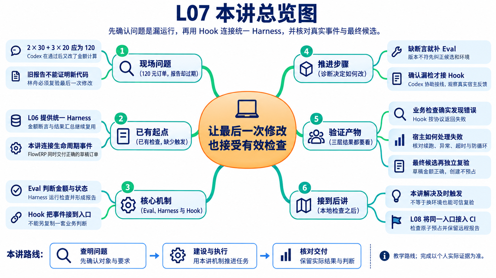
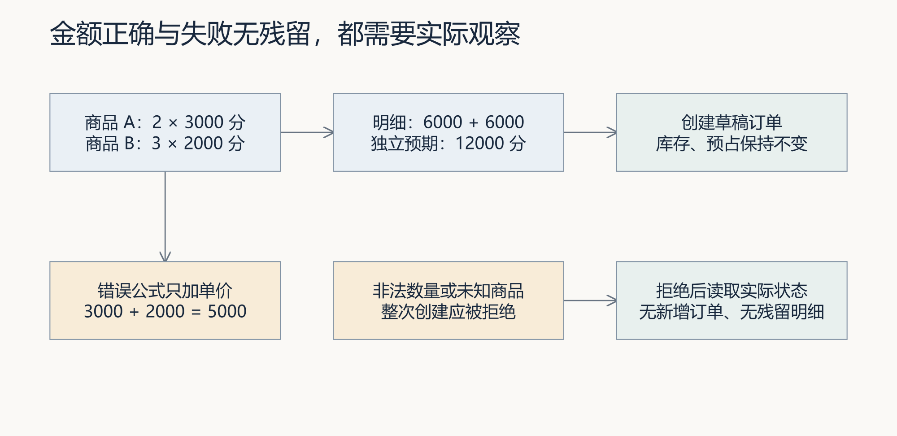
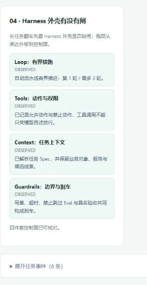
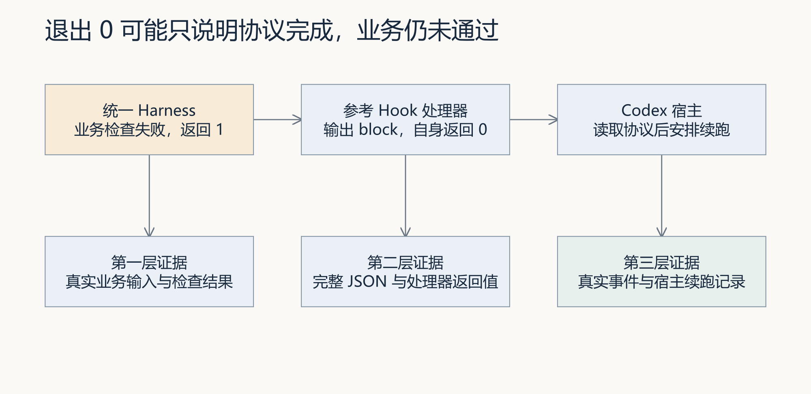
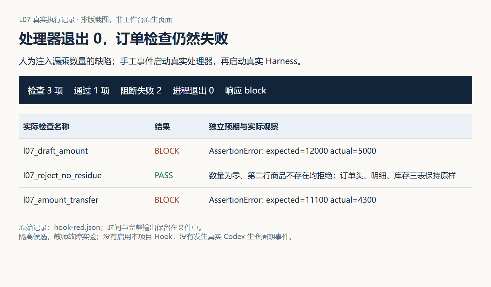
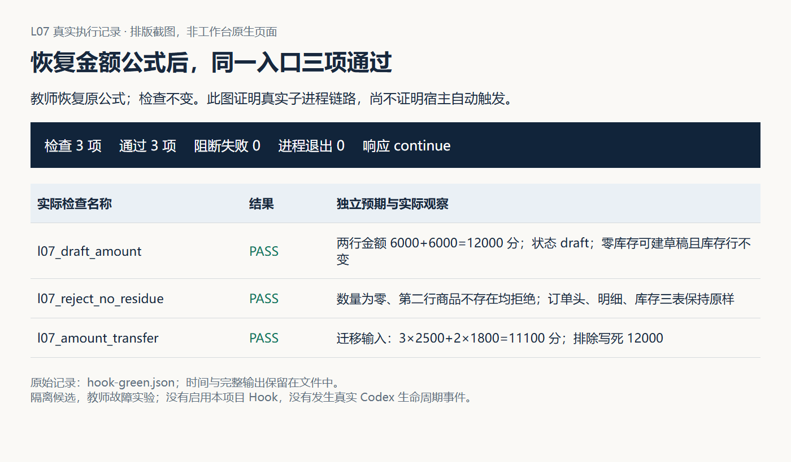
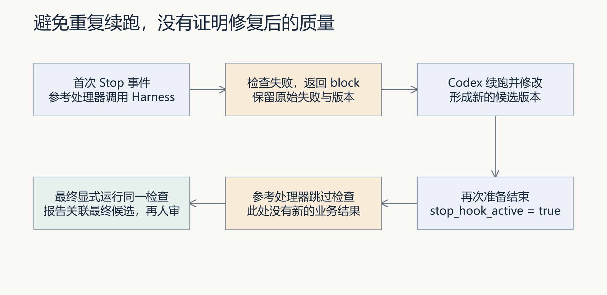
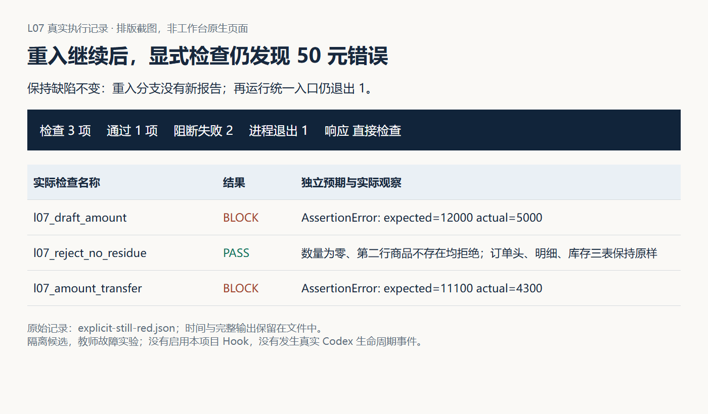
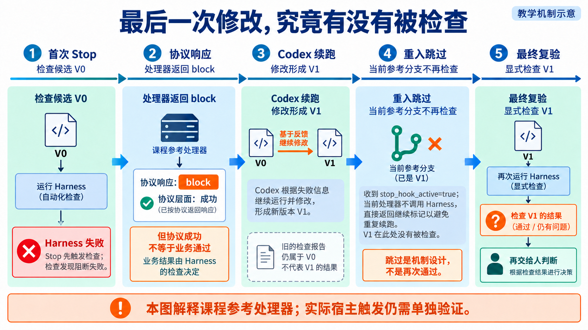

# L07｜用 Codex Hooks 建立本地护栏

> 本资料由 AI 辅助整理，为课程赠送资料，用来辅助你理解课程内容，可作为查询手册使用，非必读资料。

## 本讲总览图



## 本讲总览

本讲先诊断漏检：缺断言就补 Eval，版本不对就纠正候选，确认属于触发遗漏后才接 Hook。你将把项目生命周期事件接到同一 Harness，并观察真实失败反馈。FlowERP 交付可查询、金额正确且不预占库存的草稿订单；工作台新增检查触发能力。

## 林舟的项目手记

销售同事要登记一张订单：A 商品 2 件，每件 30 元；B 商品 3 件，每件 20 元。林舟算出总额应为 120 元，再通过工作台组织 Codex 实现草稿订单。

第一次检查通过后，Codex 又调整了金额计算。林舟准备接受时，陈珂发现报告早于最后一次修改：“现在是 120，还是只把两个单价相加成了 50？”他先复验当前候选，随后才考虑怎样让结束前的检查更不容易被漏掉。

人物与开场对话为虚构教学情境；实测材料按原注释辨认来源。人物关系与连续路线见[讲义阅读导航](../讲义阅读导航.md)。

## 从客户订单回到个人工作台

FlowERP 是面向采购、仓库、销售和财务协作的电商 ERP。L05 关注重复收货，L06 统一可用库存口径；本讲由销售登记客户想买的商品、数量与成交单价，形成可查询的草稿订单。仓库尚未为草稿锁货，L08 才进入原子预占。这样，订单金额和库存承诺各有明确的业务边界。

你使用个人研发工作台首页的“事项与决策”组织需求、Spec、候选执行和复验。Codex 协助编写订单功能、检查与待审查 Hook；业务确认者核对金额和订单含义，复验者检查最终候选。客户使用 FlowERP，研发参与者使用个人工作台；Hook 是这套工作台交付流程中的触发能力。

## 本讲怎样改进工作台

L04 提供可组织任务的工作台 V0，L05 建设业务 Eval，L06 将检查接入统一 Harness。本讲承接这些能力。Eval 用断言判断订单行为；本讲复用的 Harness 负责执行检查、汇总报告与退出码；Hook 将事件连接到这个入口，并把结果反馈给 Codex。它们共同服务于受控交付。

| 观察对象 | 本讲开始时 | 本讲要形成的结果 | 学生用什么判断 |
|---|---|---|---|
| FlowERP | 已有前序主数据、入库与库存基础，草稿订单按个人起点待交付或补齐 | 可查询的草稿订单，金额正确，非法请求无残留，创建不预占 | 自己候选中的业务正反路径及前后状态 |
| 工作台 | 已有统一检查入口，最后一次修改后的调用可能被遗漏 | Codex 准备结束时，项目 Hook 调用同一 Harness 并反馈失败 | 同一候选上的真实事件、检查报告与宿主行为 |
| 接受决定 | 可能误用旧报告或 Codex 完成说明 | 最终候选经显式复验，由实际复验者核对后接受或打回 | 最后一次修改、报告与具名决定的对应关系 |

这里的 FDE 是 Forward-Deployed Engineering，落实为现场、交付、能力三个循环。现场循环中，你与业务确认者确定草稿的含义，再诊断漏检发生在哪里；交付循环中，你决定范围，Codex 协助实现订单和 Hook，工作台组织任务与复验；能力循环中，你保留经验证的触发条件和失败策略，交给后续事项采用。若后续复用尚未发生，只能说本讲形成了待复用的方法，不能宣称记忆与工作流已经跨事项闭环。

## 七个案例与阅读路线

七个案例是同一次订单交付中的七个判断环节。阅读时始终追问：这一步消除了哪种不确定性，下一步为什么仍然需要做？

| 案例 | 学生要作出的判断 | 对应学习位置 |
|---|---|---|
| 1 | 120 元算成 50 元，是规则缺失、触发遗漏还是测错候选 | 第 1 节；先手算，再诊断 |
| 2 | 为何选择准备结束的时点，怎样接回同一 Harness | 第 2～3 节；事件与调用链 |
| 3 | 金额检查失败是否准确传回 Codex | 第 4 节；真实子进程与协议 |
| 4 | 续跑结束后，能否接受当前订单功能 | 第 5.1 节；重入与最终复验 |
| 5 | 没有有效结果时，应修业务还是修检查连接 | 第 5.2～5.3 节；超时与异常 |
| 6 | 哪些证据能够说明这次工作台改进有效 | 第 6 节；真实事件及最终候选 |
| 7 | 下一项目能采用什么，必须重新判断什么 | 第 7 节；迁移与复用边界 |

## 1. 一张订单暴露的两个问题

林舟先把订单金额算清，再检查报告对应的代码。金额错误属于产品问题，最后一次改动没有复验属于交付问题。下面按这个顺序展开，才能判断 Hook 应当补在哪个位置。

如果程序只加单价，结果会是 50 元。创建接口仍可能返回订单号，但客户报价已经错误。这是业务实现问题。若已有检查可以发现错误，只是没有人运行，则是研发流程问题。修复金额公式不能代替修复检查触发机制，自动触发也不能代替正确的金额检查。



图 1｜上方是合法订单的独立预期，下方是错误公式与非法输入的观察点。金额按“分”计算；创建草稿不预占库存。图中是待验证要求，实验才提供实际结果。

| 操作 | 应观察的业务状态 | 为什么要观察 |
|---|---|---|
| 创建两行合法订单 | 草稿订单；两行各 6000 分，总额 12000 分 | 数量、单价、明细与总额一致 |
| 数量为 0 | 拒绝且不增加订单与明细 | 错误响应之后没有残缺业务 |
| 第二行商品不存在 | 拒绝，前面已处理的内容也不残留 | 不能只检查第一行正常路径 |
| 创建草稿订单前后 | 库存与预占不变 | 创建和预占是两个业务动作 |

草稿表示订单已登记，尚未承诺货物已被占用。当前服务允许零库存商品创建草稿，之后预占时才检查可用量。因此“缺货不能创建任何订单”不属于本讲现有规则。若客户需要创建即预占，应重新设计事务边界和验收，而不是悄悄改写两个动作的含义。

配套 [订单状态实验](examples/order_state_lab.py)在临时库中调用真实服务，读取这些状态。实验不启用 Hook，也没有修改产品；它提供的是观察方法与参考行为。

### 1.1 先诊断，再决定改哪里

假设候选已经出现 50 元的错误。先保留当前版本与最后一次报告，手动对这份候选运行统一 Harness，再据实际结果选择改进位置。

| 调查结果 | 问题定位 | 学生应决定的改动 |
|---|---|---|
| 没有运行多行金额断言，或错误金额仍通过 | 检查覆盖不足 | 在 Eval 中补独立预期与反例，再接回统一入口 |
| 报告来自控制仓库或修改前版本 | 检查对象错误 | 核对候选、解释器、cwd 和版本，再执行检查 |
| 当前候选的金额错误能使 Harness 失败，但最后一次修改后没有调用记录 | 检查触发遗漏 | 为这一交付时点接入 Hook |
| 导入失败、进程超时，未执行金额断言 | 检查没有完成 | 修复环境或执行策略，业务状态暂记未验证 |

这些问题可以同时存在。先让检查能够正确识别自己的候选，再验证自动触发，否则只是更频繁地产生无效结论。请在运行前写下首次判断，运行后说明哪条证据支持或推翻它；Codex 可以调查文件与报告，你负责决定下一步改哪里。

### 1.2 怎样证明改进有用

对照实验分开观察两个变化。首先保持金额缺陷和业务断言不变，确认显式运行 Harness 会失败，再检验安装并信任 Hook 后，真实结束事件是否自动调用同一检查并反馈失败。这个对照验证触发能力。随后只修复金额实现，保持断言，重新检查最终候选；这个对照验证业务修复。

如果原来就有有效的自动触发，应记录已有能力并验证其适用条件，不制造“改进前从未检查”的故事。报告缺失只能说明缺少有效依据，不能单独证明事件从未发生。教学缺陷只在明确授权的隔离副本中注入，最终交付候选另行复验。

## 2. Hook 的价值来自触发时点

完成前面的诊断后，若确定遗漏发生在最后一次修改与结束之间，才进入事件选择。选择触发点之前，先问销售人员需要什么保证：本讲创建的是草稿订单，创建成功尚不承诺库存预占。若把“库存为零就禁止建草稿”塞进 Hook，可能改变已确认的业务范围。你负责把订单规则和检查时点分开，Codex 调查可用事件并实现连接，复验者再确认最后一次修改确实接受了检查。触发过早、只检查旧版本，同样不能支持接受当前交付。

Hook 可以理解为“某个事件发生时，调用一段处理程序”。事件决定何时运行，处理器决定怎样接收输入、调用工具和返回结果。我们选择 `Stop`，是因为要在 Codex 准备结束一轮工作时检查当前成果。

这不是文件保存监听，也不是 Git 提交检查。即使这一轮没有提交 Git，Codex 仍可能结束；反过来，人在终端直接提交，也不等于产生了这次 Codex 事件。连接不同事件，覆盖的是不同遗漏。

| 问题发生在哪一刻 | 适合考虑的机制 | 本讲的判断 |
|---|---|---|
| 工具尚未执行 | 执行前检查及权限约束 | 若要避免副作用，应在动作前处理 |
| 工具已经执行 | 执行后检查 | 可以发现问题，不能靠提示撤销写入 |
| Codex 准备结束 | Stop Hook | 适合补上本轮质量反馈 |
| 准备提交 Git | Git Hook | 观察 Git 事件，不等同于 Codex 生命周期 |

设想一次工具调用已经删除文件，随后 Stop 才发现违规。Hook 最多让流程继续处理、报告或安排恢复，不能让删除“从未发生”。选择事件时先画出副作用的位置，再问检查在它之前还是之后。不要把“自动反馈”扩大为“预防所有危险操作”。

本讲的 Stop 阻断含义是让 Codex继续处理，而非回滚代码或最终否决业务。当前协议要求成功退出时输出合法 JSON；`decision: "block"` 配合原因发起续跑，`stop_hook_active` 表明这轮已经被 Stop 续跑过。具体事件和字段以 [OpenAI Docs：Hooks](https://learn.chatgpt.com/docs/hooks)为准，核验日期为 2026-09-08。

这项能力在 FDE 交付中解决的是具体遗漏：最后一次修改之后补上质量反馈。反馈要求继续处理时，学生还要判断失败原因与修复范围；处理器不能替代执行前授权、最终候选复验和人工接受。

## 3. 连接同一 Harness，而不是再造一套规则

林舟准备写 Hook 时，没有把订单金额公式复制进去，而是连接 L06 的统一检查入口。以后金额规则变化只改 Eval，汇总方式变化改 Harness，触发和协议变化改 Hook；出了问题也能沿这三处分别追查。

仓库参考链路是：项目 `.codex/hooks.json` 注册 Stop → `.codex/hooks/quality_gate.py` 读取事件 → 调用 `python -X utf8 -m eval.harness --suite blocking` → 将结果转换为 Hook JSON。

配置与处理器解决连接问题，订单金额公式仍留在业务服务，验收断言仍留在 Eval。如果 Hook 再写一遍金额检查，后续改口径时就要维护两个判断来源；一个通过、另一个失败时，学生也难以解释哪个是当前标准。



项目截图｜这是本项目工作台页面的实际截图。页面把 `loop`、`tools`、`context`、`guardrails` 显示为同一任务的控制面；本讲的 Hook 只负责把 Codex 的 Stop 事件接到统一 Harness，并不能替代业务 Eval、写集边界、超时策略和具名人审。截图中的任务是演示证据，不等同于学生个人候选已经通过。

### 3.1 为什么找到脚本还不够

参考配置通过 Git 根目录找到处理器，但处理器没有给子进程显式设置 `cwd`，也没有根据事件中的 `cwd` 切换目录。它继承启动环境。因此“脚本路径正确”并不保证“被测候选正确”。

例如，从控制仓库启动处理器，却想验证另一份候选，`eval.harness` 可能读取控制仓库中的代码。解决方法是让项目、候选、实际工作目录和解释器对应起来，并从真正的事件记录核对这些值。不要只在提示词里写“请测试正确项目”。

参考命令使用 `python` 或 `python3`，实际版本取决于启动环境。处理器用 `sys.executable` 启动 Harness，能沿用自己的解释器，却不能保证自身一开始就用了项目 `.venv`。两层选择都需要检查。实践手册给出在练习副本中显式选择项目解释器的配置方式。

### 3.2 信任究竟信任什么

Hook 是将执行的程序。审查配置时，应沿命令找到处理器，再沿处理器找到它实际调用的代码。解释器、工作目录、文件访问与网络操作共同决定实际行为。命令名称叫 `quality_gate`，不代表内容可靠。

当前官方机制要求非托管 Hook 审查并获得信任；项目来源还依赖项目配置层信任。可以在支持的 Codex CLI 中通过 `/hooks` 核对来源与状态。配置发现、信任、实际触发是不同步骤。不要只因为同名文件已存在就记录“已启用”。

课程保留配置和处理器的 SHA-256 内容指纹，是为了比较复核前后文件是否变化。指纹没有认证作者，也没有证明脚本安全，更不表示依赖代码不会被修改。学生仍需说明看过哪些代码，以及哪些运行条件尚未确认。

## 4. 三种结果不要合成一个绿色



图 2｜沿箭头逐段核对。替身实验能检验中间的失败翻译，却不能证明左侧真实业务已被检查，也不能证明右侧宿主实际续跑。这里的 1 与 0 属于两个不同程序。

首先是业务 Harness 是否完成并通过；其次是适配程序是否成功输出协议；最后才是宿主是否读取结果并按预期续跑。这三个命题可以得到不同答案。

参考处理器在 Harness 失败后，输出一个 JSON 对象：

```json
{"decision":"block","reason":"阻断级 Eval 未通过。修复后重新验证：……"}
```

原因末尾来自实际输出的最后十行。处理器随后返回 0，意思是这次协议响应完成了，并不表示订单检查通过。

| 实际观察 | 可以得出的结论 | 仍须查什么 |
|---|---|---|
| Harness 返回 1，适配器返回 0，JSON 为 block | 失败已转换为协议结果 | 宿主有没有收到并继续处理 |
| stdout 先打印调试文字，再打印 JSON | 协议可能被破坏 | 完整 stdout 能否作为一个 JSON 解析 |
| 协议实验输出 block | 处理器在该输入下返回阻断请求 | 不证明真实 Codex 事件运行过 |
| 实际事件产生通过报告 | 这一轮有检查结果 | 版本、范围及最终人工接受 |

理解这里的两个退出码，可以把处理器当作翻译者：Harness 的 1 表示业务检查失败；处理器的 0 表示它成功把这次失败翻译成宿主可读的协议。真正要续跑，还需宿主接收并处理 block。若翻译者崩溃，既不能说业务通过，也不能说宿主已经收到请求。

标准输入 `stdin` 接收事件，标准输出 `stdout` 返回协议，标准错误 `stderr` 保存诊断。假设 stdout 先出现“开始检查”，下一行才是 JSON，人在屏幕上看得懂，协议解析器却可能拒绝整段输出。因此测试要解析完整 stdout，并检查宿主真实行为；搜索到了 block 字样只验证了一小部分。

默认 `order_total_matches_lines` 只检查一行订单的明细和总额。它不覆盖本章所有非法输入、多行与失败后状态。项目 Hook 调用全套阻断检查，也不能自动补齐不存在的断言。学生要把新增业务检查接入统一 Harness，并核对实际运行的用例名称。

### 4.1 案例 3：把真实金额失败传到处理器

这次参考实验补齐中间链路：在隔离候选中将总额公式从“数量乘单价再求和”改成“仅将单价求和”；登记三个真实订单检查，用原有 Harness 执行。只替换候选的用例注册表，保留执行器实现和处理器调用方式。三个检查分别验证两行订单、拒绝后无残留及另一组金额，代码见 [订单合同检查](examples/order_contract_checks.py)。

我们手工提供 Stop 格式输入，启动真实处理器；处理器实际创建 Python 子进程，调用候选内的 Harness。两项金额检查失败，拒绝后无残留通过；Harness 返回非零，处理器将失败翻译成 block，并以 0 返回合法协议。这比替身实验多验证了真实业务与子进程，但还没有证明 Codex 宿主产生事件或接受续跑请求。



图 3｜按“订单检查名称—实际金额—block 响应”阅读截图。进程退出 0 指外层处理器；内部报告仍有两项阻断失败。完整证据见 [失败记录](assets/latest/hook-red.json)。

教师恢复原公式后，原入口的三项检查通过。迁移用例采用 3 件 25 元与 2 件 18 元，独立预期为 111 元；它用于识别写死返回 120 元的假修复。原始检查没有为变绿而修改。



图 4｜三项通过只支持这份候选在所选要求下的行为；教师恢复代码不等于学生完成实现，也不等于真实 Codex 事件已验证。

## 5. 防循环与失败策略是取舍

失败已经能传回，林舟还要观察 Codex 接着做什么：若一直要求重做，任务可能停不下来；若直接跳过，最后修改又未被验证。他先用仍有缺陷的候选检验停止策略，再设置异常与超时的交回方式。

### 5.1 跳过重入并不等于再次通过



图 5｜这是当前参考处理器的行为及其后续验收要求。左下角显式复验需要另外执行，不是重入分支自动提供的能力；若修改了版本，首次报告不能替它作证。

参考处理器收到 `stop_hook_active=true` 时直接输出继续标记，避免反复续跑，且不会再次调用 Harness。这个分支保护了执行次数，但也意味着续跑后即使仍有缺陷，它也不会再次产生业务检查结果。

因此必须保留第一次失败，不能把“避免重复续跑”显示成“质量已通过”。修复后的验收应重新显式运行相同检查，并与最终候选关联。若希望允许多次自动修复，应另行设计有上限的状态与停止条件；L10 会进一步讨论有界 Loop。

本轮还做了一个容易误判的对照：保持金额缺陷不变，向同一处理器提供重入输入。它返回 continue，但报告内容指纹没有变化。随后显式运行同一 Harness，金额仍为 5000 分，退出 1。这证明“重入结束”与“修复成功”是两件事，不能用旧报告给新状态下结论。



图 6｜先观察 [重入记录](assets/latest/hook-reentry.json)，再对照 [显式失败记录](assets/latest/explicit-still-red.json)。先前的检查记录仍应保留；修改完成后必须重新运行。



*读图：每份报告只绑定它检查的候选。重入跳过没有产生新报告，末端的显式复验因此不能省略。*

陈珂可以只问一句：“V1 的报告在哪里？”这比询问“Hook 执行过没有”更准确。首次 Hook 已经检查 V0，说明触发链有过工作；Codex 后来产生 V1，就增加了新的验证责任。防重入解决的是不要无限续跑，后置复验解决的是新候选是否正确。两项设计都需要，不能靠把 continue 翻译成“通过”把它们合并。

### 5.2 外层超时与内部超时有什么区别

参考配置设置 120 秒的宿主超时；处理器内部 `subprocess.run` 没有 `timeout` 参数。通过宿主运行与直接手动运行脚本，受到的控制条件并不相同。也不能因为配置里有 120，就声称内部已可靠终止全部子进程。

学生需要设计两层策略：内部检查超时后如何保存诊断并返回“未验证”；宿主到期时如何处理仍未完成的 Hook。内部时限应为记录和返回结果留出余量，实际值根据运行耗时确定。还要验证相关进程是否结束，不能只看界面停止等待。

### 5.3 异常不是目标业务反例

参考处理器对畸形 JSON、启动异常以及内部异常没有专门捕获。配套实验会如实显示这些异常，而不是将它们包装成检查通过。

| 输入或故障 | 参考处理器的观察 | 应作出的判断 |
|---|---|---|
| 首次事件，模拟 Harness 通过 | 调用一次，返回继续 JSON | 仅验证协议通过分支 |
| 首次事件，模拟 Harness 失败 | 调用一次，返回 block JSON | 仅验证失败翻译 |
| 重入事件 | 调用零次，输出避免续跑信息 | 此分支没有业务复验 |
| 畸形 JSON | 解析异常，未调用 Harness | 输入协议故障 |
| 模拟启动失败或超时异常 | 异常未转换成协议响应 | 处理器的故障处理仍需补齐 |

这里“模拟超时”是让测试替身抛出超时异常，用于观察异常处理。它没有等待 120 秒，也不证明宿主如何终止真实进程。把模拟观察与真实宿主验证分开，才能知道后续实验应该补哪里。

## 6. 从实验走到实际交付

### 6.1 按三个问题组织交付证据

| 要回答的问题 | 必须观察的证据 | 证据不足时的决定 |
|---|---|---|
| 已有检查能发现这份订单错误吗 | 当前候选显式运行 Harness，目标金额断言失败，来源和命令明确 | 补覆盖或纠正候选，暂不归因于触发遗漏 |
| 工作台会在选定时点调用检查并反馈吗 | 保持该缺陷，真实 Stop 事件调用同一 Harness，产生失败反馈，并观察宿主响应 | 调查事件、信任与协议，不能仅凭手工 JSON 宣称接入有效 |
| 修复后的订单可以接受吗 | 最终候选同入口通过，多行与失败后状态有覆盖，实际同伴复验 | 返工或等待补证，重入结束不能替代复验 |

学生先写自己的判断，再让 Codex 协助收集材料；同伴从原始事件和报告反查版本，最后由实际审核者决定接受或打回。订单功能通过与 Hook 接入有效分别记录，避免用其中一项替另一项作证。

### 6.2 从机制实验走到自己的候选

实践分成三个相互独立的验证层。第一层在临时库中检查真实订单服务；第二层用测试替身检查参考适配器的分支；第三层在自己的受控候选中让真实 Codex 生命周期触发 Hook，留下失败、反馈、修复和复验。

第一、二层容易重复，适合调查处理器；第三层证明连接确实生效。课程提供的示例不能替代第三层，也不替代你亲手编写的项目配置与处理器改进。

在隔离候选中先记录准确的金额要求与允许文件，确保已知金额缺陷能被统一 Harness 发现。若当前参考代码已经正确，使用明确标记的教学缺陷建立对照，并如实说明来源，不伪称发生过真实产品事故。

通过工作台组织订单增量后，在同一候选核对项目 Hook。启动 Codex 前审查配置来源，确认解释器和目录；让一次正常结束尝试产生真实事件。失败时保留事件、协议和报告，观察 Codex 是否继续处理。完成修复后再运行同一 Harness，核对最终版本，并由实际同伴作第二次签字。

配置入口、完整命令与排错见 [实践操作手册](实践操作手册.md)。任务和事件涉及不同编号，提交时记录它们的对应关系；如果还未取得真实事件或同伴复验，就分别标记待完成。两个条件缺失时不能靠手工补一份 JSON 代替。

课程将生成与启用分开：Codex 在 `hook_staging/` 交付待审查配置和处理器，学生审查后安装到实际候选的 `.codex`，再验证真实触发。这样修复了旧投影要求执行者写入受保护目录的冲突，并保留活动配置保护。暂存文件不是已启用 Hook；业务检查通过也不是完整 Hook 验收。安装来源、指纹和真实事件仍须关联同一任务。

## 7. 把经验提炼成下一次可用的流程

本讲留下的经验不应只是“所有项目都加 Stop”。更有价值的方法是：先找会被遗漏的检查，再选择事件；确认真正的输入和运行环境；把业务失败翻译为协议；最后用真实触发验证宿主行为，并说明仍需独立复验的部分。

配套 [Hook 证据审查 skill](skills/hook-evidence-review/SKILL.md)将这些步骤用于后续项目。先用“返回 0 但内部失败”“重入跳过被写成通过”“控制仓库报告冒充候选报告”三个反例检查它的判断，再提供完整证据，观察是否能给出有限而准确的结论。保存实际响应和本人修订，后续再次采用才构成复用证据。

迁移到发送邮件前的收件人核对：Stop 发生在发送之后就太晚，应把检查放在产生外部副作用前。用本地模拟发送器设计实验即可；本练习不授权向真实收件人发送邮件。

交接时写一段有证据的改进结论：“本次在____候选发现____；显式检查____说明问题位于____；接入____后，真实事件____调用检查并得到____；最终版本____经____复验；仍未覆盖____。”空缺保留为待完成，不让 Codex 推测填入。复用记录还要包括采用者、流程版本、适用前提与失效后的修订决定。

回到 FDE 的能力循环，可复用的是“从遗漏风险选择触发点，并验证最后状态”的方法。后续接入另一个动作时，应重新确认副作用发生时点和人的责任。保留本次漏检来源、事件验证和修订版本，才能说明下一任务采用的护栏为什么适用；复制配置本身没有证明遗漏已经消除。

### 思考与自查

1. 同样看到订单金额错误，怎样区分检查缺失、触发遗漏和测错候选？各举一条能支持诊断的证据。
2. Hook 返回 0，订单检查返回 1，为什么不矛盾？分别说明两个程序处理的对象。
3. 重入时没有调用 Harness，能否引用上一次通过说明当前修改正确？需要比较哪些版本？
4. 配置、脚本指纹都没变，但 Python 环境变了。原验证是否仍然充分？
5. 同样得到 block，手工模拟与真实事件各证明哪一段连接？
6. 如果每次事件都运行十分钟，怎样在快速反馈与完整验收之间分工？不要为加速直接删掉重要断言。

判断依据是对象、时间和状态：哪个程序、哪次事件、哪份代码、哪项检查。下一讲将同一套 Eval 放到独立执行环境中，检验本地结论是否能够复现。

## 离开这一讲之前

林舟不再拿修改前的报告签收订单，而是核对最后一次改动之后的实际检查。陈珂接着提出：“在你的电脑上能查出来，换到我的环境呢？”下一讲把同一套检查交给独立环境运行，并用多行预占检验那个绿灯是否可信。

## 附录 A 本讲课程大纲合同

本讲对应 CLO-3：反例与可信质量证据。

- **核心内容**：生命周期 Hook、信任边界、超时、失败策略，以及 Hook 与 Git Hook 的区别。
- **演示结果**：Codex 在关键生命周期节点运行质量检查并反馈失败。
- **课内增量**：配置一个项目级质量 Hook，调用统一 Harness，而不是复制另一套质量逻辑。
- **通过标准**：Hook 来源可检查；故意引入违规时流程被阻断；恢复后重新通过。

配套：[实践操作手册](实践操作手册.md)、[行动卡](行动卡.md)、[提示词](prompts/README.md)、[提交模板](SUBMISSION.md)、[完整课件](slides/L07-用CodexHooks建立本地护栏-imagegen重设计-33页.pptx)、[课件覆盖](../教师资料/L07/slides/PPT大纲.md)。

来源：[OpenAI Docs：Hooks](https://learn.chatgpt.com/docs/hooks)、[Git Hooks](https://git-scm.com/docs/githooks)、[Python subprocess](https://docs.python.org/3/library/subprocess.html)。本仓库配置、处理器、订单服务与检查在 2026-09-08 核对；正式授课前复核实际安装版本。
