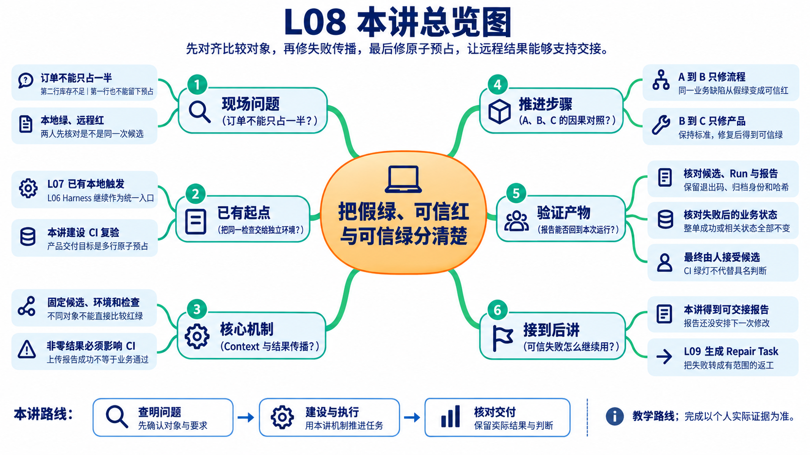
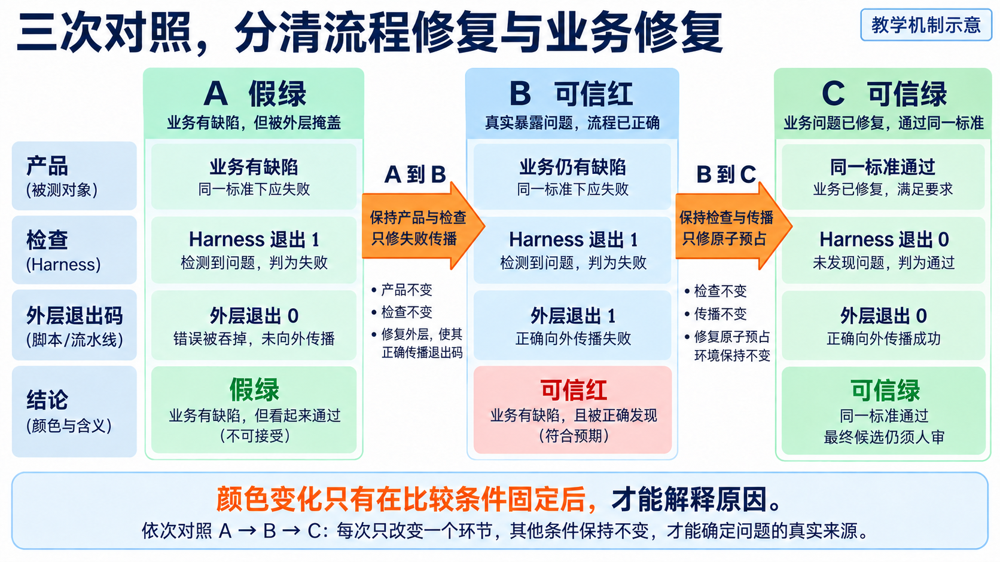
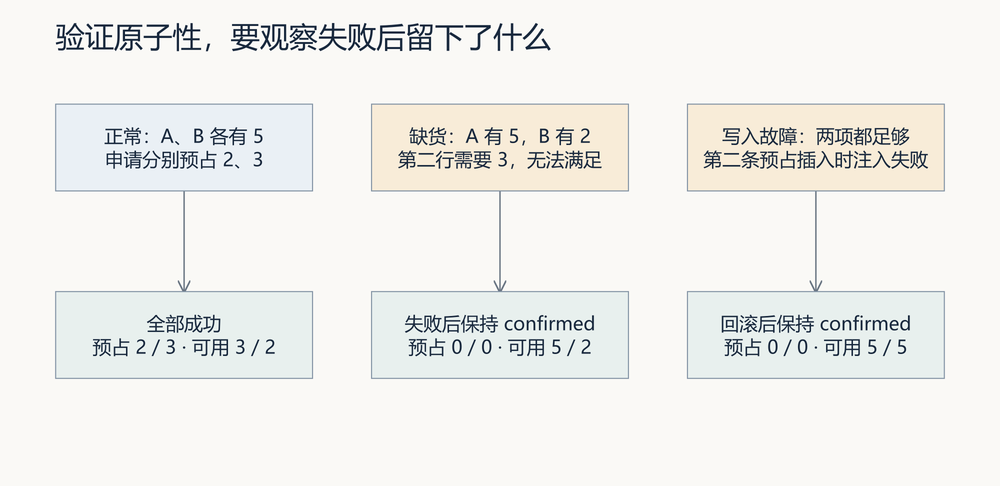
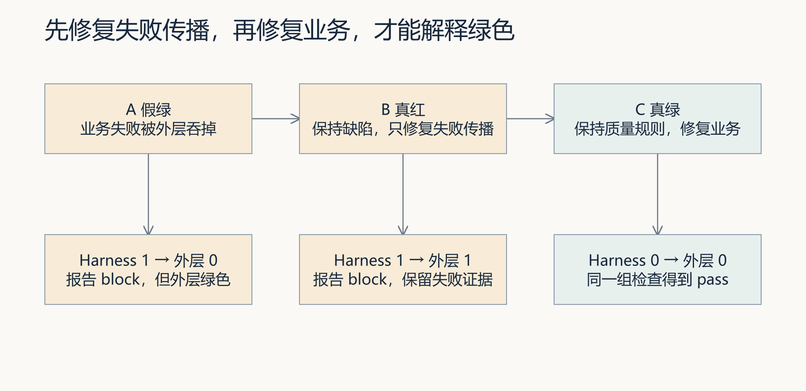
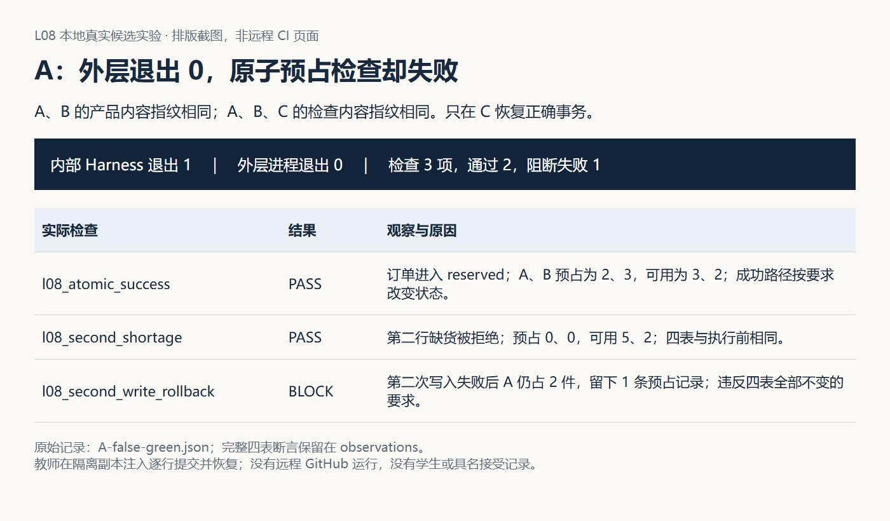
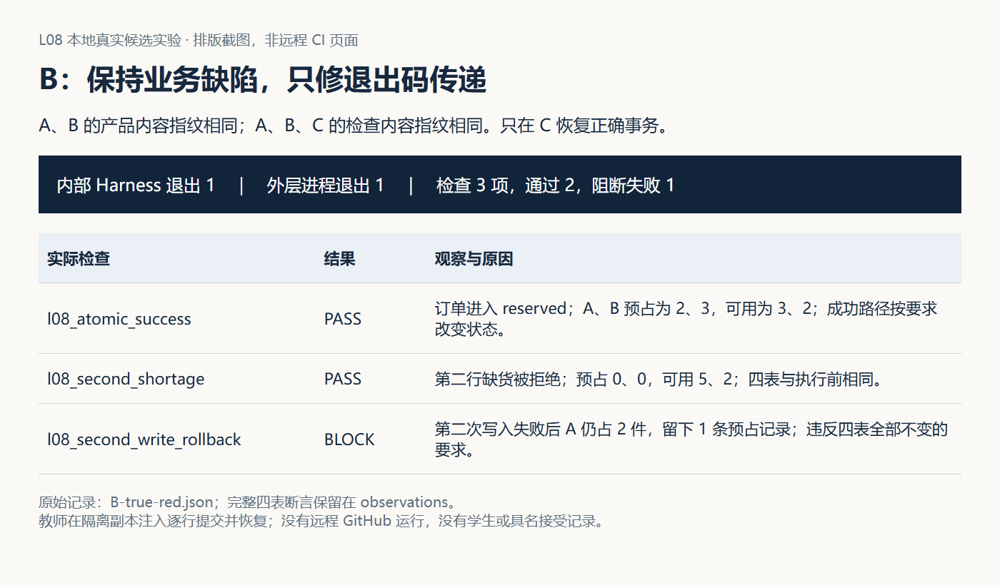
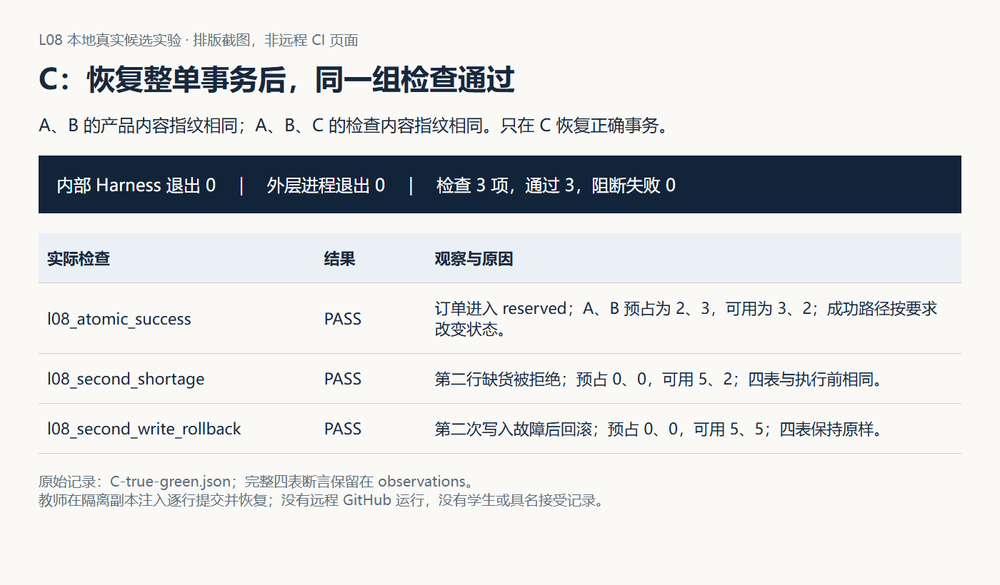
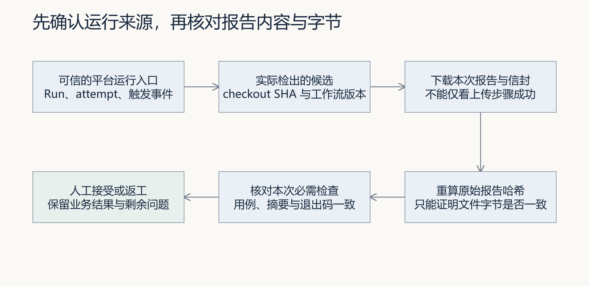

# L08｜把同一套 Eval 接入 CI

> 本资料由 AI 辅助整理，为课程赠送资料，用来辅助你理解课程内容，可作为查询手册使用，非必读资料。

配套[图解课堂 PPT](L08-把同一套Eval接入CI-图解课堂版.pptx)共 30 页；图页页脚标注本资料的小节号，也可通过[图文对应索引](assets/imagegen-classroom-20260917/README.md)查找。

## 本讲总览图

## 本讲总览

本讲用三次对照建立可信复验：A 中检查失败却显示假绿；只修失败传播得到 B 的可信红；保持标准、修复原子预占得到 C 的可信绿。Codex 协助调查和接入 CI，你确认范围，复验者核对最终候选与报告后作验收决定。

## 林舟的项目手记

销售订单开始进入预占环节。林舟检查一张两行订单：第二行库存不足，程序返回拒绝，第一行的库存却已经被占住。周宁需要的是整单可承诺，不能留下只占一半的结果。

林舟看到本地绿灯，陈珂却拿出另一环境的失败报告。他没有立即归咎于 CI，先核对两人用的是不是同一候选、同一环境条件和同一组检查。只有比较对象相同，才谈得上查明分歧。

人物与开场对话为虚构教学情境；实测材料按原注释辨认来源。人物关系与连续路线见[讲义阅读导航](../讲义阅读导航.md)。

## 本讲交付与学习证据

| 层次 | 本讲要形成的结果 | 不能越过的证据边界 |
|---|---|---|
| FlowERP 产品 | 正式销售入口的多行预占全部成功，或相关状态全部不变 | 一条错误消息、单行缺货或订单状态不变都不足以证明原子性 |
| 个人研发工作台 | 同一 Harness 在本地和 CI 运行，非零结果阻断候选并保留报告 | 工作流文件存在、上传步骤成功或一张绿灯截图都不足以证明可信复验 |
| 人与 Codex 协作 | 人确定业务口径、候选范围和接受决定；Codex 协助调查、实现与接线；复验者独立核对 | Codex 自报完成、CI 通过或自动修复都不能代替具名接受 |
| 学生学习证据 | A 假绿、B 可信红、C 可信绿，附同一候选链、原始报告、本人解释与同伴法证 | 课程参考运行不能替代学生自己的候选、远程运行和判断 |

Harness 提供统一检查入口，CI 提供独立执行与运行记录，FDE 则把业务确认、候选交付、现场分歧和后续复用连成闭环。第08讲真正要教会的，不是“会写一份 CI YAML”，而是判断一次“通过”是否足以支持交接。

## 学习路线：一个判断，三次对照，五项核对

本讲不再把技术点当作并列目录。所有内容都服务于 A/B/C 三次受控对照：

| 运行 | 保持不变 | 只改变 | 应得出的判断 |
|---|---|---|---|
| A 假绿 → B 可信红 | 同一业务缺陷、同一检查规则、同一产品实现 | 失败传播流程 | 检查流程修好了，业务还没修好 |
| B 可信红 → C 可信绿 | 同一检查规则、同一业务要求 | 原子预占实现 | 业务在同一标准下恢复正确 |

这组实验遵循一个简单原则：一次只改变要调查的那一层。若同时换了产品代码、删了失败用例、修了工作流，绿色出现后就无法解释是谁起了作用。候选版本、运行环境、检查集合、退出码和报告来源，都是为了核对“什么改变了，什么保持不变”。

*读图：先看两条箭头上的改变，再读三列结论。可信红意味着失败开始被如实表达；可信绿还要经过最终候选复验与人审。*

---

## 1. 先确定产品怎样才算正确：订单不能只占一半

面对两份报告，林舟先请周宁确认订单预占的结果要求。第二行缺货时，第一行不能留下预占；这条规则将同时约束本地与远程检查，不能为了消除分歧改动它。

原子性要求相关变化作为一个整体生效：全部完成，或全部不生效。FlowERP 本次交付要观察的不只是返回值，而是四类业务状态。

图 1｜三列采用不同的实验起点。缺货和写入故障都要求库存余额、预占记录、订单明细、订单状态四类观察结果与执行前一致；右列专门验证进入写入路径后的回滚。图中使用正式销售服务，预占前订单为 confirmed。

| 对象 | 全部成功时 | 第二行缺货或写入中途失败时 |
|---|---|---|
| 库存余额 | A、B 的预占分别增加 2、3 | 两者均保持执行前状态 |
| 预占记录 | 能解释本订单的两项占用 | 不留下部分记录 |
| 订单明细 | 每行的已预占数量一致 | 不留下第一行已占、第二行未占 |
| 订单状态 | 进入已预占状态 | 保持预占前的合法状态 |

课程有入门门面 `ERPService` 和正式销售服务 `SalesService`。L07 的入门实验创建 draft；本讲跟随正式销售用例，先 confirm，再 reserve，因此失败后应保持 confirmed。两个接口和底层表不同。个人 Spec 必须写清实际产品入口，不能拿门面的通过报告证明正式销售服务也正确。

### 1.1 为什么普通缺货还不足以证明原子性

先检查每行库存，全部足够后再写，能减少普通缺货引起的部分修改。但写入时仍可能发生数据库约束错误、连接故障或并发竞争。如果事务边界只覆盖单行，第一行可能已经提交，第二行才失败。

配套[原子预占实验](examples/atomic_reservation_lab.py)提供三类观察：

- `pass`：A、B 各 5 件，成功预占 2、3；
- `shortage`：B 只有 2 件，写入前拒绝；
- `write-error`：两行库存均足够，但在第二条预占记录插入时注入故障。

后两种失败都逐项比较四张相关表的完整前后状态。`write-error` 的故障触发器只安装在本次临时数据库，明确属于教学注入；它验证进入写入路径后的回滚，不代表已经穷尽并发、断电或生产进程中断。

### 1.2 错误实现为什么会骗过只看状态的人

教师在隔离副本的预占循环末尾加入逐行提交，再让第二条预占记录插入失败。第一行已经落库，之后的异常只能回滚尚未提交的变化。

| 观察对象 | 执行前 | 错误实现失败后 | 正确实现失败后 |
|---|---|---|---|
| A、B 预占量 | 0、0 | 2、0 | 0、0 |
| 预占记录数 | 0 | 1 | 0 |
| 两行已预占数量 | 0、0 | 2、0 | 0、0 |
| 订单状态 | confirmed | confirmed | confirmed |

错误实现和正确实现都留下 confirmed，实际占用却不同。原始四表数据见[部分写入记录](assets/latest/partial-write-state.json)，正确失败后的完整状态见[中途故障实验](assets/latest/atomic-write-error.json)。当前默认 `sales_credit_and_atomic_reservation` 只检查一行缺货及余额，不足以单独证明多行写入中途回滚；学生要把新增断言登记到统一 Harness，并确认本地与 CI 都实际选择了它。

**回到 A/B/C**：这一节建立的是三次运行共同使用的业务裁判。没有“四表全部不变”这条固定标准，后续红绿颜色没有稳定含义。

---

## 2. 再固定比较对象：两个人到底是不是在复验同一候选

林舟请陈珂保留原报告，两人先不修改代码，依次核对：

1. 是否为同一候选版本；
2. 是否使用同一产品入口、环境与数据准备；
3. 是否执行同一组检查；
4. 如果前三项一致，Harness 的失败是否被外层流程掩盖；
5. 流程可信后，业务实现是否仍然违反原子性。

前三项不同，说明当前还没有形成受控对照。先消除差异，再进入 A/B/C；否则每次颜色变化都可能来自换代码、换数据或漏测试。

### 2.1 一份可复验候选至少要固定什么

| 要固定的对象 | 要回答的问题 | 缺失时会造成的误判 |
|---|---|---|
| 业务候选 | 原子预占缺陷与修复分别在哪个提交 | 把另一版代码的结果算到当前候选 |
| 实际 checkout | CI 真正运行的是分支头还是合并结果 | 看见 SHA 不同就误判报告来源 |
| 环境与数据 | Python、依赖、初始化和故障注入是否一致 | 把环境差异误判为业务差异 |
| 检查集合 | 多行成功、第二行缺货、中途回滚是否都运行 | 通过较弱检查却宣称原子性成立 |
| 工作流版本 | 外层怎样传递退出码、何时生成与上传报告 | 把流程修复误写成业务修复 |

“我的电脑通过”可能隐含未提交文件、额外依赖或已有数据库。CI 从确定版本重新建立环境，能暴露这些未写进项目的条件；但独立环境并不天然可信，如果它仍运行同一份错误模板或遗漏同一条关键检查，仍会假绿。

### 2.2 PR 分支头与测试提交不同，不一定是谁造假

GitHub 的 `pull_request` 事件默认语义可能测试 PR 的合并结果，`GITHUB_SHA` 对应合并引用上的提交，不一定等于贡献者分支头。测试“分支本身”和测试“分支合入目标分支后的组合”回答的是不同问题。[GitHub 事件说明](https://docs.github.com/en/actions/reference/workflows-and-actions/events-that-trigger-workflows)

因此要记录事件类型、候选分支头、实际检出的 `git rev-parse HEAD`、目标分支与工作流版本。即使两个目录 HEAD 一样，未提交改动也可能不同；个人新增但未提交的测试不会自然出现在远程 checkout 中。

**回到 A/B/C**：候选与环境信息不是额外的“Git 知识点”，而是证明 A 与 B 保持同一业务缺陷、B 与 C 只改业务实现的前提。无法固定这些对象时，只能结论为“对照尚未成立”。

---

## 3. 用 A/B/C 拆开两个问题：流程可信吗，产品正确吗

对齐条件后，林舟检查一条教学失败链：Harness 已发现部分预占并返回 1，外层脚本却忽略结果、最后返回 0。平台据此显示绿色。他先修这段传播，让产品缺陷如实显露，再修预占实现。

图 2｜A 到 B 保持业务缺陷和检查规则，才能证明失败传播已修复；B 到 C 保持检查规则，才能证明业务恢复。任何一次同时改业务、删测试和调工作流，都会破坏因果判断。

### 3.1 A：假绿——先证明“绿色”可能不可信

A 保留已知事务缺陷，也保留能够发现部分写入的三项检查，但故意让外层包装器吞掉 Harness 的非零退出码。

图 3｜正常和普通缺货检查通过，中途回滚检查失败；Harness 退出 1，外层却退出 0。查看[A 原始记录](assets/latest/A-false-green.json)。

A 能证明：平台绿色可能来自错误的状态传播。A 不能证明：业务正确、候选可交付或 CI 已经修好。它是隔离教学实验，不能合入主分支，也不能作为真实交付的通过依据。

### 3.2 A → B：只修失败传播，得到可信红

B 保持 A 的业务缺陷、检查内容和产品候选不变，只让外层正确传递 Harness 的退出 1，并保存本次失败报告。

图 4｜B 的红色说明流程终于如实表达了已存在的业务缺陷。它证明“检查流程修好了”，尚未证明“业务修好了”。

这一对照是本讲第一个关键判断：**A 假绿 → B 可信红，不是质量倒退，而是工作台从掩盖失败升级为能够诚实阻断。**

### 3.3 B → C：只修原子预占，得到可信绿

C 保持 B 的质量规则、检查入口和失败传播方式，只恢复完整事务，让三项原检查重新运行。

图 5｜C 的三项检查通过。对照[运行索引](assets/latest/product-abc-index.json)核对两层退出码、产品指纹和检查指纹；完整四表数据与错误保留在各记录中。

这一对照是第二个关键判断：**B 可信红 → C 可信绿，才说明业务在同一标准下恢复正确。** 如果 C 通过是因为删除用例、降低等级或换了服务入口，就不是业务修复。

### 3.4 三次运行分别能证明到哪里

| 运行 | 内部 Harness | 外层流程 | 可以支持的结论 | 仍不能证明 |
|---|---:|---:|---|---|
| A 假绿 | 1 / block | 0 / green | 发现失败传播缺陷 | 产品正确、流程可信 |
| B 可信红 | 1 / block | 1 / failed | 同一业务缺陷能诚实阻断 | 业务已修复 |
| C 可信绿 | 0 / pass | 0 / green | 同一标准下当前候选通过 | 已获人工接受、已可自动合并 |

配套[本地状态传播实验](examples/ci_signal_lab.py)用教学断言比较 0、1、0 三个包装进程退出码，适合观察机制；图 3～5 的材料使用真实产品缺陷和真实 Python 子进程，但仍是本地隔离候选实验，没有在 GitHub 上执行，也没有替学生完成远程作业。

---

## 4. 这次 A/B/C 对照可信吗：逐项补齐证据缺口

陈珂收到 A/B/C 记录后，仍要回查候选、标准、退出结果、报告生成时间和接受人。三种颜色只概括了结论，这些材料才能说明比较是否成立。

### 4.1 候选身份：比较的是否真是那三份代码

一次可解释的复验至少关联候选分支头、实际 checkout、工作流版本、Python 与依赖、数据准备和未提交差异。A/B 若产品指纹不同，就不能声称“只修了流程”；B/C 若工作流或检查指纹改变，就不能声称“只修了业务”。

**对应证据缺口**：它保证 A → B 和 B → C 的“保持不变”确实成立。

### 4.2 检查集合：三次是否都用了同一业务裁判

报告必须列出实际运行的用例，至少覆盖多行成功、第二行缺货和写入中途回滚。全套运行的 `requested_cases` 可能为空，消费者需要明确“选择整个 blocking 套件”如何展开，不能盲目把空列表理解为零测试或全部测试。

报告自称运行了哪些用例还不够；应从本次任务的业务要求反向核对实际注册与选择。只执行当前默认单行缺货用例，不能支持多行中途回滚的结论。

**对应证据缺口**：它保证 C 的绿色不是通过漏测、删测或降级得到。

### 4.3 失败传播：Harness 的非零结果是否真正阻断候选

CI Job 的最终状态必须与关键检查退出结果一致。归档步骤可以在检查失败后继续运行，但上传成功只能证明文件传输完成，不能覆盖前面业务检查的失败。

截至 2026-09-17，仓库的 `.github/workflows/eval.yml` 为 Harness 步骤设置了 `if: ${{ !cancelled() }}`：前序单元测试失败后，只要任务未取消，仍会尝试运行 Harness。信封生成与报告上传使用 `always()`。但环境准备失败、进程崩溃或报告写入失败，仍可能导致本次业务报告缺失。检查未开始与业务断言失败应分别记录，不能用旧报告补位。

GitHub 条件表达式中的 `always()` 让步骤在前序失败时仍有机会运行，但不保证任务被取消或执行器丢失时仍能归档。[GitHub 条件表达式说明](https://docs.github.com/en/actions/reference/workflows-and-actions/expressions)

**对应证据缺口**：它解释 A 为什么是假绿，也证明 B 的红色确实能够影响交付决定。

### 4.4 报告归档：拿到的是不是本次运行的原始材料

当前报告路径在 `.runtime/reports/`。`upload-artifact` v4.4 起默认排除隐藏文件，包括点目录中的文件。工作流应使用非隐藏证据目录，或仅对已审查的明确报告路径启用隐藏文件上传。[upload-artifact v4 说明](https://github.com/actions/upload-artifact/tree/v4)

截至 2026-09-17，当前工作流已对两份明确的报告路径设置 `include-hidden-files: true` 和 `if-no-files-found: error`。这只是配置现状；仍需下载本次运行的文件核对内容。

不要为了上传两份报告而打包整个运行目录，那里可能包含数据库和其他任务材料。作业要实际下载 artifact，检查本次目录中确有报告与身份材料；“上传步骤是绿色”不等于内容存在，更不等于业务通过。

**对应证据缺口**：它保证 B 的失败报告与 C 的通过报告都来自各自运行，而不是空上传或旧文件。

### 4.5 信封与人工决定：哈希能证明什么，谁有权接受

Evidence Envelope 记录报告字节的 SHA-256，以及环境传入的提交、Run、工作流、系统和 Python 信息。它有助于回答“收到的文件是否还是当时那份”，却不能凭空创造来源信任：本地填入 `GITHUB_SHA=SIMULATED-SHA` 也能生成信封，空对象 `{}` 在当前辅助函数中仍可能得到一个决策为空的信封。

图 6｜先从可信平台入口定位 Run，再核对 checkout、报告内容、退出结果和哈希，最后由具名责任人决定接受或返工。顺序不能倒过来。

配套[信封边界实验](examples/envelope_boundary_lab.py)展示缺报告、缺身份、畸形 JSON、空报告、字节被改和旧输出残留六种情况。它们说明信封是关联证据的一层，不是业务裁判，也不是合并授权。

| 情况 | 当前观察 | 应作出的判断 |
|---|---|---|
| 报告不存在 | 拒绝生成 | 本次缺报告，未验证 |
| 提交或 Run 身份缺失 | 拒绝生成 | 缺少声明身份 |
| 畸形 JSON | 解析失败 | 协议或文件故障 |
| 空对象 `{}` | 仍可生成，决策为空 | 辅助函数没有完成报告语义校验 |
| 报告字节后来变化 | 原哈希不再匹配 | 收到的内容已变化 |
| 本次报告缺失但旧输出仍在 | CLI 返回 1，旧文件存在 | 文件存在不等于本次生成 |

收到 C 的材料时，陈珂按这个顺序核对：先从平台找到真实 Run，再确认它运行的候选和检查，接着读取分项结果，最后比较下载文件与信封的哈希。若从一份来历未知的 JSON 开始，即使哈希匹配，也只说明文件与那份声明一致。来源、内容完整、业务正确、人工接受是四种判断，后面的判断需要前面的依据，却不能互相替代。自动修复产出的候选或草稿 PR 仍应交给具名责任人决定是否接受与合并。

---

## 5. 工作台怎样组织一次可交接的原子预占交付

工作台不是把业务开发和 CI 配置分成两张互不相干的任务单，而是围绕同一个接受决定组织角色、对象和证据。

| 阶段 | 人与 Codex 的协作 | 工作台留下什么 | 对应 A/B/C |
|---|---|---|---|
| 确认业务 | 业务确认者说明整单成功或全部不变；学生固定入口、四表状态和暂缓范围 | 事项、PRD/Spec、允许文件、反例 | 三次运行共同的业务标准 |
| 建立候选 | Codex 协助实现候选和新增 Eval；学生审查 Diff、服务入口与用例注册 | 候选版本、检查集合、前置失败 | A 的业务缺陷与固定检查 |
| 修复流程 | 学生识别吞错、漏跑或报告缺失；Codex 协助调整工作流 | A/B 工作流差异、两层退出、失败报告 | A 假绿 → B 可信红 |
| 修复业务 | 保持质量规则，只修原子预占事务 | B/C 业务 Diff、同命令复验 | B 可信红 → C 可信绿 |
| 独立复验 | 同伴从平台入口下载 B/C 原始材料，核对候选、用例、退出与哈希 | 复验记录、反例、具名意见 | 判断对照是否可信 |
| 接受或返工 | 责任人依据最终候选和复验意见作决定 | 接受/打回、是否合并、后续任务 | C 通过不自动等于接受 |

本讲 `course-submit --lesson 8 --execute-code` 是项目驱动的非交互执行入口，能产生本地任务与候选；它不会自动替你完成远程授权、创建可信 Run、取得同伴签名或合并主分支。具体命令、预期输出与失败处理见[实践操作手册](实践操作手册.md)。

将远程发现的未声明依赖、错误状态传播或缺失报告作为反馈回到同一事项。记忆系统保留首次判断、A/B/C 候选和复验结论；工作流蒸馏提炼“先固定候选与标准，再拆开流程修复和业务修复，最后具名接受”的版本化方法。只有后续事项明确召回并采用该方法，才形成跨事项复用证据；本讲登记一份 skill 还不等于复用闭环已完成。

---

## 6. 与 L07、L09 以及 FDE 的关系

- **L07：最后一次修改，有没有及时检查？** 本地 Hook 在关键生命周期节点调用统一 Harness，解决漏跑和反馈时机。
- **L08：别人能否复验这份修改，失败能否如实影响交付决定？** CI 从确定候选独立运行同一入口，A/B/C 拆开流程可信与产品正确。
- **L09：根据可信的失败证据，怎样形成范围受控的修复任务？** B 的报告和候选身份成为 Repair Task 的来源，不能从一句错误摘要无限扩权。

FDE 的三重循环在本讲落到具体角色和动作：

- 现场循环：从部分预占对销售、仓库和其他订单的影响确认业务要求；
- 交付循环：用 A/B/C 候选、Harness、CI、报告和具名复验支持接受或返工；
- 能力循环：把候选核对、失败传播和报告归档提炼为可复用审查方法，并在新事项中重新验证。

因此，CI 不是远离业务的“平台知识”，原子预占也不是孤立的“事务知识”。业务风险提供裁判，工作台让裁判在独立环境中诚实运行，FDE 负责把结果带回真实交付决定。

## 7. 迁移：把判断方法用于数据导入

配套 [ci-candidate-evidence-review](skills/ci-candidate-evidence-review/SKILL.md)将候选、报告、状态和平台来源核对整理成步骤。先用“上传成功但业务失败”“PR 头与合并提交不同”“旧信封冒充新结果”三个反例观察实际响应，再使用自己的真实运行。

迁移到数据导入时，可以复用 A/B/C 的实验结构：A 保留已知导入缺陷并观察假绿，B 只修失败传播，C 再修业务。但不能照搬“整批回滚”这一业务规则。第二条记录失败时是整批回滚、保留成功项还是进入待处理队列，必须由新的业务合同确认。

迁移成立的证据不是说“方法也适用于导入”，而是记录新业务口径、新反例、采用的方法版本、实际运行和修订。skill 的输出只是审查建议，不能替代真实同伴和人工接受。

### 思考与自查

1. 本地绿、远程红时，为什么要先核对候选、环境和检查集合，再判断是业务问题还是流程问题？
2. A → B 为什么必须保持业务缺陷和检查规则不变？B 的红色为什么是一种进步？
3. B → C 若同时删除中途回滚用例，C 的绿色还能证明什么？
4. 上传步骤成功、Harness 返回 1，候选是否合格？哪一项状态必须影响交付决定？
5. 信封哈希正确但没有可信 Run 来源，能够证明什么，不能证明什么？
6. C 可信绿之后，谁决定接受与合并？为什么自动修复不能直接完成这一步？

下一讲会把 B 这类可信失败翻译成范围受控的修复任务。只有先说明失败来自哪份候选、哪项业务要求和哪次运行，L09 才能给出可靠的返工边界。

## 离开这一讲之前

陈珂能独立回查最终候选的预占结果，林舟才有依据交接。几天后，检查又报出取消订单未释放库存。这次他不缺可信报告，缺的是把报告变成下一项具体工作的办法。L09 将接住这份失败。

## 附录：本讲课程大纲合同

本讲对应 CLO-3：反例与可信质量证据。

- **核心内容**：本地快速反馈与远程可信复验；候选分支、报告归档和人工合并。
- **演示结果**：不合格变更在 CI 中失败，修复后生成通过报告。
- **课内增量**：配置 CI 工作流并上传 Harness 报告。
- **通过标准**：本地与 CI 使用同一入口；非零退出码阻断候选变更；自动修复不直接合并主分支。

[实践操作手册](实践操作手册.md) · [行动卡](行动卡.md) · [提示词](prompts/README.md) · [提交模板](SUBMISSION.md) · [课件覆盖安排](../教师资料/L08/slides/PPT大纲.md)

源码与官方机制核验日期：2026-09-09。参考依据包括独立 FlowERP 的 `flowerp/sales.py` 与业务 Eval，以及 CodexFDE 的 `eval/harness.py`、`eval/cases.py`、`workbench/ci_evidence.py` 和 `.github/workflows/eval.yml`；同名 Eval 文件须按所属仓库区分。文中的流程缺口是当前版本观察；不将教学实验表述为已发生的远程运行、真实客户事故或学生达成证据。
