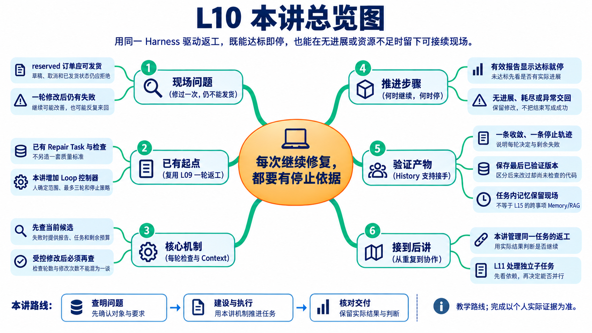
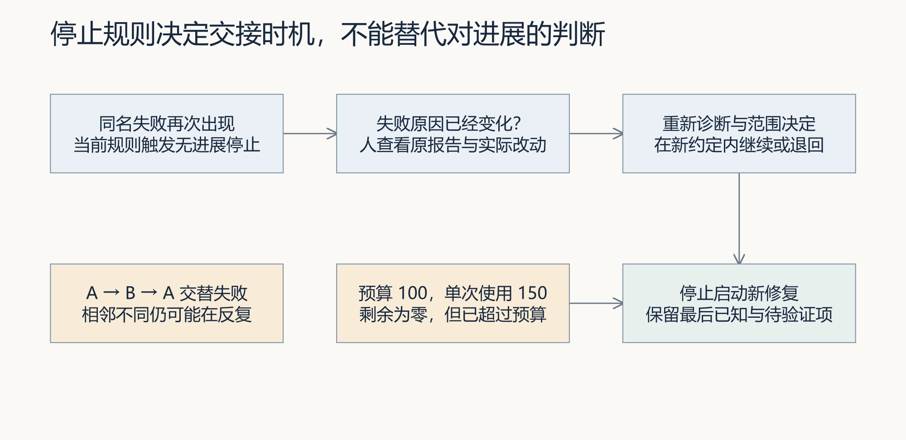
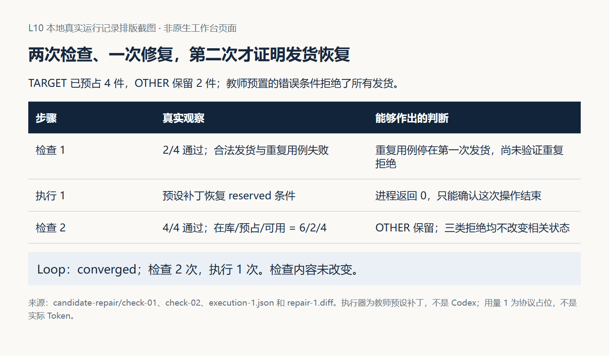
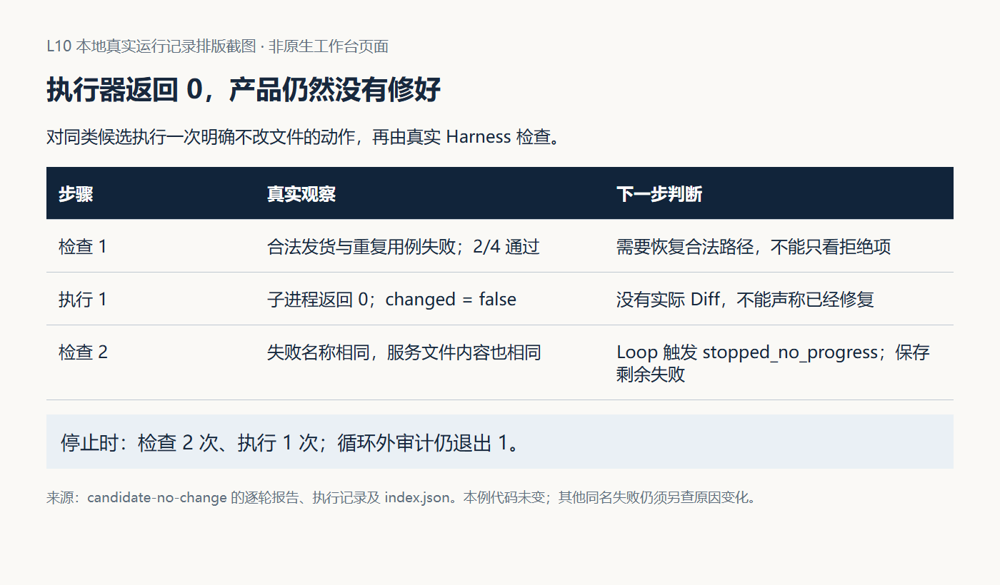
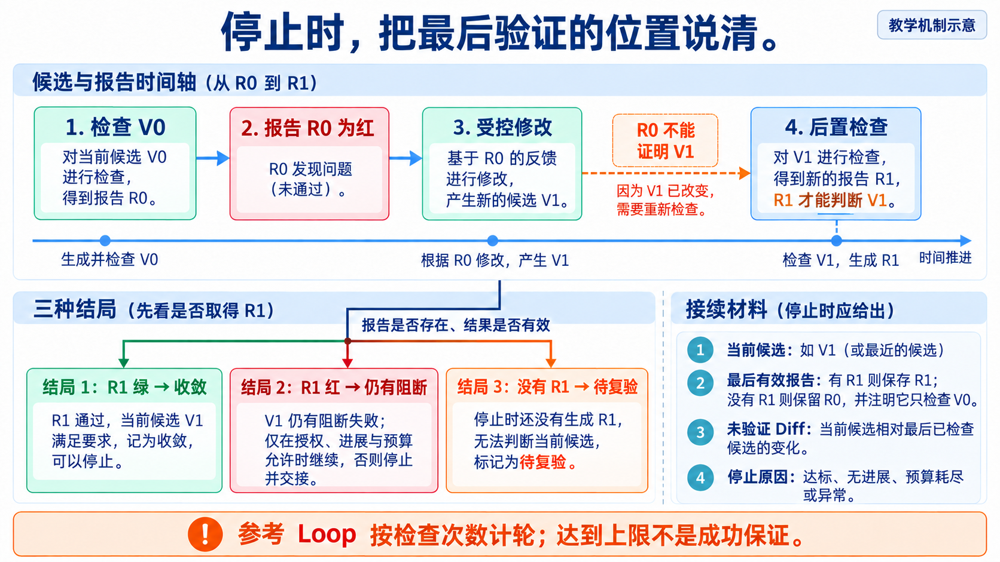
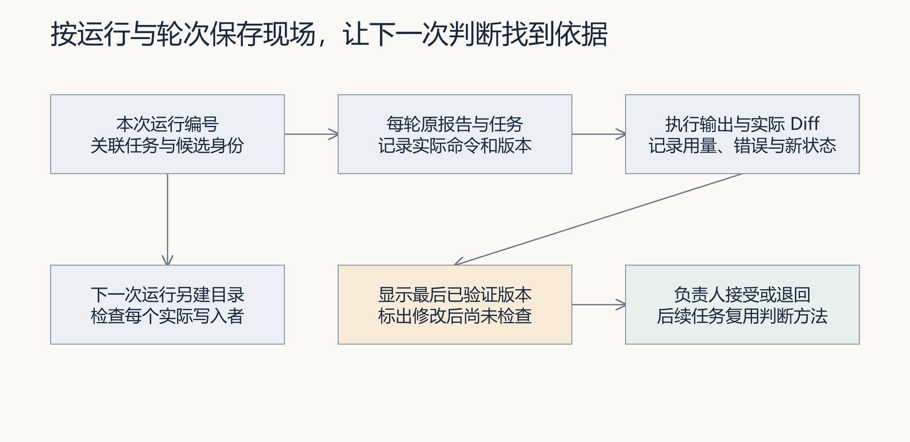

# L10｜建立有停止条件的修复 Loop

> 本资料由 AI 辅助整理，为课程赠送资料，用来辅助你理解课程内容，可作为查询手册使用，非必读资料。

## 本讲总览图



## 本讲总览

本讲把 L09 的一次返工接成 Loop。每轮读取当前检查、形成 Repair Task、受控修改、再用同一 Harness 复验；达标即停，无进展、预算耗尽或异常也要停。产品目标是合法订单可发货、非法状态仍被拒绝。你要留下收敛与未收敛两条真实轨迹，解释最后验证到哪一版。

## 林舟的项目手记

取消订单的修复让林舟有了一套返工办法。继续检查发货时，他又碰到一份候选：为了阻止非法跳转，程序把合法发货也拒绝了。Codex 改过一轮，Harness 仍有失败。

“那就继续改，直到通过？”林舟写到一半停下来。再改一轮可能改善，也可能反复来回，甚至留下未经检查的新代码。他先与陈珂约定最多三轮、怎样算有进展、什么时候交回，再请 Codex 补齐工作台的循环控制。

人物与开场对话为虚构教学情境；实测材料按原注释辨认来源。人物关系与连续路线见[讲义阅读导航](../讲义阅读导航.md)。

## 本讲学习目标

完成本讲后，你应能做到：

> 借助 Codex 建设一个最多三轮的修复 Loop，用固定 Harness 反馈组织下一轮任务；在达标、无进展、预算耗尽或执行异常时停止；并用 Loop History 说明最后验证到哪里、还剩什么问题以及为什么作出这个决定。

## 本讲交付合同

| 要回答的问题 | 本讲答案 |
|---|---|
| Codex 怎样协作 | Codex 协助建设 Loop，并在每轮 Repair Task 的授权范围内修改产品候选 |
| FlowERP 形成什么状态 | 合法订单可以发货，草稿、取消和已发货订单仍被拒绝 |
| 工作台新增什么能力 | 串联执行、Harness、Repair Task 和再执行，并根据进展与预算停止 |
| 学生怎样证明会做 | 留下一条真实收敛轨迹、一条真实停止轨迹，以及本人判断和复验记录 |
| 人保留什么责任 | 确认目标、范围、预算和停止策略，核对 Diff，并作最终接受或退回决定 |

## 1 从一轮仍然失败开始

林舟沿用 L09 的任务生成方法，处理的是新的发货问题。他先固定合法与非法状态要求，再判断这一轮的变化。取消订单的通过记录不能替代下面的发货检查。

以 FlowERP 的订单发货为例，已确认规则是：

- `reserved` 订单可以发货；
- `draft` 和 `cancelled` 订单不能发货；
- 已经 `shipped` 的订单不能再次发货；
- 一次发货不能破坏其他订单的预占和库存状态。

假设候选 V0 为了阻止非法跳转，把所有发货请求都拒绝了。它保护了非法路径，却破坏了合法业务。第一次修复得到 V1 后，工作台不能仅凭 Codex 返回 0 就认为任务完成，而要让同一套 Harness 检查 V1。

如果 V1 仍然失败，负责人需要回答四个问题：

1. 最新报告是否来自刚修改的候选；
2. 本轮是否真正改善了已确认问题；
3. 下一轮是否仍在允许范围和预算内；
4. 如果现在停止，接手者能否知道最后验证到哪里。

这些问题共同决定 Loop 是继续、停止还是交回人处理。Loop 的价值不是多运行几次，而是把每次继续都变成有依据的决定。

## 2 一个完整决策轮怎样运行

当前参考实现 `agent.loop.run_loop` 把一次 Harness 检查记为一轮。每轮先检查当前候选；若有阻断失败且仍允许继续，才生成 Repair Task 并调用执行器。修改后的候选在下一轮开头接受检查。

因此，本讲统一采用下面的计数约定：

> 一轮是一次 Harness 决策轮。一次修改只有在后续轮次通过 Harness 检查，才能记为已验证改善。若最后一轮发生修改但没有后置检查，结果必须标记为待复验。

一个决策轮包含六个动作：

1. Harness 加载当前候选并运行固定检查；
2. 工作台确认报告有效并提取阻断失败；
3. L09 映射器生成只针对当前失败的 Repair Task；
4. 工作台核对写集、剩余轮数、时间和 Token；
5. Codex 在授权范围内创建一个新候选；
6. 工作台保存实际输出和 Diff，进入下一轮回判。


图 1｜修改发生在两次检查之间。只有后置 Harness 报告能够证明新候选是否改善。

### 2.1 人与系统分别负责什么

| 角色或组件 | 本讲责任 |
|---|---|
| 人 | 确认业务目标、允许写集、预算、停止策略和最终接受 |
| 工作台 Loop | 调用检查、建任务和执行器，保存历史并决定继续或停止 |
| Codex | 根据当前 Repair Task 调查并修改候选，不自行扩大范围 |
| Harness | 对实际候选给出独立反馈，不因修复方法而改变标准 |
| Loop History | 保存每轮候选、动作、报告、资源和决定，使任务可以接续 |

Loop 不重新定义业务正确性，也不替代人验收。它自动组织的是已经确认的单次修复动作。

### 2.2 三条轨迹不能混为一种结果

| 轨迹 | Harness 次数 | Codex 修改次数 | 正确结论 |
|---|---:|---:|---|
| 起点已经通过 | 1 | 0 | 当前候选通过，没有发生自动修复 |
| 失败后修改并通过 | 2 | 1 | 修改后的候选经后置检查收敛 |
| 失败后修改并达到上限 | 1 | 1 | 已修改但尚未在 Loop 内复验 |

模型回复“已经完成三轮”不能代替三次真实检查。轮数、执行次数和最后报告对应的候选必须能够从历史中重建。

## 3 工作台只需要作出四类决定

林舟把继续与停止写成固定顺序：先查报告有效性，再看是否达标，接着判断进展，最后核对资源。这样每轮都有相同依据，不让执行者为了继续工作临时降低门槛。

| 决定 | 触发条件 | 工作台动作 |
|---|---|---|
| 达标停止 | 当前候选的有效报告没有阻断失败 | 返回 `converged`，保存报告，进入人工接受 |
| 继续一轮 | 仍有阻断失败，但出现可说明的改善且范围和预算允许 | 生成下一轮 Repair Task |
| 安全停止 | 无进展、达到轮数上限或预算不足 | 保存剩余失败和最后已知状态，不再启动修改 |
| 异常交回 | 检查、任务生成或执行发生异常 | 保存异常、Diff 和待复验动作，交给人调查 |



图 2｜不同停止原因对应不同现场。不能把所有 stopped 状态统一写成“修复失败”。

### 3.1 达标即停

Harness 对当前候选给出有效绿灯后，Loop 立即停止，不再调用 Codex。多做一次修改不会增加正确性，只会扩大未经需求支持的变化。

`converged` 只说明当前候选在指定任务和检查条件下通过。负责人仍需核对候选身份、Diff、写集和产品行为，才能决定接受或退回。

### 3.2 无进展就停

当前参考实现把阻断失败名称排序后形成签名。连续两轮签名相同，就返回 `stopped_no_progress`。这条规则容易检查，但只是触发人工复核的近似判断。

这个签名是一项低成本的停止策略，不是距离正确答案的精确测量。同名失败可能从模块导入错误推进到业务断言，也可能一直没有变化；失败数量从二降到一，也可能是删掉了一项检查。判断进展时要固定检查集合，再看期望与实际、业务不变量和 Diff。若失败集合按 A、B、A 交替出现，还应调查是否在两种错误实现之间来回切换。课程参考签名未捕获全部情况，学生应说明采用这项近似的代价，并在疑点出现时交回调查。

本次订单任务可以用以下证据判断是否有进展：

- 合法发货是否从拒绝推进到成功；
- 非法状态是否仍全部被阻断；
- 其他订单和库存状态是否保持不变；
- 本轮 Diff 是否触及实际原因；
- 是否重复采用已经失败的方法。

学生应在启动任务时写明进展标准。若无法判断两个候选谁更接近目标，就保留事实并交回人处理，不能让 LLM 临时更改权重挑选结果。

### 3.3 最大轮数不是成功保证

本讲最多运行三轮。达到上限只表示工作台不再继续消耗资源，不表示第三轮必然修好。

若第三轮开头检查仍红，随后执行器完成了修改，当前参考实现会以 `stopped_max_rounds` 结束。此时最后报告仍来自修改前候选。正确表达是“已有修改，尚待复验”，不能说修改无效，也不能说已经收敛。

## 4 预算与异常怎样安全退出

林舟约定最多三轮，陈珂又问：“第一轮卡住很久怎么办？”轮数限制管不了所有等待，因此还要约定时间与 Token 预算。触发任一停止条件后，程序停止新动作，保留已经发生的修改和检查。

| 限制 | 控制对象 | 达到限制后的正确处理 |
|---|---|---|
| 最大轮数 | 最多进行多少次 Harness 决策 | 输出剩余失败和是否存在待复验修改 |
| 时间预算 | 本次任务最多占用多久 | 不再开始下一动作，保存最后报告和运行输出 |
| Token 预算 | 最多投入多少模型处理量 | 不再调用 Codex，记录已核验用量和剩余额度 |
| 执行异常 | 检查或修改过程失去正常返回 | 记录异常、当前 Diff 和未知状态，转人工调查 |

当前参考 Loop 在 Codex 返回后累计执行器报告的 `total_tokens`。如果预算为 100，而一次调用使用 150，它会记录实际用到 150，并停止下一轮。这是“达到或超过以后不再继续”，不是调用前的硬额度保证。

执行器没有返回可核验用量时，当前实现返回 `stopped_token_usage_unavailable`。这表示预算策略无法继续执行，不表示本轮没有成本。

时间预算也不是完整的硬墙钟。当前代码会把剩余时间传给 Codex，但没有为 Harness 设置同等的独立超时。学生必须说明控制器实际约束到了哪一层。

执行器超时或抛出异常时，也不能假定文件没有变化。安全退出至少保存：

- 动作已经启动的事实；
- 最后一次已知 Harness 报告；
- 当前工作区 Diff；
- 尚未完成的后置复验；
- 建议由谁接手以及先检查什么。

当前 `agent.loop.py` 还没有完整捕获所有执行异常。补齐异常交回语义属于本讲工作台建设任务；已有进程退出或截图不能证明现场已经保存。

## 5 用两条轨迹理解继续与停止

下面继续使用同一个 FlowERP 订单发货案例。教师候选实验采用预设补丁或无修改动作，用于观察控制顺序；它不构成学生的真实 Codex 修复、真实 Token 用量或具名接受。

### 5.1 一次真实收敛需要前后两份报告

错误候选把合法发货也全部拒绝。第一轮 Harness 检查得到阻断失败，L09 映射器生成 Repair Task，执行器恢复合法迁移条件。第二轮 Harness 加载修改后的候选并通过，Loop 返回 `converged`。



图 3｜轨迹中有两次检查和一次修改。第一份红灯证明问题存在，第二份绿灯才证明修改后的候选在当前检查范围内通过。

这条轨迹的产品结果是合法发货恢复，非法跳转仍被拒绝；工作台结果是能够完成一次“检查、修复、再检查”并达标停止。

### 5.2 一次未收敛也必须留下可用结果

另一条轨迹中，执行器正常退出却没有修改文件。第二轮仍出现相同失败，Loop 返回 `stopped_no_progress`。



图 4｜执行进程退出 0 与产品仍未修好可以同时成立。工作台停止重复消耗，并保存候选未变、剩余失败和停止依据。

未收敛轨迹的价值不是“失败了一次”，而是让接手者知道：最后检查了哪个候选、尝试过什么、为什么没有改善、下一步应重新调查还是扩大范围。

### 5.3 末轮修改必须单独标记待复验

若上限设为一次检查，执行器修改后 Loop 立即达到上限，`remaining_failures` 仍来自修改前报告。参考实现没有单独的 `pending_verification` 状态，学生可以补充这一状态，或在循环外安排一次只读审计。

循环外审计必须另存记录，并标明它不属于原 Loop 轮次。它可以判断最后修改是否有效，但仍不等于负责人已经接受产品结果。

这三种观察共同说明：Loop 不只负责继续，也负责在继续不再合理时准确停止。



*读图：R0 只检查 V0；修改产生 V1 之后，必须取得 R1 才能判断新结果。没有 R1 时，应交接待复验的改动。*

这里可以用两项信息完成最重要的核对：当前候选是谁，最后有效报告检查的是谁。两者一致，才讨论该报告的红绿；两者不同，先标出尚未检查的改动。例如 V1 已经生成、预算恰好耗尽，就保存 V1、R0 和 V0 到 V1 的 Diff，下一位接手者先复验 V1。不能据旧红灯断言 V1 无效，也不能据执行器正常退出认定它已修好。这正是停止状态必须包含业务事实而不只包含一个单词的原因。

## 6 Loop History 怎样支持接续

林舟停下修复后，把 History 交给陈珂。她应能找到最后验证过的代码、随后是否又有改动，以及剩余失败；若仍要问原执行者才能接手，记录就缺了关键内容。每轮至少保存：

- 运行编号、轮号和当前候选身份；
- 本轮 Harness 报告及阻断失败；
- 由报告生成的 Repair Task；
- Codex 实际输出、Diff 和退出结果；
- Token 与时间使用情况；
- 继续或停止的决定及理由；
- 最后修改是否已经复验。



图 5｜历史要说明最后验证到哪里。接手者应先找到最后已验证候选，再决定复验、重新调查或继续修复。

当前参考实现会保存每轮失败名称、任务草案和执行器摘要，但默认 Harness 报告可能写入固定路径，完整 stdout 和 stderr 也没有全部进入返回值。学生实现应按“运行编号和轮号”隔离目录，并分别保存原始材料与人读摘要。

### 6.1 下一轮只读取必要上下文

下一轮 Codex 不应只看到最新一句报错，也不需要读取从项目开始以来的全部日志。工作台应从 History 组装一个最小上下文包：

```text
固定输入
- 已确认的产品目标与禁止事项
- 允许写集和候选身份
- 固定 Harness 命令与停止条件

本轮新增
- 上一轮 Repair Task
- 上一轮实际 Diff
- 最新 Harness 失败事实
- 已尝试但没有解决的方法
- 剩余轮数 时间和 Token
```

这项上下文装配让下一轮避免重复已经失败的方法。它是 Loop 内的任务记忆，不代表工作台已经形成跨事项记忆闭环。只有前一事项经验被后一独立事项召回、采用并再次验证，才能说明经验开始复用。

### 6.2 最佳候选只是防止回归的护栏

若新候选比上一个已验证版本退步，工作台应保留历史较优候选及其报告，下一轮从较优候选建立新副本。这里的“较优”只指同一目标、同一检查和同一预算条件下更接近通过。

候选存在不同失败且无法按预先规则比较时，交回人决定。不得删除退步候选、修改 Harness 或临时改变评分标准来制造“更好”。

当前 `agent.loop.py` 没有最佳候选快照和排序逻辑。这项能力用于处理回归和停止后的接续，不是本讲基本通过标准；学生可将其作为进阶改进，并单独验证。

## 7 学员本讲真正要完成什么

### 7.1 产品增量

通过个人工作台组织有界修复，使 FlowERP 恢复合法订单状态迁移：合法发货可以完成，草稿、取消和已发货订单仍被拒绝，其他订单与库存状态不受破坏。

本讲复用已经确认的业务 Harness，不重新展开测试设计。若必须修订测试，应另存原版本、修改理由和审批记录，不能让修复候选同时降低评价标准。

### 7.2 工作台增量

实现或补齐一个最多三轮的修复 Loop，串联：

```text
执行 → Harness → 生成 Repair Task → 再执行
```

学生先指导 Codex 升级工作台控制器，再让工作台组织订单修复。控制器建设和 FlowERP 产品修复分别确认写集，避免产品修复在同一轮修改自己的评价规则。

Loop 必须支持达标即停、无进展停止、最大轮数、时间预算、Token 预算和异常交回。每轮历史必须能够对应到实际候选和实际报告。

### 7.3 学习证据

学生本人至少留下两条轨迹：

1. 一条真实收敛轨迹，包括前置红灯、Repair Task、Codex 实际修改和后置绿灯；
2. 一条真实停止轨迹，包括停止原因、最后已验证候选、实际 Diff、剩余失败和接续建议。

同时记录实际命令及退出码、检查次数、执行次数、资源使用、每轮候选身份，以及负责人对结果的接受或退回决定。

如果真实修复第一轮就通过，立即停止，不为凑够三轮制造额外修改。控制替身和教师截图可以解释顺序，不能替代学生的真实 Codex 执行、真实产品复验或具名接受。

### 7.4 FDE 在本讲怎样发生

现场订单问题给出产品目标；学生与 Codex 根据失败建设有界 Loop；工作台组织授权、执行和复验；FlowERP 的新状态与停止历史交回业务确认者。重复发生的继续与停止判断被保留为工作台能力，供下一次返工使用。

因此，本讲不是单独学习一个循环算法，而是让工作台能够对真实交付作出受控的继续和停止决定。

## 8 从纵向修复进入横向协作

L10 解决同一任务怎样按顺序重复，以及什么时候停止。L11 将处理多个彼此独立的任务能否交给不同 Subagents 并行执行。

```text
Loop 处理同一任务的纵向重复
Subagents 处理独立任务的横向分工
```

两种方式都继承 L09 的任务边界。会修改同一文件的任务不能为了追求并行而同时执行；无论循环还是并行，主 Agent 都要能够追溯每个结果来自哪个候选和哪份检查。

## 课后思考

1. 第一轮返回 `converged`，执行次数为零，为什么不能说自动修复成功？
2. 最后一轮完成修改，为什么仍可能处于待复验状态？
3. 同名失败的原因发生变化，为什么不一定属于无进展？
4. 一次调用超过剩余 Token，为什么只能停止后续调用，不能声称从未超预算？
5. 执行器异常以后，哪些材料能说明代码是否已经变化？
6. 未收敛退出时，什么记录能让下一位接手者继续？
7. 新候选出现回归时，为什么要保留历史已验证候选？
8. 一次修复收敛为什么不能证明模型权重已经更新或记忆闭环已经完成？

## 离开这一讲之前

循环停下后，陈珂应能从 History 找出最后已验证版本，而不用问林舟“最后一次到底改好了没有”。接下来的采购申请同时需要补测试和查风险。问题从是否再做一轮，转向哪些工作可以分给不同执行者。

## 配套材料

- [行动卡](行动卡.md)
- [个人提交模板](SUBMISSION.md)
- [实践操作手册](实践操作手册.md)
- [完整课堂 PPT（29 页主线自学版）](slides/L10-建立有停止条件的修复Loop-主线自学版-29页-插图重设计.pptx)

配套材料用于完成控制实验和个人交付。阅读时以本讲主线和上位课程合同为准；控制替身、教师候选和个人真实运行必须分别标注。

## 附录 A 本讲课程大纲合同

本讲对应 CLO-4 受控返工。以下内容保持上位课程合同原文。

- **核心内容**：最大轮数、达标即停、无进展检测、时间与 Token 预算、安全退出。
- **演示结果**：修复循环成功收敛一次，并展示一次未收敛退出。
- **课内增量**：串联“执行 → Eval → 生成修复任务 → 再执行”。
- **验收命令**：`python -X utf8 -m agent.loop --max-rounds 3`
- **通过标准**：最多三轮；达标即停止；无进展或预算耗尽时输出剩余失败，不宣称成功。

## 附录 B 当前实现与进阶建设边界

| 能力 | 当前参考实现 | 本讲要求 |
|---|---|---|
| 最大轮数和达标停止 | 已实现 | 必须理解并验证 |
| 无进展与时间、Token 预算 | 已实现近似或部分控制 | 必须解释适用边界和控制层级 |
| 末轮待复验与异常交回 | 可观察但状态和保存不完整 | 必须在历史中明确标记并补齐交回 |
| 最佳候选快照与最小上下文 | 尚未自动接通 | 进阶任务，不属于基本通过标准 |
| 跨事项记忆复用 | 本讲不能证明 | 留到后续独立事项验证 |

GEPA 通过轨迹反思改进提示词候选，提供了相关研究思路。本讲只借鉴“反馈应改变下一次行动”的思想，不运行提示词搜索，也不涉及模型训练或权重更新。

## 本讲一手来源

核验日期：2026-09-11。

- 本仓库 `agent/loop.py`：有界 Loop 的当前参考实现。
- 本仓库 `agent/repair.py`：L09 Repair Task 映射器。
- 本仓库 `eval/harness.py`：每轮统一回判入口。
- [FlowERP service.py](https://github.com/congde/flowERP/blob/main/flowerp/service.py)：订单服务实现来源。
- [FlowERP sales.py](https://github.com/congde/flowERP/blob/main/flowerp/sales.py)：销售状态迁移实现来源。
- [GEPA 论文](https://arxiv.org/abs/2507.19457)：Reflective Prompt Evolution Can Outperform Reinforcement Learning，arXiv:2507.19457，用于理解轨迹反思与候选选择。
