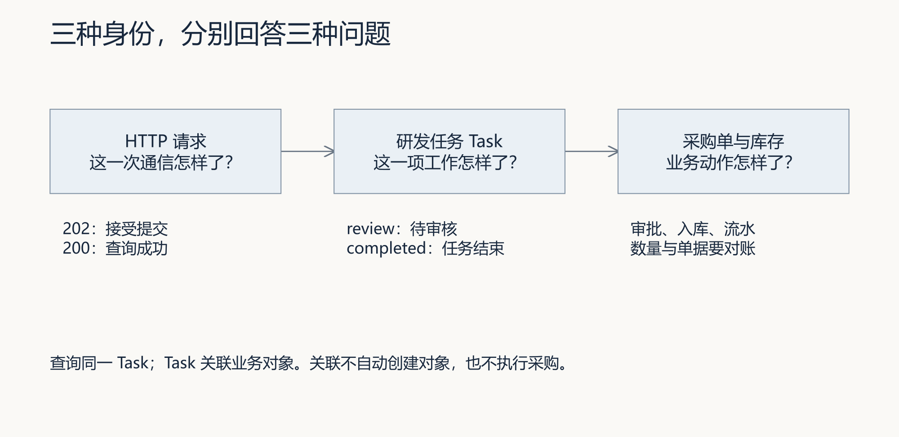
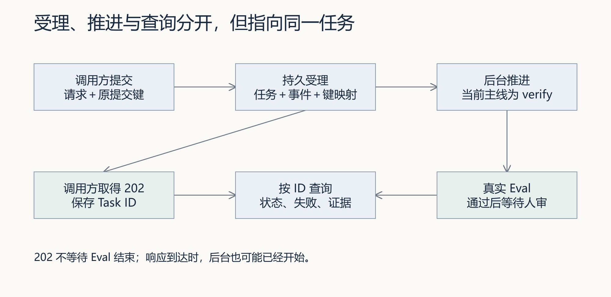
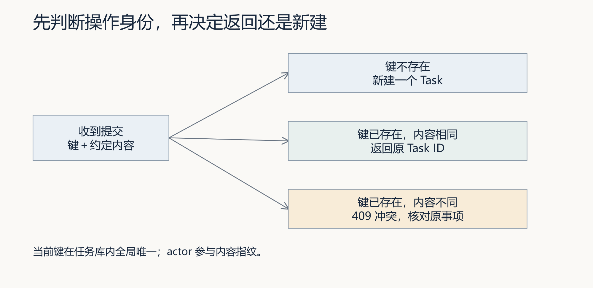
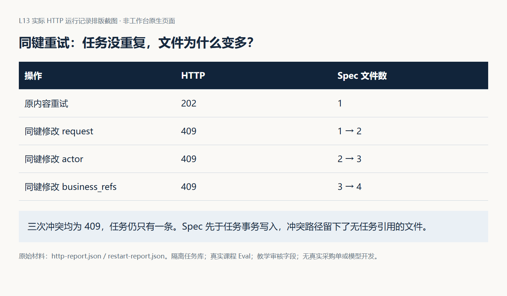
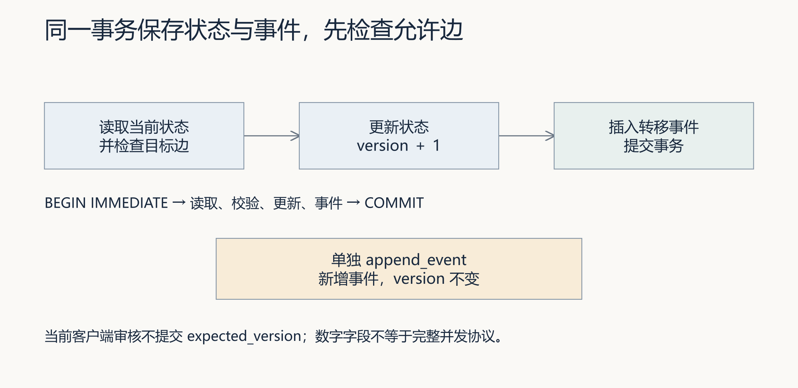
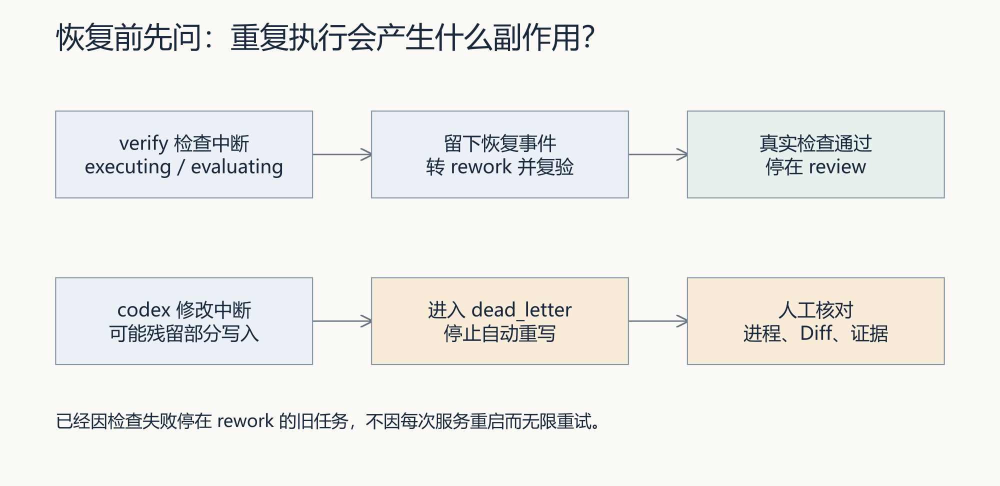

# L13｜把执行链路封装成任务 API

> 本资料由 AI 辅助整理，为课程赠送资料，用来辅助你理解课程内容，可作为查询手册使用，非必读资料。

## 本讲总览图

## 本讲总览

本讲把受理和执行分开，依次处理请求身份、任务状态、重复提交、持久化与重启恢复。你定义任务含义和权限，Codex 协助实现。通过 API 组织补货交付仍须有真实执行与产品复验；当前参考接口默认 verify，只复验已有实现，不能当作已驱动新代码交付。

## 林舟的项目手记

FlowERP 运营周宁请林舟跟进商品 A 的补货事项，强调七件、先审批、同一收货不能重复入账。工作台返回了“请求成功”，她关掉页面后又想查进度，却不知道刚才成功的是受理、研发交付，还是采购入库。

林舟意识到，上一讲把流程内部的去向写清了，外部接手者还缺一个能持续查询的对象。他与 Codex 开始设计任务 API：先给请求一个稳定的任务编号，再用这个编号查状态、事件和证据。

人物与开场对话为虚构教学情境；实测材料按原注释辨认来源。人物关系与连续路线见[讲义阅读导航](../讲义阅读导航.md)。

## 1 为什么需要任务 API

先从接手者遇到的困难出发，确定为什么要保存一个独立于聊天窗口的任务。只有明确这个对象负责什么，才能继续约定接口。

### 1.1 从一段对话，到一个有寿命的工作对象

如果每次工作都依赖同一个聊天窗口，人就要记住上下文、重新描述起点、寻找运行日志，并猜测上次执行有没有结束。当网页刷新、命令行退出或服务重启，这些脆弱的连接会断开。把聊天记录保存下来能帮助追忆，却不能直接回答“这项交付现在允许执行什么动作”。

任务 API 把请求变成一个可识别的工作对象：它有稳定编号、需求来源、合同、执行方式、当前状态、事件、检查报告和审核决定。界面只是提交和查询它的入口。终端脚本、工作台页面、后续集成程序可以围绕同一个编号工作，而不是各自制造一份“当前进度”。

API 是程序之间约定的接口。这里的重点不在 HTTP 名词，而在接口承诺：接收什么，什么时候算受理，如何查询，失败如何表达，哪些动作必须由人决定。如果这些含义不清，即使所有请求都返回 200，协作仍然会混乱。

### 1.2 API 把完整需求链路连接起来

图 1 为课程建设目标示意。箭头代表前一阶段的结论成为后一阶段的输入，不代表每一步都已自动实现。线上效果回收要带回原需求，再决定是否发起新事项。

业务问题是“缺货造成多少影响”；PRD 说明给谁解决、范围和可观察行为；技术方案说明怎样实现、边界与取舍；开发产生候选；测试收集证据；线上效果回收检查真实使用后是否改善。一个 Task 可以承担其中一段受控执行，不能因为有一个 task_id，就认为六个阶段全已发生。

补货案例中，“库存不足”不能直接跳到“调用入库函数”。先确认本次是建设采购审批功能，还是使用既有功能执行一张采购单；两者的授权、完成标准和副作用不同。研发任务可以交付“未经审批不可入库”的能力，真实采购还需要业务审批。工作台的交付审核不能代替采购人的决定。

### 1.3 不打开 Codex App，任务仍可被组织

Codex App 是一种人与 Codex 交互的入口。项目也可以通过 CLI 和受控执行器组织任务：工作台根据项目目录和合同准备上下文，调用执行器，在授权范围内运行 Codex，再运行 Eval、保存证据并等待审核。因此，不打开桌面 App，并不等于不需要 Codex，也不等于可以省略项目环境、执行进程和授权。

本讲先把服务入口和任务存储做可靠。当前课程工作台的异步受理接口默认只运行 `verify`：按课程合同准备 Spec，复验已有实现。它不调用 Codex 修改代码。要证明“API 驱动了一次新功能交付”，还必须接上真实执行器，并给出候选 Diff、前后验收和人的决定；不能把本讲参考接口的绿报告当成那个证明。

## 2 先分清三个身份、三种成功

周宁追问刚才那句“成功”，林舟把请求、研发任务和采购单三个编号摆在一起。收到请求、交付软件和货物入库各有自己的依据，下面逐个说明它们如何关联。

图 2 为对象关系示意。一个任务可以关联业务对象；一次查询也可以读取这个任务。关联引用是对账线索，不自动证明对象存在或业务动作发生。

### 2.1 HTTP 请求回答“这一次通信怎样了”

提交请求可能很快返回，开发和检查则需要更久。让连接一直等到全部工作结束，会让刷新、网络超时和客户端重试与长任务纠缠。异步接口先接受请求并返回编号，再由后台推进；客户端之后查询这个编号。

当前主线的成功受理返回 202。它表示接口已经接受这一提交，不表示 Eval 通过，也不表示库存改变。GET 查询返回 200，只说明查询成功；响应中的任务仍可能是 rework。客户端必须同时读取 HTTP 状态和任务内容，不能把任意 2xx 转成“交付完成”。

### 2.2 Task 回答“这一项研发工作怎样了”

task_id 在多次查询、同一提交的重放、服务重新打开后保持不变。任务记录应让后来接手的人找到原请求、Spec、业务引用、执行阶段、失败原因和证据。事件记录的是过程，当前状态负责支持下一步决策。

当前课程任务的主要成功路径为 queued → spec_ready → executing → evaluating → review → completed。名称为 executing 的状态本身不证明执行了 Codex；还要检查 execution_mode 和执行器入口。verify 模式也会经过该状态。review 是等待审核，completed 才是符合当前任务完成守卫的结束。

### 2.3 采购单回答“业务动作怎样了”

采购单有自己的编号、状态和明细。假设 A 原来在库 10、预占 2、可用 8，真实审批后的 +7 入库应得到 17、2、15，并且留下属于这张采购单的一次流水。任务报告中包含 `PURCHASE:某编号`，不会自动做到这些事。

| 观察 | 可以支持的判断 | 还不能证明什么 |
|---|---|---|
| POST 返回 202 和 task_id | 已受理，可按编号跟踪 | 开发完成、检查通过、采购入库 |
| GET 返回 200，status 为 rework | 查到了需要返工的任务 | HTTP 成功不等于任务成功 |
| status 为 review，报告通过 | 检查完成，仍待审核 | 已得到有权限的人批准 |
| status 为 completed | 当前任务完成守卫接受了审核 | 真实身份已认证、ERP 数据已改变 |
| 采购单、库存、流水一致 | 所检查业务动作及数据相符 | 线上缺货率已经降低 |

最后一行还需要效果回收。例如同一统计口径下的缺货次数、补货耗时和异常比例。演示数据只能帮助学会对账，不能当作真实客户收益。

## 3 受理与执行怎样分开

林舟决定，受理时先可靠地保存工作对象并返回编号。后面的执行可能需要等待或失败，周宁仍应查到同一任务。下面据此区分接口返回与任务最终结果，避免让一个成功响应承担过多含义。

图 3 是主线受理路径的机制示意。后台可能在响应到达前已经开始运行；异步的关键是响应不等待 Eval 完成，而不是保证客户端一定先看到 queued。

图 4｜本次真实 HTTP 实验先暂停 Eval，确认 POST 已返回 202，再查询到 evaluating；放行后到 review。按原 Task ID 对照原始响应，说明为什么这些状态都不能直接表示采购入库。

### 3.1 一次受理至少留下什么

TaskStore 把任务、初始事件和提交键映射放入同一次数据库事务。这样返回编号时，后续查询才有依据。如果先响应“已接受”，再尝试保存，保存失败会留下一个客户端持有、系统却不认识的编号。

数据库事务只保护包含在其中的写入。当前课程入口先写独立 Spec 文件，再创建任务；同键同内容重放后会清掉新写的多余文件，但同键冲突的异常路径会留下无任务引用的 Spec 文件。任务表没有重复行，并不意味着文件系统也没有残留。本讲实验会数出这个区别，让你判断事务边界到底在哪里。

任务合同也不能仅靠一个可变路径表示。独立目录减少不同任务互相覆盖，但审核仍需要确认本次读了哪份内容。对重要输入可以保存快照与摘要，并把报告绑定到该快照和候选。这里的摘要指内容校验值，不是模型总结。

### 3.2 后台队列解决什么，没有解决什么

当前 DeliveryAutomation 用线程执行任务，限制同时运行的数量，并用内存列表排队；任务和事件保存在 SQLite。它适合课程的单机工作台，但不等同分布式任务系统。服务重启后，内存线程和队列不会自动复活，需要从持久任务中识别可恢复工作。

两个工作线程争抢同一任务，和两个服务实例同时运行，不是同一个问题。单进程锁能减少本进程重复启动；数据库状态守卫约束状态写入；正常服务入口还有运行目录租约。它们分别保护不同层，不能拿“有锁”笼统代替对执行所有权、超时和外部副作用的分析。

### 3.3 主线两种提交接口不要混用

| 当前 :8001 主线接口 | 实际行为 | 学习时怎样使用 |
|---|---|---|
| POST /api/v1/delivery/requests | 要求提交键；受理后返回 202；后台 verify | 本讲主要提交入口 |
| GET /api/v1/tasks/{id} | 读取任务及事件，返回 200 或不存在的 404 | 同编号追踪状态与原因 |
| POST /api/v1/tasks | 同步创建并复验，成功返回 201 | 对比旧入口，不能当异步受理 |
| POST /api/v1/tasks/{id}/review | 接收审核字段，成功 200；状态等错误当前为 400 | 在本地实验观察审核守卫 |

仓库还有其他 API 实现，同名路径未必具有相同行为。先确认运行入口、端口和处理函数，再阅读接口说明。不要把另一套带用户权限的服务约定套到课程工作台上。

## 4 重试为什么需要提交身份

林舟考虑一种中断：服务已保存任务，响应却没有到达周宁的页面。她再提交一次时，服务需要认出原操作；否则一次补货事项会变成两项工作。相同提交键却改了内容，又必须另作处理。

客户端提交后没有收到响应，可能是请求根本没到，也可能是任务已经保存，只是响应丢了。直接换一个新编号重发，会把通信重试变成第二项工作。让用户“不要连点”只减少一种入口的重复，解决不了网络和脚本重试。

图 5 为当前课程 TaskStore 的提交键规则。同键同约定内容返回原任务；同键不同约定内容冲突。新键表示新的提交，不承诺按自然语言语义去重。

### 4.1 提交键与 Task ID 的分工

提交键与 Task ID 处在一次请求的不同时间。调用方先为操作确定 K，服务受理后才产生任务 T。若响应在返回途中丢失，调用方还不知道 T，却仍持有 K，因此能用它重新找到原操作。这两个编号的价值就在“尚未收到回答”的空隙里。

*读图：服务端已保存与客户端已知道是两件事。沿 K 找回 T，才能避免把一次通信恢复变成第二项业务。*

同键重试还必须比较协议定义的内容。K 原来对应采购七件，再带着十件重发，是业务要求变化，不是原请求的简单重放。服务应按约定返回冲突，调用方核对原任务后再决定是否建立新事项。可靠的去重还要求“查键、建立任务、保存关联”不能被两个同时到达的请求各做一半；实现时要核对事务与唯一约束，验证时则观察最终任务数和原内容。下面继续看当前课程接口具体包含哪些字段。

当前接口把 `Idempotency-Key` 请求头交给 TaskStore。键在同一个任务库内全局唯一；actor 属于内容指纹的一部分，不是独立的键命名空间。因此甲和乙使用同一个键，即使请求文字一样，也可能得到冲突。多人或多项目接入时，应明确选择命名空间、保留期限与查询权限，再设计协议，不能误称当前已经按账号隔离。

当前指纹包含请求文字、需求编号、业务引用列表、actor、执行方式、写入范围、超时和自动化模式等字段。实际 Spec 文件内容不在指纹中。列表的顺序也进入序列化内容。因此“同内容”应指协议定义的规范内容，而不是肉眼觉得意思相同。哪些字段忽略空格、哪些列表按集合处理，都需要事先约定。

图 6｜沿用同一个提交键，第一次重复原内容，后三次分别改变请求、提出者和业务引用。三次冲突后任务数仍为一，Spec 文件数却逐次增加；文件写入位于任务事务之外。这是当前实现的缺口，不能因为实验断言通过就称已经修复。

### 4.2 提交幂等不等于收货幂等

提交键防止同一次请求创建多个 Task。收货幂等键防止同一业务操作增加多次库存。就算只有一个 Task，后台也可能因为失败恢复而多次尝试入库；就算每次收货幂等正确，客户端也可能创建了两张本来不该存在的采购单。

沿整条链有三个需要分别判断的动作：提交是否只建立一个 Task，执行中断后是否安全接续，同次收货是否只增加一次库存。前端禁用按钮只影响点击；任务提交去重只影响 Task 身份；业务幂等才约束重复收货的效果。一个 Task 仍可能重试执行，多项 Task 也可能引用同一业务对象。因此实验分别比较任务数、执行轨迹、采购状态和库存流水。L12 的结论仍成立：后来补齐单据，不等于首次写入已经保持原子性。

### 4.3 冲突应该让调用方作出决定

遇到同一提交键但内容变化，先让提出需求的人判断是在重试，还是改变了补货要求。若是改变需求，应回到确认过程，不能悄悄用旧任务结果回答新内容。学生负责约定冲突后可采取的动作，Codex 实现并保留依据，复验者验证原任务与业务对象仍可追踪。这是把现场沟通中的歧义落实为接口的可观察行为。

同键改需求，当前接口返回 409。正确操作是查明原提交，而不是捕获所有异常后自动换键。自动换键虽然让请求继续成功，却会破坏“这是同一次操作”的约束。只有人在业务上确认是新事项，或协议明确规定新的操作身份，才应创建新的提交键。

## 5 状态、事件和版本怎样相互支撑

提交身份解决了“是不是同一项工作”，但同一项工作也会不断变化。下面转向任务内部：怎样限制下一步、保留过程，并避免把过期的决定写进当前结果。

图 7 为当前状态转移的数据库机制。版本递增发生在转移中，单独追加事件不递增版本；这不是覆盖全部记录变化的通用并发令牌。

### 5.1 合法路径是动作约束

TaskStore 在写状态前读取当前状态，检查目标是否在允许集合中，再更新任务、递增版本并写事件，处于同一事务中。审核完成还要求 reviewer 非空、decision 为 approve，以及已保存报告的摘要为通过且阻断失败数为零。

这能阻止部分跳步和重复批准，但仍需继续问：允许边是否符合业务语义？检查摘要是否真的对应有效报告与当前候选？审核人是不是有权限的人？“程序中有一张状态表”不能免除这些问题。

例如当前允许 executing → rework，方便执行异常后返工；而 review(reject) 也通过同一目标状态迁移。如果不额外限定审核入口的起始状态，就可能把“执行错误转返工”与“人在等待审核时打回”混为同一条边。可以共享目标状态，仍应区分触发动作与授权条件。

### 5.2 两人同时批准，为什么只有一次成功

本讲实验同时发起两个批准请求。当前实现通过数据库串行写入与状态检查，让一个请求完成任务；后来的请求看到 completed，不能再走 completed → completed，返回 400。实验验证的是这种具体竞争场景，不是所有并发问题已解决。

返回体中的 version 会随状态变化递增，但客户端审核没有提交 expected_version，服务也没有按客户端读到的版本作比较。因此它不是完整的乐观并发协议。进一步设计时应明确审核对象版本、过期决定的拒绝方式和冲突响应；仅增加一个数字字段并不足够。

### 5.3 当前错误与历史错误需要区分

事件应该保留首次失败与修订过程，不能恢复成功后全部删除。另一方面，当前 task.error 如果仍展示已经恢复的旧错误，客户端也可能误判仍在失败。现有转移使用 COALESCE 保留旧 error，后续成功未必清空它。

因此读取任务时，要联合状态、事件时间和最新报告解释；设计新接口时则应明确“当前阻断原因”和“历史错误”的字段含义。历史不能抹去，当前决策也不应该依赖猜测。

## 6 重启恢复：先判断重复动作的代价

陈珂重启服务后，先按原编号查询，核对已保存事件与可能发生的动作。林舟只有查清哪些已经执行，才能决定继续、重查还是交人处理；重启本身不能当作重做业务的理由。

图 8 为当前自动任务的主要恢复策略。图中的可重放检查限于课程受控的 verify 场景；扩展到会发消息、扣款或修改外部系统的检查时，必须重新评估副作用。

### 6.1 持久化和恢复不是一回事

关掉一个对象后重新打开 SQLite，证明记录可读。真正的进程中断实验还要证明：执行中断后进程已经退出；新进程查询到原 Task ID；旧事件仍保留；恢复策略真的推进了任务。仅重新 new 一个 WorkbenchApp 不足以支持“服务被终止后自动恢复”。

课程提供的进程实验会在第一次 Eval 开始后暂停，终止自己启动的服务子进程，再用同一目录启动新进程。新进程把中断的 verify 从 evaluating 转为 rework，留下恢复事件，然后运行真实课程 Eval，最后停在 review。实验不接入 Codex，也没有交付新的 ERP 功能。

### 6.2 为什么不把所有任务重新跑一遍

对 verify，检查中断通常可以重新复验；对 codex，进程中断时可能已经改了一半文件，甚至还有子进程在写。直接重新运行会让两轮改动混在一起。因此当前中断的自动 codex 任务进入 dead_letter，等待人核对残留进程、Diff 和证据。

dead_letter 在这里表示自动处理停下、需要人介入，不是删除记录。已经因为检查失败停在 rework 的旧任务，也不会在每次服务启动时无限重试。恢复要区分“上次正在做但被中断”和“上次已经做完并明确失败”。

### 6.3 已完成任务重启后仍要可解释

完成后能查到一个 completed 标签还不够。应能回到需求、合同、报告、审核和业务引用，并检查它们对应同一交付对象。数据库文件还在，但外部报告路径已经失效，也会让结果不可复验。长期保留策略要覆盖证据文件及其版本，而不只覆盖 tasks 表。

图 9｜新增的[完成后重启实验](examples/completed_restart_lab.py)先完成中断恢复，再提交明确标注的教学审核字段，关闭第二个服务进程并启动第三个进程。通过 HTTP 读取原编号，完整响应与重启前相同；证明的是已完成记录跨进程可读，不是教学姓名所代表的人实际批准。

## 7 最小权限从动作边界开始

当前受理接口拒绝 execution_mode=codex，防止这个 verify 入口被当作代码执行入口。这个限制有实际意义，但它不是完整账号系统。当前 reviewer 来自请求体；非空且不属于 Agent 标识，只能说明字段被检查，不能证明提交者真是那个人。

设计面向多人使用的服务时，应从已认证的主体取得身份，再分别判断能否提交、能否读取该任务、能否运行代码、能否审核。项目身份、任务归属、可写范围和批准对象都应参与判断。API 密钥放进网页或仓库，不会增强这条边界，反而把凭据交给了不该持有它的人。

最小权限也不是弹出尽可能多的确认框。已经明确授权的受控步骤应继续执行；新的业务决定、扩大写入范围或批准另一份候选，则需要对应权限与依据。课程所要求的“具名人审”应落到真实人的判断和证据，不能由脚本填写两个人名模拟达成。

## 8 把一次实验提炼成可复用流程

接口、状态与恢复的检查最终要回到下一次交付。以下把本讲的判断整理成有来源和适用条件的流程，并说明怎样证明后续任务确实采用了它。

图 10 是跨事项闭环的建设目标。记录经验和登记流程只是起点，后续任务真正召回、采用并接受检查，才产生复用证据。

Harness 让任务按约束执行并留下检查与审核证据；记忆系统保存“从哪里得出的经验、适用什么条件、目前是否有效”；工作流蒸馏把真实经历提炼成可审查的流程版本。蒸馏在这里是工程流程提炼，不是模型训练或权重自动更新。

本讲可以形成一条经验：“202 后必须按原 Task ID 查询；通信超时重试沿用原提交键；人工审核和业务对账分别进行。”但不能把这句话无条件套给所有接口。有些接口没有提交键，有些操作不能安全重放。应保存它来自哪个实验、哪种接口和哪些反例。

下一事项例如“通过任务 API 交付库存余额筛选”采用这条流程时，要写出采用版本、任务和业务对象的对应关系，重新验证异步、重试与失败路径，并保留 Harness 和人的审核。若复用失败，修订或停用该版本。A 有日志、B 也有日志，不等于 B 使用了 A 的经验。

完成本讲的 FDE 交付后，请让同伴只凭原任务编号说明已受理、待审和已入库分别有何依据。如果仍须作者口头补充，先修订交接说明或接口行为，再复验。下一需求可沿用任务身份与恢复方法，但业务对象、重试代价和完成标准需要重新确认；保留流程采用记录才能讨论复用效果。

## 9 用三个问题检验理解

第一，客户端超时了，任务可能已经创建。你怎样避免再建一项工作？答案应同时包含原提交键、同键内容约定、原 Task ID 的后续查询与冲突处理，而不仅是“重试三次”。

第二，重启后任务为 review，旧 error 仍有文字，真实报告通过。你怎样判断？要按事件顺序确定旧错误是否已恢复，核对最新报告和候选，再等待对应人的审核；不能只看一个字段，也不能自行把记录改成 completed。

第三，任务完成了，A 的库存没有增加。这一定是系统错误吗？先问任务交付的是研发能力还是执行采购动作，再查关联采购单是否经过业务审批和收货。若任务目标只是复验已有审批规则，库存不变可能符合预期；若目标明确包含一张真实采购单入库，则缺少业务状态变化就是未交付。

接下来按[实践操作手册](实践操作手册.md)把预测变成自己的操作与证据。L14 会把这些状态、失败原因和下一步决定放到工作台主界面。界面能否让人作出正确判断，取决于本讲接口是否提供了可信、清楚的事实。

## 离开这一讲之前

关掉入口以后，陈珂仍应能用原 Task ID 找到状态和失败原因。接续有了依据，周宁却未必能读懂原始字段。下一讲要把这些事实组织成页面，让使用者知道此刻该等、该查，还是该由自己作决定。

## 附录：本讲合同与核对入口

- **核心内容**：任务模型、异步执行边界、状态机、持久化和最小权限。
- **演示结果**：提交任务后获得 ID，并查询 Spec、执行阶段和最终结果。
- **课内增量**：实现任务提交与状态查询两个最小接口。
- **通过标准**：状态只按合法路径变化；失败原因可查询；已完成任务在服务重启后仍可读取。

对应 CLO6。ERP 交付目标为通过 API 组织补货需求，工作台增量为可追溯 Task API 与异步状态；二者通过需求、业务引用、合同、Eval 和审核关联。参考 verify 实验只验证基础链路；个人成果仍要说明自己的实现与补货交付结果。

实现口径核对日期：2026-09-06。可按需查看 [HTTP 入口](../../../workbench/workbench_server.py)、[任务存储](../../../workbench/task_store.py)、[后台调度](../../../workbench/automation.py)、[课程合同投影](../../../workbench/course_mainline.py)和[真实进程恢复实验](../../../scripts/audit_task_recovery.py)。这些是查证入口，不是额外必读清单。具体命令、预期和证据位置在实践手册中。

## 课件对照

[30 页图文案例版 PPT](slides/L13-把执行链路封装成任务API-图文案例版-30页.pptx)按七个案例组织。

|案例|课件页|阅读与实践|
|---|---|---|
|1 三种成功|4–5|讲义§1–2；实践§1|
|2 持久受理|6–7|讲义§3；实践§2|
|3 重试与冲突|9–13|讲义§3–4；实践§2|
|4 状态与审核|15–18|讲义§5；实践§4|
|5 进程恢复|21–23|讲义§6；实践§3|
|6 业务对账|24|讲义§2；实践§5|
|7 迁移与审查|27–28|讲义§8；实践§6|
