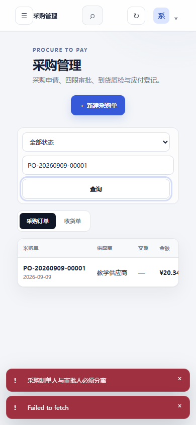
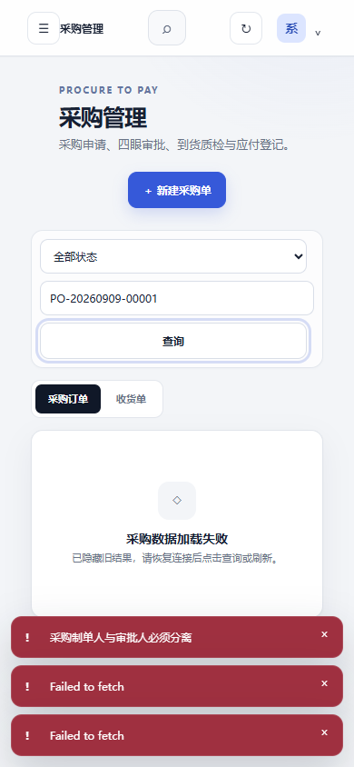
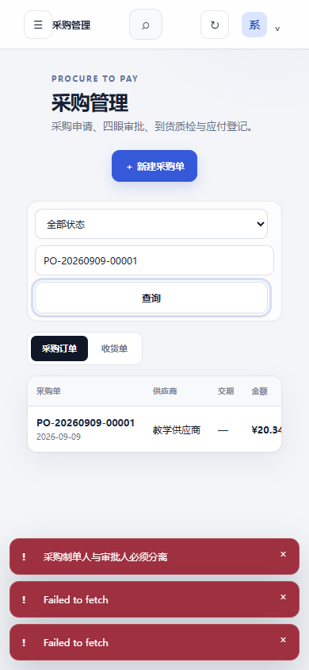
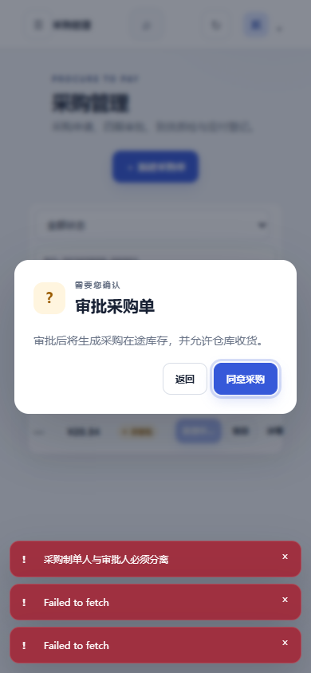

# 采购页在窄屏中怎样查询并恢复

本例接着采购离线修复，验证同一项操作在390像素宽的窗口中还能否完成。背景是采购人员只看得到屏幕中的一部分内容：如果“查询”需要移到屏幕外，或失败原因仅出现在已隐藏的顶部状态栏，页面逻辑正确也可能无法继续使用。

## 先确定这次观察能回答什么

本次使用实际FlowERP页面与隔离教学账套。登录、建单和设置搜索条件由自动化准备；将焦点放在已打开采购页的移动导航按钮后，使用Tab和Enter走查询路径。它证明这段键盘路径的实际行为，不证明从登录开始的完整键盘使用，也不替代同伴观察。

## 从查询到恢复的过程

移动导航按钮 → Tab经过顶部工具、新建按钮和筛选条件 → 查询按钮 → Enter执行 → 断网失败 → 恢复连接 → 再按Enter → 原采购单重新出现。

原生截图｜查询按钮有可见焦点轮廓；筛选条件和按钮纵向排列。实测按钮宽294像素，左右边界为44与338像素，处于390像素视口内。这里只把焦点位置与按钮边界作为证据，不从截图推断其他控件都可用。

原生截图｜断网后，采购结果区明确显示“采购数据加载失败”和恢复方法，旧审批入口消失。顶部状态文字在窄屏中隐藏，所以页面内的说明承担了必要的信息传递。底部仍可见近期操作的多条提示，本次没有将这些提示当作当前查询结果。

原生截图｜恢复网络并再次按Enter后，搜索条件保留，原采购单重新出现。后续同一隔离流程完成审批、收货和库存导出。业务审批使用教学账号，不表示独立审核者接受了页面修复。

## 失败记录怎样影响判断

首轮脚本等待了已隐藏的顶部状态文字而超时；第二轮同时选中了采购列表与收货列表中的两个提示。两次均为观察脚本定位错误，记录保留。第三轮明确等待采购结果区中的提示，完成上述流程。不能把脚本定位错误写成产品先红，也不能删掉记录后只展示成功截图。

## 已观察与下一步

这条查询路径可用，失败和恢复后对象没有混淆，页面总宽度与390像素视口一致。采购表格右侧的状态和动作不在首屏中，后续实际走查已验证Tab到达审批时表格会横向滚动，详见下节。工作台首页的事项、证据展开和返回路径也需另做走查。请同伴在不告知按钮位置的情况下完成同样任务，记录其首次卡点，再决定下一次修订。

结构化观察见[实际走查记录](../assets/latest/purchase-narrow-observation.json)。

## 表格右侧能操作 退出后却丢失原焦点

恢复原采购单后，从查询按钮继续按Tab，经过采购订单与收货单两个页签，再到审批按钮。浏览器自动滚动表格，使按钮出现在视口内；因此，首屏没有显示右侧列不等于动作无法使用。

原生截图｜审批按钮位于视口横向220至258像素范围，焦点可见。此时只观察入口，没有提交审批。

按Enter打开确认框，阅读后按Escape退出。接口复查仍为待审批，说明取消没有改变单据。

原生截图｜确认框可以退出，但退出后的焦点没有回到原审批按钮。记录显示当前活动元素没有原按钮的动作标识；代码中的关闭函数只隐藏弹层、返回结果，没有保存和恢复触发控件。因此，“弹窗消失”和“用户能够接着操作”是两个不同的检查点。

下一步修订应先保存打开弹窗前的触发控件，退出时在控件仍存在且可操作的条件下恢复焦点。复验至少覆盖Escape、返回按钮，以及原控件已经因刷新而移除的情形。这里提出修复要求，尚未把它写成已修复结果。独立同伴还应说明退出后自己是否知道现在位于哪里。

这一缺口把FDE现场观察带回工作台：原事项补充“取消后可继续操作”的接受条件，委托Codex在允许范围修复，再用原键盘路径复验。不要仅凭按钮可见或接口不变接受完整交互。

实际记录见[表格与确认框走查](../assets/latest/purchase-table-keyboard-observation.json)。
