# L14｜让交付状态在 Web 面板可见

> 本资料由 AI 辅助整理，为课程赠送资料，用来辅助你理解课程内容，可作为查询手册使用，非必读资料。

## 本讲总览图

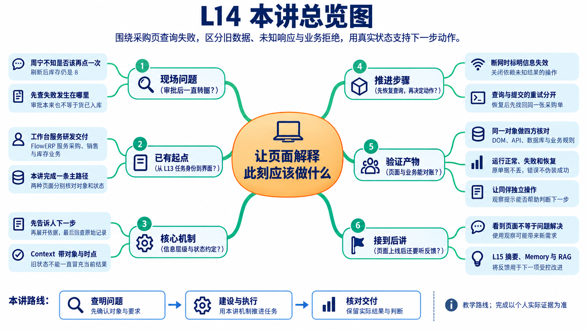

## 本讲总览

本讲从使用者的下一步动作推导信息层级和状态文案，围绕采购页查询失败后的恢复完成一条主路径。Codex 协助实现，你定义判断与验收，复验时核对页面、API、数据库和业务对象。已有进货、销售、库存、财务入口提供背景，本讲不同时重做四个模块。

## 林舟的项目手记

周宁打开采购页，点击审批后一直转圈。她问林舟：“要再点一次吗？”刷新后库存仍是 8，她又拿不准是审批没有保存，还是批准本来就不会增加库存。

林舟先陪她走一遍操作，发现“接口正常”解释不了眼前的犹豫。他把注意力放到页面应该支持的决定：当前是哪张单、信息是否仍有效、失败后应重新查询还是重新提交。工作台自己的交付面板也要接受同样的追问。

人物与开场对话为虚构教学情境；实测材料按原注释辨认来源。人物关系与连续路线见[讲义阅读导航](../讲义阅读导航.md)。

## 1. 同一个需求，为什么需要两种界面

个人研发工作台服务于交付者，回答“这项需求推进到哪里，依据是什么，谁要作决定”。FlowERP 服务于业务使用者，回答“这笔采购是什么状态，哪些商品可以收货，库存如何变化”。前者管理研发工作，后者承载客户业务。

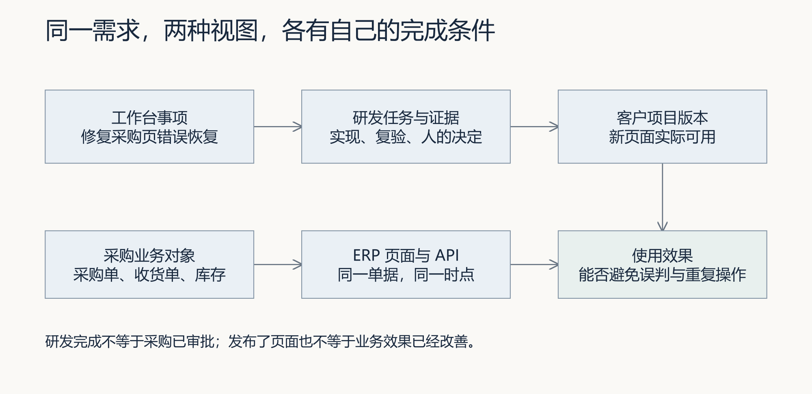

假设你的研发事项是修复采购页错误恢复。该事项会形成一个或多个 Task，Task 保存执行与复验记录。最终接受一个候选，表示你认可这一版软件改动；它不自动批准某笔采购单。反过来，业务采购已审批，也不能证明页面修复已经通过验收。

需要分别保存事项 ID、Task ID 和采购单 ID。事项可以经历多轮交付，一轮候选可能关联多笔业务验证数据，因此这几个 ID 不是可以互换的别名。业务引用把它们连接起来，连接本身不创造业务结果。

完整需求链是“业务问题 → 产品需求 PRD → 技术方案 → 开发 → 测试 → 线上效果回收”。页面要让这条链中当前需要的决定和证据可见。例如，产品需求规定“查询失败后仍能找回同一采购单”，技术方案规定如何保存对象身份，测试验证断网与恢复，效果回收再观察使用者是否减少了误操作。不能仅凭页面出现六个阶段标签，就认定六个阶段均已完成。

工作台通常从 `http://127.0.0.1:8001/` 进入；FlowERP 默认在 `http://127.0.0.1:8000/`。它们分别使用自己的运行目录和数据库。自定义端口时仍从工作台根路径进入。真实事项从首页“事项与决策”开始，调研、确认、执行与验收应回到同一事项。

## 2. 从使用者的决定推导信息层级

周宁要判断这张采购单接下来能做什么，陈珂要检查页面修复依据。林舟分别整理两人的首屏信息，把支持决定的摘要放在前面，再给出继续回查的入口。

将全部 JSON 放到页面上，信息并没有减少，但理解成本转给了使用者。将 JSON 全部藏起来，只剩一个绿色图标，理解成本看似降低，却失去了判断依据。合理的信息层级使初次判断容易，深入复验也有路可走。

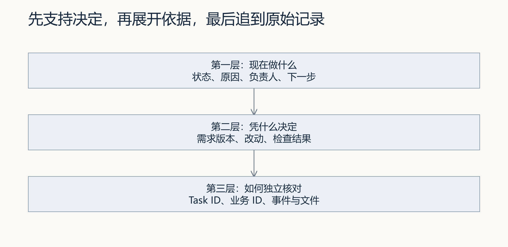

第一层回答“现在要我做什么”。默认展示事项目标、当前阶段、停止原因、下一步和负责角色。第二层回答“凭什么”。展开本次需求版本、修改范围、检查摘要与审核依据。第三层回答“我能否独立核对”。继续追到 Task、事件、报告、候选文件与业务对象。

以“自动检查通过，等待验收”为例，第一层应明确下一步由人验收；第二层应说明检查覆盖了哪些用例；第三层应能打开本次报告与改动。单独写“100%”反而模糊了事实：到底是测试结束了、任务完成了，还是业务目标实现了？没有真实总工作量和计算口径时，按已知阶段展示更准确。

信息默认出现的位置也影响判断。若“未发布”藏在折叠日志里，首页却显示“交付成功”，使用者容易误以为客户已经获得新版本。对是否继续操作有直接影响的限制，应与当前状态放在一起。长日志、完整启动参数和调试细节则适合按需展开。

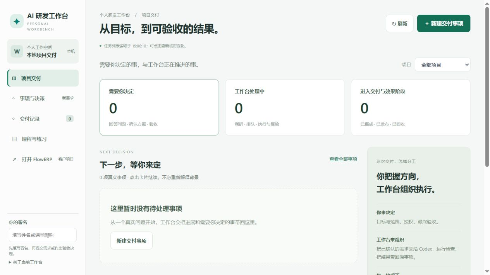

图中是启动隔离工作台后取得的真实截图。没有事项时，页面解释当前为空并提供新建入口。这里的 0 有明确含义：查询到了空记录集合。它不能与“查询失败时暂时取不到数量”混为一谈。

## 3. 状态文案是一份交互合同

林舟写下同一采购页在等待、拒绝、断网和恢复时应说什么，并逐项列出对应事实与允许动作。文字要帮助周宁作决定，因此每一种提示都需要能够复验的状态依据。

请让同伴按采购人员的任务试用：查询失败时，他能否识别这是旧内容，能否保留原单据再查询，而不是重新审批？先保存他作出错误判断的位置，再选择修改文案、数据新鲜度或恢复入口。学生与业务确认者约定动作边界，Codex 实现，同伴在相同条件下重做。若只更换颜色却未改变判断依据，就还没有解决这次现场问题。

交互合同规定：每一种事实应怎样显示，哪些动作允许，动作失败后保留什么。它连接前端实现、后台接口与验收用例，不只是选择几个颜色。

| 页面面对的事实 | 使用者需要知道 | 应支持的判断 |
|---|---|---|
| 尚无任务或结果 | 还未创建或还未产生 | 从哪里开始，是否需要等待 |
| 正在读取 | 本次查询尚未返回 | 暂不依据旧结果作新决定 |
| 已受理，执行中 | 工作已开始，结果未定 | 查看进展；按实际能力停止或等待 |
| 检查通过，待审核 | 自动检查结束，仍需人的决定 | 查看本次候选与报告后接受或返工 |
| 业务拒绝 | 请求到达，但前提不满足 | 修正数量、审批或对象状态 |
| 网络失败或陈旧 | 无法确认当前事实 | 保留对象身份，重新读取 |
| 未知状态或字段异常 | 当前页面无法可靠解释响应 | 显示异常，关闭依赖该解释的动作 |

这张表是设计要求，不表示当前所有页面都已完整实现。状态合同最好同时写入一组具体例子。例如采购单未审批时，页面应解释不能收货，而不是只让按钮变灰；没有操作权限时，要说明由哪类角色处理，而不是声称采购单本身错误。

按钮可见不等于操作被授权。前端禁用按钮减少误操作，后端仍必须检查身份、权限、当前状态和目标对象。刷新页面、直接调用接口或使用旧页面，都不应绕过这些检查。页面中的“署名”字段也不能单独证明身份认证。

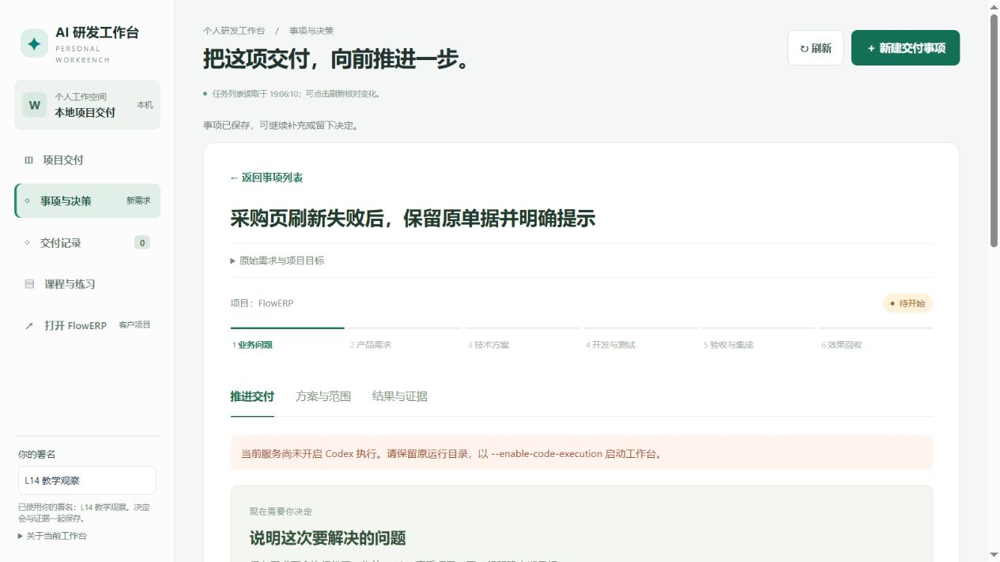

这次真实观察只保存了隔离教学事项，没有启动 Codex。页面显示“待开始”，并说明服务尚未开启执行；调研按钮不可用。这个画面证明需求被记录且执行条件被提示，不证明已经调研、实现或测试。

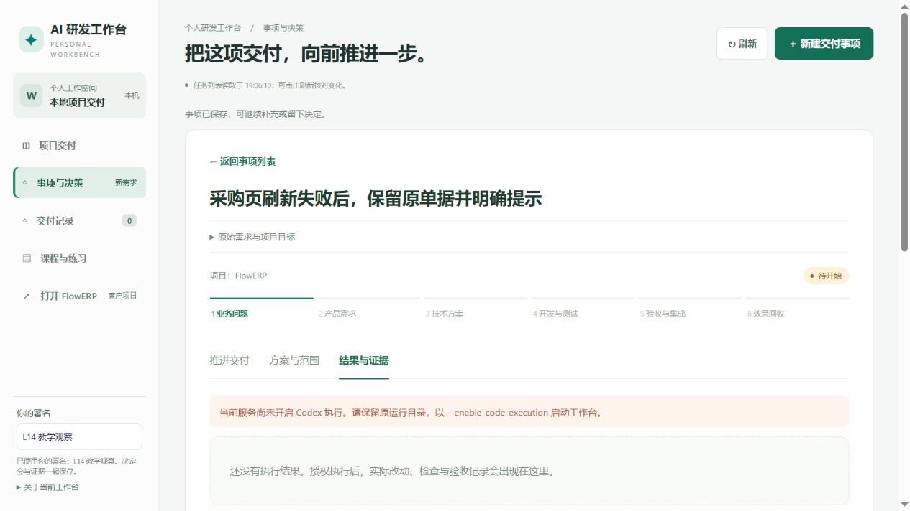

无结果与失败不同。尚未执行时应说明结果将在何时出现，不能编造一份空白“成功报告”。如果执行确实失败，应保留失败原因和已有记录，不能又退回“什么都没有发生”。

### 案例 1：三个检查通过，为什么页面仍等待验收

先在隔离工作台的“交付记录”打开课程复验入口，选择 L14，提交“教学复验：检查页面状态与后端一致，查看失败与结果依据。”实际任务为 `TASK-0456F5029A`。这次运行选择 verify，只检查已有实现，没有调用 Codex 修改文件。

图 1：从上向下核对同一个 Task。顶部说明“检查已结束，等待你的验收”；阶段条指向人工验收；协作栏明确 Codex 本次未调用。三处共同回答“检查做完了，谁还要做什么”，不能仅凭按钮存在便认定已获批准。

再打开“核验证据”，展开“查看逐项检查结果”。这次报告列出交付控制、Web 投影与持久状态、仓库密钥三个检查，均通过。

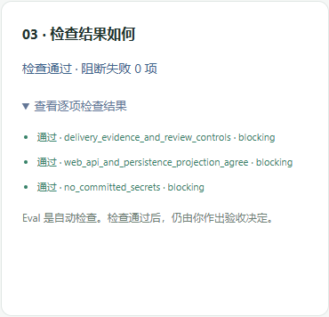

图 2：报告的价值在于可以核对检查范围。三个检查通过支持这些用例的结论；本次没有 Diff，不能据此声称交付了采购页修复。下一步应由审核者核对实际候选与需求，本轮保留待审核状态，没有代替真人作出决定。

这项课程复验没有关联此前首页保存的研发事项。两处可以分别观察页面行为，但不能按相似标题拼成一条真实研发交付链。个人实践须从原事项继续，回查它实际产生的 Task。

## 4. 页面怎样知道数据还有效

林舟让周宁先看一次正常查询，再模拟断网。屏幕还留着上次的采购状态，但这只能说明曾经查到过。下面要决定旧信息如何标记、哪些动作应暂停，以及恢复后怎样查回同一张单。

轮询是页面隔一段时间重新查询。推送是服务在有更新时向页面发送事件。两者只改变消息如何到达，都没有自动解决对象身份、消息顺序、失联和重复消息问题。选择方式前，先定义正确性条件。

假设请求 A 读取到“执行中”，请求 B 稍后读取到“待审核”。因为网络延迟，B 先返回，A 后返回。如果每次响应都覆盖页面，使用者会看见状态从待审核倒退到执行中。

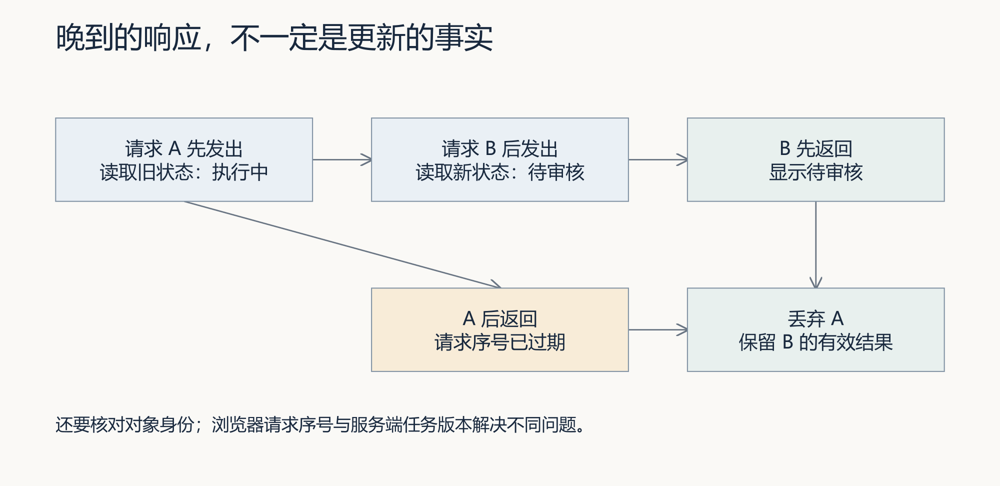

浏览器可为每次读取分配递增请求序号，记录当前对象与查询条件。响应回来时，先核对它是否仍回答用户当前的问题，再决定是否更新。旧请求只是“最后到达”，并不因此成为最新事实；切换事项以后，旧事项的成功响应也应丢弃。

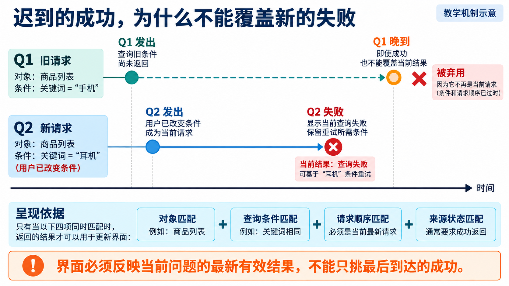

*读图：Q2 已经成为当前查询；即使 Q1 后来成功，它也不能把 Q2 的失败洗成绿灯。该图表示设计条件，实际页面仍需逐条验证。*

更容易漏掉的是失败分支：Q2 失败后若只写错误文字，没有让 Q1 失去更新资格，Q1 随后成功就会把旧列表重新放回页面。用户以为新条件查询成功，实际看到的是旧结果。因此成功、失败、取消和切换对象都应遵循同一请求身份规则。可以在隔离实验中延迟 Q1、让 Q2 先失败，再释放 Q1，检查旧列表与旧按钮是否回来；只测试两个成功响应还不够。

服务端对象版本解决另一个问题：响应代表对象的哪个持久版本。多个客户端或多个缓存可能返回不同版本，仅靠一个浏览器的请求序号无法比较这些事实。还要明确版本何时增加。L13 已观察到，任务状态迁移会增加 version，但单独追加事件不一定增加它，因此不能用“版本相同”推断全部事件内容也相同。

**当前实现核验。** 2026-09-06 的任务详情读取在 `workbench_web/app.js` 中使用 `detailVersion` 拒绝已过期响应，并检查返回的 Task ID；运行阶段在响应后约 2 秒安排下一次查询，稳定阶段停止自动更新。GET 请求设有 10 秒中止时间。读取失败后会隐藏旧证据和审核动作。

同日的事项工作流使用另一套读取逻辑：比较事项 ID 和读取序号，在事项页可见且没有提交动作时约每 2.5 秒刷新。失败分支写入错误文字，不能据此宣称所有旧操作都已禁用。它也不是已经实现指数退避的通用轮询器。两套页面的行为应分别实测，不能用一处实现替另一处通过验收。

刷新时间也要解释来源。浏览器显示“读取于 10:00”通常表示客户端完成读取的时间；它不直接证明业务记录在 10:00 更新，更不能证明当前仍在线。一个清楚的页面可以分别说明“最后成功读取时间”和“当前无法更新”，使旧数据仍可参考，但不会被当成实时状态。

## 5. 失败之后，先分清应该重试什么

周宁还在问要不要再点，林舟先查刚才失败的是查询、提交响应，还是业务前提。重新查询通常是取回事实，重新提交可能再次执行业务，页面需要明确区分这两个动作。

采购员看到错误，常用的动作是再点一次。工程设计必须先回答：错误发生在查询、写入响应，还是业务校验？三者对应的恢复动作不同。

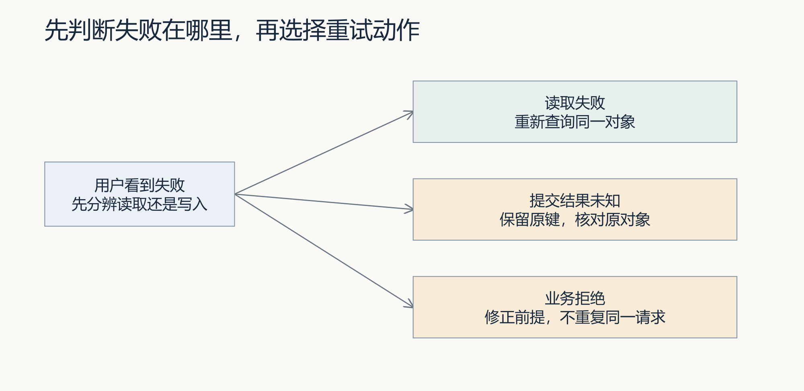

**读取失败。** 已知采购单 ID，只是无法获取最新详情。重新读取同一采购单通常足够，不应把“重试”连接到创建采购单接口。旧内容可保留作参考，但应标明尚未更新，并限制依赖最新状态的动作。

**提交结果未知。** 请求可能已经保存，只是响应没有到达。应保留本次操作身份，按已有幂等协议核对或重放原请求。改变键再提交，会把恢复变成新的操作。浏览器关闭后是否还能找回提交键，也需要明确；一个只存在于内存的键不会因为设计文档写了“幂等”就自动持久化。

**业务拒绝。** 未审批采购不能收货。这里响应已经明确，重复相同请求不会改善业务前提。应引导使用者完成审批或修正输入，并验证拒绝后没有收货单和库存副作用。

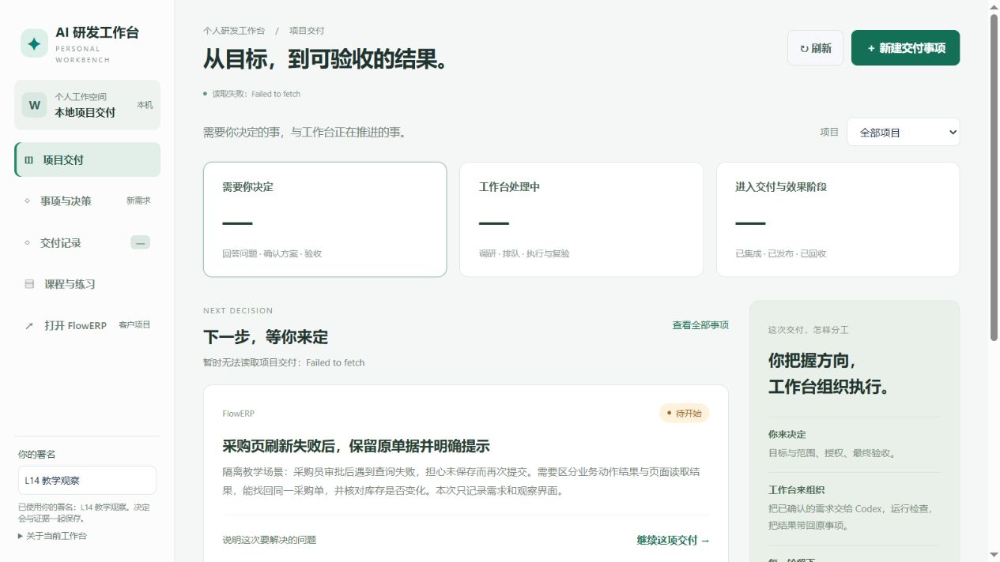

本次实验停止了自己启动的隔离服务，再点击刷新。观察到首页统计由数字变为“—”，显示读取失败；旧事项卡片仍保留。这个结果不能简单归类为“离线处理已全部通过”。还应继续检查旧卡片是否标明新鲜度、进入详情后有哪些操作可用、恢复服务后是否能找回同一事项。

### 案例 2：断网之后，旧绿灯为什么必须退出当前判断

在案例 1 的任务详情中，主动断开浏览器网络，再点击刷新。服务和隔离数据库保持运行，本实验只注入读取失败。页面统计改为“—”，出现读取失败说明；原报告与审核控件停止显示，提示重新读取证据后再操作。

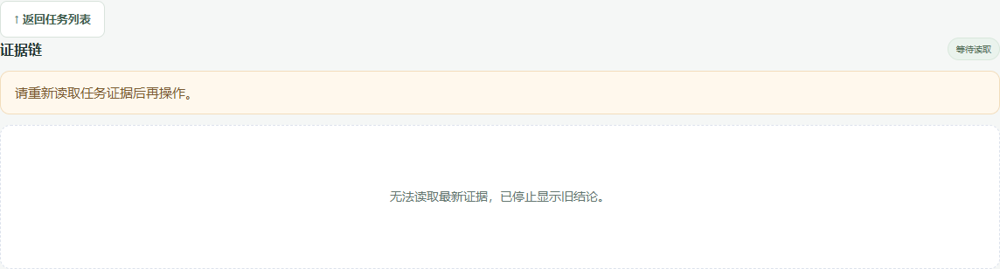

图 3：这里没有把“暂时读不到”显示成零任务，也没有继续展示先前绿报告。原因是审核动作依赖当前候选与证据，旧结果不足以支持新的决定。原任务记录仍在后端，隐藏旧结论没有删除失败或历史证据。

恢复浏览器网络并再次刷新后，页面重新显示 `TASK-0456F5029A`，状态仍为 review。前后查询均只有一项任务，审核仍未发生。

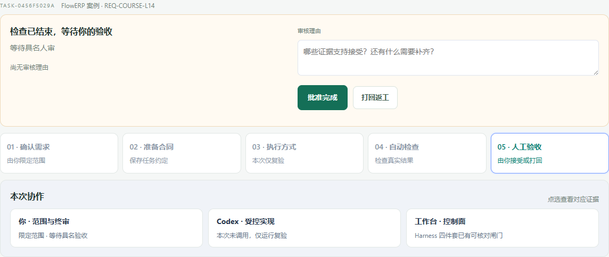

图 4：恢复链是“原 Task → 读取失败 → 暂停依赖旧证据的动作 → 重读原 Task”。它证明这条任务详情读取路径的行为，不证明采购页采用相同机制。接着应在自己的 FlowERP 采购单上重做查询失败与恢复，并检查单据身份和业务副作用。

对临时网络错误可以设计退避，例如逐渐延长等待时间并设置上限；手动重试可恢复积极查询。退避减少无效请求，但也增加状态变化被发现的延迟。稳定终态可以停止频繁轮询；待审核事项若可能被另一人处理，仍要提供刷新或一致性提示。没有一种固定间隔适合所有任务。

错误文字本身也是输入。用户备注、外部错误和执行日志可能包含尖括号等内容，应按文本呈现，避免被解释为可执行 HTML。当前若某些区域用了 `textContent`，只能证明这些区域的渲染方式；完整检查还要覆盖其余插入路径。

## 6. 四方对账，究竟在核对什么

页面重新显示同一张单后，陈珂继续追查数量和状态：页面读到哪次响应，接口返回哪条持久记录，记录又是否符合审批与库存规则。下面把这四处按同一对象核对。

DOM 是浏览器实际呈现的文档结构；API 是接口这次返回的字段；SQLite 保存持久记录；ERP 服务按领域规则解释和修改业务状态。四方对账的目的，是追查同一对象从持久事实到使用者看到的结果是否失真。

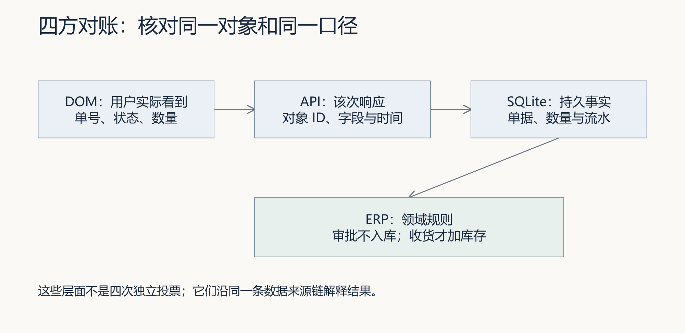

四方对账有两种不同检查。第一种查传递：页面上的值是否来自这次 API，API 是否对应所查的持久记录；第二种查含义：这个数是否符合业务规则。若数据库错误地保存了可用量 10，API 与页面都原样显示 10，传递完全一致，业务仍可能错。陈珂应先独立算出“在库 10 减预占 2 等于可用 8”，再沿来源逐层查差异。数字一致是必要线索，独立预期才使这条链具备辨识错误的能力。

下面是独立教学预期，不是已经完成的学生操作：在库 10、预占 2、可用 8；采购 7 件。审批通过后，还没有发生收货，在库与可用量应保持不变。实际收货后，在库 17、预占 2、可用 15。按同一收货幂等身份重放，仍只有一笔有效入库。

| 检查时点 | 采购/收货事实 | 在库 / 预占 / 可用 | 应核对的副作用 |
|---|---|---|---|
| 未审批尝试收货 | 收货被拒绝 | 10 / 2 / 8 | 无新增收货与入库流水 |
| 采购审批完成 | 可进入收货步骤 | 10 / 2 / 8 | 审批记录，不冒充入库 |
| 实际收货 7 件 | 对应收货已生效 | 17 / 2 / 15 | 一笔有效入库 |
| 同身份再次请求 | 按协议返回或明确拒绝重复 | 17 / 2 / 15 | 不增加第二笔入库 |

实际使用哪种 API、订单结构与幂等语义，应以自己选择的 FlowERP 路径为准。简单课程服务与完整采购模块的表名、状态、单据模型并不相同，不能复制一套 SQL 去证明另一套对象正确。提交记录应明确服务、运行目录、对象 ID、字段与查询时间。

月销售额为 0 也是同样的问题。先确认月份、日期字段、有效订单状态、金额单位与统计范围，再检查明细。接口返回 0 不能自动证明聚合正确，也不能为让截图好看而补一个任意正数。教学账套可以构造，但明细与汇总必须可解释，且不能冒充真实经营数据。

现有 `web_api_and_persistence_projection_agree` Eval 检查部分接口投影、持久状态与页面源码约定。它没有实际驾驶浏览器完成全部业务操作。通过这一条 Eval 后，仍应核对页面文字、按钮、网络失败及实际业务副作用。验证结论的范围，应与真正执行的检查相等。

### 采购实测：从同人审批被拒，到三件真正入库

用另一套隔离客户账套准备教学商品 `L14-DEMO`，采购 3 件；原始库存为 0。本例使用完整采购模块，与上文“10 / 2 / 8”的手算预期属于两组输入，不能把两组数值混为一次运行。教学单据由真实 API 创建，随后在原生采购页以制单账号点击审批并确认。

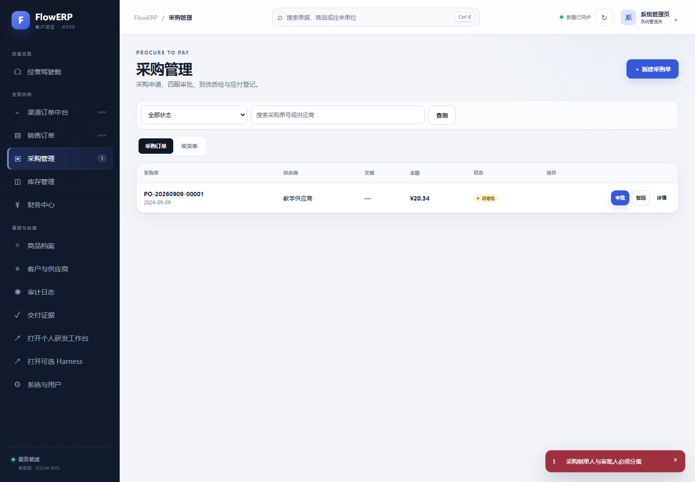

页面仍为“待审批”，右下角提示“采购制单人与审批人必须分离”，接口返回 409。拒绝的原因是业务职责条件不满足；重新刷新或重复点击不能改变这个条件。后续由脚本使用另一教学账号审批，再创建收货单并过账。本例的两个账号用于检验职责规则，不代表两位真实业务人员已经作出决定。

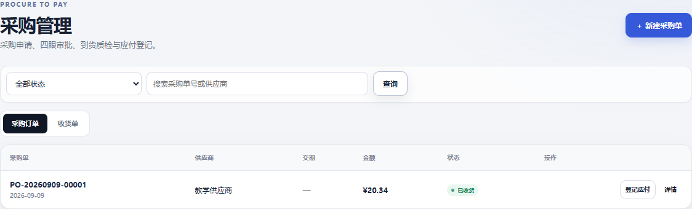

审批后尚无现货增加；收货过账后，页面显示“已收货”，API 与 SQLite 中原采购单也为 received。实际库存是 3 / 0 / 3，同一入库身份重放后仍只有一条目标库存流水。四方对账要追踪的是这一个采购单与它的收货记录，而不是各找一张看起来相符的截图。

同时做了查询失败实验：主动让浏览器离线，点击采购页“查询”。当时画面仍显示旧“待审批”、审批按钮和“数据已同步”；原业务拒绝提示也未被本次读取状态取代。恢复网络后可以查询回原单据，但这不足以宣布离线状态合格。这个差异正是个人实现可以进一步调查的缺口：任务详情已经隐藏过期结论，采购列表却尚未向用户明确区分旧结果与本次读取失败。

这张图记录实际缺口，不是修复后效果。应先复现并保存失败请求，再让 Codex 在允许范围内修改提示、恢复动作与状态约束；修复后以同一单据和同样的离线条件复验。浏览器离线只影响读取条件，本例没有删除原单据或篡改库存来制造失败。

### 从失败记录到实际修复

上面的截图保留了修改前的问题。随后在当前Codex会话中，我们补充两项检查：查询失败后应隐藏旧审批按钮并保留查询条件；较早成功响应不得覆盖较新的失败。修改前，两项检查都失败，说明问题不只是提示文字不够醒目，还涉及页面动作与请求顺序。

修复把采购“查询”接入统一加载流程。开始读取时清空旧采购和收货结果，失败后显示恢复提示；顶部也显示“采购数据加载失败”。每次查询分配请求序号，只允许当前请求更新结果。因此，恢复后的新结果不会被迟到的旧响应替换。原单据仍在后端，隐藏旧页面结果没有删除业务数据。

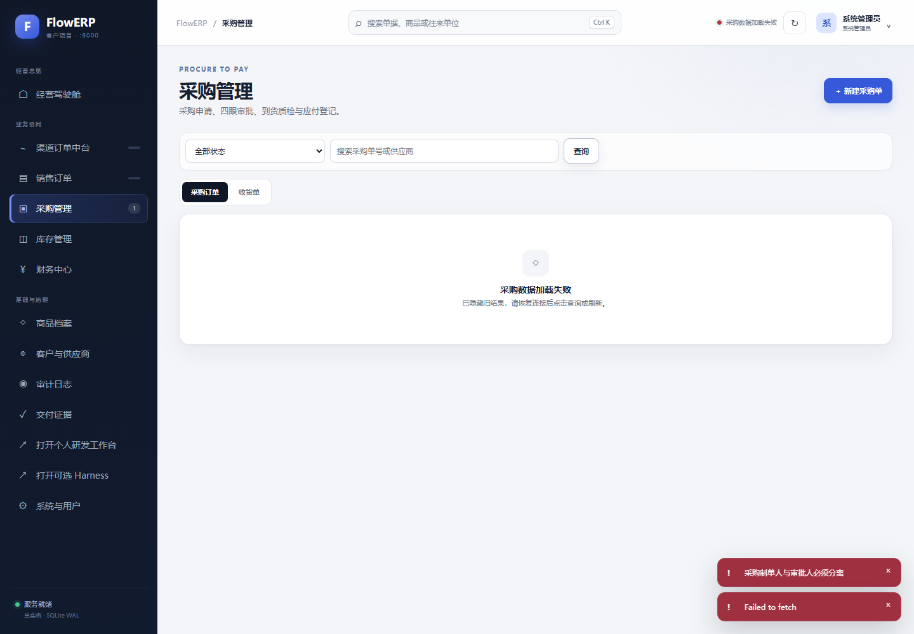

原生截图｜另一隔离教学账套中的实际断网复验：采购列表显示失败，旧单据和审批入口不再显示，查询条件仍保留。恢复连接后可重新查询同一单据。侧栏原有计数不作为本次实时业务数量的证明。

修改后，两项新增检查与17项库存筛选检查通过，16项HTTP测试和29项阻断检查通过。浏览器还完成了恢复查询、审批收货和库存导出，验证这次修复没有阻断已有正常路径。完整过程见[采购查询失败修复](examples/采购查询失败修复.md)。本次是当前会话直接实现与自动复验，没有后台开发Task或独立具名接受；学生仍须通过自己的工作台事项完成分工、授权和复验。若当前起点已包含修复，应另找真实缺口，不删掉正确代码制造失败。

## 7. 结果可下载，还需要哪些条件

前面的对账以单据和库存为对象。交付文件也需要相同的追踪方法：用户下载的必须是刚才核对过的任务产物，而且无产物、文件失效和下载成功应有不同结果。

页面提供“下载”按钮，不代表交付已经完成。首先要知道下载的是什么：某次任务的补丁、自动检查报告、业务导出，还是一张预览图。不同产物有不同的权限、有效期和使用方法。

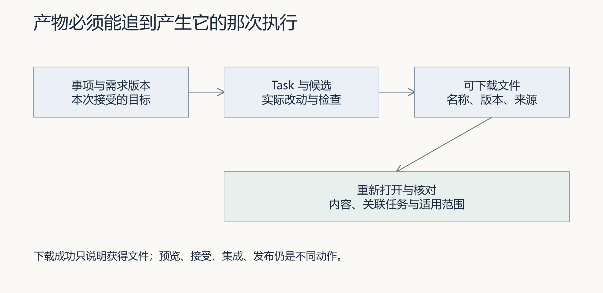

本次事项工作流源码只有在任务事件出现“日常研发交付包已保存”时，才显示指向该 Task 的补丁链接。这个条件体现了一个基本思路：以实际产物记录决定下载入口，不能在任务刚受理时就显示一个假链接。是否真的可下载，仍要打开对应链接、核对响应和文件内容。

### 案例 3：报告可以查看，补丁为什么返回 400

沿用同一 Task 请求补丁接口，实际返回 HTTP 400，内容为“本任务尚未生成交付补丁”。这与 verify 模式一致：自动检查产生了报告，但没有产生代码改动包。不能把报告入口与补丁入口统称为“结果已交付”。

检查下载可按“确认产物类别 → 查本轮任务的产物记录 → 请求对应文件 → 核对内容和摘要”推进。原verify实验验证了无补丁时明确失败的路径；后续补充了历史真实代码任务的HTTP正向下载，具体条件见下文。自己的候选仍须从原事项下载复验。若页面需要改进，应把缺失原因显示在使用者寻找结果的位置，而不是让他反复尝试不存在的文件。

验收时记录文件来自哪个 Task、哪一轮候选、什么需求版本。若文件可以被后来执行覆盖，仅有相同文件名就不足以追踪；可使用不可变产物标识或摘要值帮助识别。读取不存在、已过期或无权访问的产物时，应明确失败，不能返回另一项任务的“最新结果”来凑成功。

### 实际补丁下载：文件相同与交付合格是两次判断

为了核对代码产物的正常路径，我们复核了历史库存筛选任务TASK-402AD958DB。使用原任务数据库的只读快照，调用项目现有HTTP下载处理器读取原补丁，没有新启动开发，也没有改写原任务状态。下载返回200，文件名为TASK-402AD958DB.patch，共18,992字节；下载字节的SHA-256与任务交付事件登记的摘要完全一致。

本次按“原Task → 交付事件 → 下载响应 → 字节摘要 → 修改范围”逐项回查。补丁包含web/index.html、web/app.js与两个测试文件，正好对应该任务批准的四文件写集。原补丁下载前后未变，任务仍为review，审核人为空。完整响应和案例条件见[补丁下载与任务回查](examples/补丁下载与任务回查.md)。

这个观察证明能够取回该历史任务登记的代码产物。摘要相同只确认字节身份，不判断业务是否正确；四文件范围相符也不能替代新增功能复验。补丁依赖正确基线，不是直接启动的完整项目压缩包。自己的采购页修复仍要在原工作台页面下载同一候选，并由复验者核对结果，不能借用这一历史任务完成个人交付。

### 正常下载对照：客户库存 CSV 与研发补丁分开核对

同一采购实测结束后，浏览器实际下载了客户项目的库存 CSV。文件包含 `L14-DEMO`，在库 3、预占 0、可用 3，与本次 API 和 SQLite 记录一致。参考文件见[实际库存导出](assets/latest/inventory.csv)，原始响应、对象 ID 与文件摘要见[采购与下载观察记录](assets/latest/erp-evidence.json)。

这个文件属于客户库存数据，能证明本次导出正常路径；它不是工作台生成的代码补丁，也没有自动绑定研发 Task。个人交付仍要核对原事项的实际候选包，不能用库存 CSV 替代代码修改或发布证明。通过比较两种产物，才能理解为什么“下载成功”必须同时说明下载的是什么、来自哪个对象和何次执行。

预览、接受、集成和发布是四个动作。预览检查候选表现；接受记录人的决定；集成把确认的改动带回项目；发布才使指定环境使用该版本。当前页面还区分效果观察，说明发布以后需要回收使用证据。某一截图显示“已接受”，不能直接用作线上发布证明。

前端和仓库不得包含模型密钥、数据库秘密或可越权使用的凭据。浏览器需要的是受控接口和必要业务字段。把密钥变量改个名字、藏在压缩文件或源码映射中，都没有改变它会被交付到客户端的事实。检查应覆盖实际构建产物、网络响应与仓库变更；只搜索一个变量名不足以得出全面结论。

## 8. 用工作台组织这次页面改进

现在已经有状态、恢复、对账和下载的判断标准。把这些标准用于一项实际修复，才会形成工作台能力与 FlowERP 产品增量之间的因果关系。

先在同一事项里记录“采购查询失败使使用者无法判断是否保存”的原始问题。PRD 写明使用者、触发条件、保留的对象身份、错误提示和恢复后的验收标准；技术方案再说明读取顺序、动作边界、字段映射与测试方式。

让 Codex 先查现有实现，并用自己的话说明哪里已满足、哪里还有缺口。你确认范围后，工作台才组织受控执行。没有开启实际执行的服务只可用于观察与记录；不要把本讲截图中的待开始事项写成 Codex 已完成开发。

项目驱动的含义，是把项目目录、目标、允许改动、检查方式与人审要求变成可执行合同。执行器可以由工作台在后台调用，因此不需要先打开 Codex 桌面 App 才能完成每次任务。但实际运行仍依赖该机器已配置的执行器、登录条件和权限边界，应核对调用记录及结果，不能只看界面上出现了 Codex 字样。

本讲也为“工作台 = Harness + 记忆系统 + 工作流蒸馏”提供了具体落点。Harness 保留这次页面改动的范围、检查与决定；记忆系统保存“旧响应覆盖新结果”的经验及来源、边界和有效状态；工作流蒸馏把经过复验的方法提炼为有版本的检查流程。下一项需求必须实际召回、采用并再次验证，才证明发生复用。一个漂亮的状态面板不能单独证明这三个部分已经闭环。

从 FDE 能力沉淀看，本讲应留下“先观察用户决定，再绑定对象、时点和恢复动作”的方法。迁移到耗时导出时，排队、生成、过期和可下载需要新的业务合同。采用原方法后仍让使用者误读时，应修订方法或适用边界；一次截图整齐或接口返回成功，都不能代替使用复验。

### 键盘走查让隐藏的问题显现

前面已经核对结果与文件，接下来要让使用者真正走完动作。屏幕变窄时，顶部状态可能隐藏，表格的动作列可能移出首屏；只检查接口正确，无法回答用户还能否继续操作。

实际将采购页调整为390像素宽，从移动导航按钮按Tab经过工具与筛选条件，到达查询按钮。按Enter触发断网查询，结果区仍能读到失败与恢复方法；恢复网络再次查询，同一采购单重新出现。页面总宽度也是390像素，没有整体横向溢出。这是隔离教学账套的自动键盘观察，不是完整登录流程或独立同伴走查。

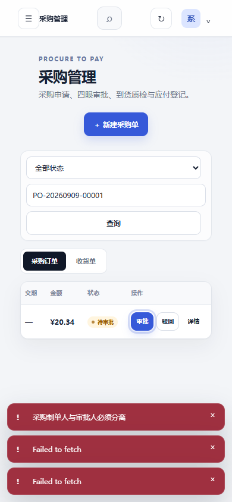

原生截图｜从查询继续按Tab，经过两个页签到审批，表格随焦点横向滚动，按钮出现在可见区域。因此，“右侧列不在首屏”应继续检查能否到达，不能直接判断不可用。

按Enter打开审批确认框，再按Escape退出，单据仍为待审批。但焦点没有返回原审批按钮。关闭函数只隐藏弹层并返回结果，没有恢复触发控件。这解释了为什么弹窗虽能关闭，键盘使用者仍可能失去当前位置。

本轮没有修复这个新缺口。下一次事项应写明：取消后返回原触发控件；若控件因刷新移除，应选择仍可操作的位置。用Escape、返回按钮和控件失效三种条件复验，再请同伴不依靠提示完成同样操作。FDE在这里体现为把真实卡点转成接受条件，再交给工作台组织实现与复验。完整步骤和五张截图见[采购页键盘与窄屏走查](examples/采购页键盘与窄屏走查.md)。

## 9. 怎样证明自己会设计可信页面

完成一版实现之后，还需要确认这些提示是否真的帮助别人作出正确决定。下面用同伴独立操作和新场景迁移，区分“我会演示”与“别人能够使用”。

完成实践时保留第一次判断、真实观察、自己的实现、失败后的状态和修订。交给没有参与实现的同伴，让他在不听讲解的情况下回答：现在需要我决定什么；为什么停住；证据在哪里；下一步谁负责；怎样恢复或停止。记录卡点，再做一次有依据的删减、合并或提示修订。

同时检查键盘是否能到达关键操作、焦点是否可见、状态变化是否通过文字传达，以及窄屏时重要字段和动作是否仍能使用。颜色和桌面截图不能替代这些检查。

最后将合同迁移到“耗时导出”需求。沿用对象身份、新鲜度、失败和产物追踪；重新定义该业务的排队、生成、失败、过期和可下载条件。能说明哪些规则可复用、哪些必须重写，比把同一个页面换个标题更能证明掌握。

下一讲会把真实使用观察转成可追溯摘要与反馈。这里留下的是用户遇到的问题和证据；反馈是否进入执行、是否改变检查标准，还需要后续审核。

## 离开这一讲之前

页面修订后，林舟要观察周宁能否判断下一步，而不仅是能否点到按钮。试用中的一句“导出坏了”又可能包含多种原因。下一讲从这类反馈继续追查，让摘要、经验和新任务有据可接。

## 附录：课程合同与核验来源

本讲对应 CLO-6。正式合同保持如下：

- **核心内容**：面板信息层级、轮询或推送、失败重试、结果下载和密钥边界。
- **演示结果**：从 Web 提交需求并查看阶段状态、Eval 报告和产出文件。
- **课内增量**：完成只覆盖一个任务主路径的最小面板。
- **通过标准**：状态与后端一致；失败路径明确；结果可追踪；前端和仓库中没有密钥。

实现核验日期为 2026-09-06。真实截图来自本地隔离教学运行。新增记录验证了课程复验任务的报告展开、浏览器离线与恢复，以及无补丁请求的明确失败；采购教学实测进一步验证了业务拒绝、收货过账、同一单据恢复与库存 CSV 下载，原采购列表离线提示不足的失败记录保留，后续已由当前会话修复并通过浏览器自动复验；另已通过只读任务快照复核历史真实库存筛选补丁的HTTP正向下载，摘要与原事件一致；本讲本人修复、原页面下载及发布仍待验证。原始字段与结论边界见[浏览器观察记录](assets/latest/browser-evidence.json)。这些未完成路径仍属于个人实践要求。

- [课程大纲](../../课程大纲-Codex-FDE行动营-个人研发自动化工作台.md)：L14 合同与产品状态。
- [任务详情页面实现](../../../workbench_web/app.js)：读取序号、超时、轮询、失败处理与证据呈现。
- [事项工作流页面实现](../../../workbench_web/initiative_workflow.js)：阶段、当前动作、产物与事项刷新。
- [现有阻断用例](../../../eval/cases.py)：接口、持久化与投影检查的实际范围。

配合[实践操作手册](实践操作手册.md)完成观察、实现、对账与同伴复验。
