# L15｜生成交付摘要并采集真实反馈

> 本资料由 AI 辅助整理，为课程赠送资料，用来辅助你理解课程内容，可作为查询手册使用，非必读资料。

## 本讲总览图

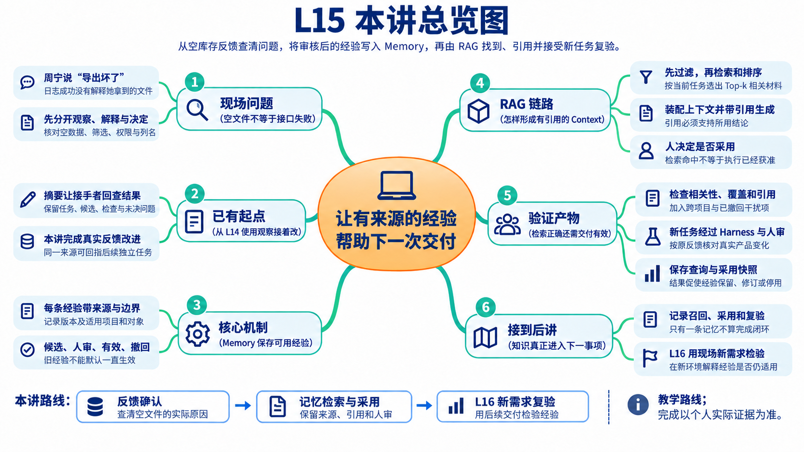

## 本讲总览

本讲从摘要到反馈分诊，再到 Memory 的来源、版本、边界和状态，最后用最小 RAG 检索带引用的上下文，由人决定采用并组织一项真实改进。开场是虚构教学情境，下面署明日期和编号的维护记录属于原有参考材料；个人反馈、采用与复验必须实际形成。

## 林舟的项目手记

FlowERP 运营周宁导出库存后拿到一个空文件，告诉林舟：“导出坏了。”他查看请求记录，响应却是成功的。如果照着日志写周报“功能正常”，周宁遇到的困难就会从交付材料里消失。

林舟先保存她的观察，再请 Codex 比较几种解释：确实没有库存，筛选条件不同，还是空表丢了列名？陈珂要求他把解释和已证实事实分开。问题查清、范围确认后，才能建立新的改进任务；留下的经验也要到后续事项里再检验。

人物与开场对话为虚构教学情境；实测材料按原注释辨认来源。人物关系与连续路线见[讲义阅读导航](../讲义阅读导航.md)。

## 1. 摘要是证据的索引，不能凭文字制造完成

上一讲让阶段与结果可见，本讲首先解决怎样把它们交给另一个人。摘要要保留哪些内容，取决于接手者需要作什么判断；先分清结论层次，再选择证据。

### 1.1 先区分三种结论

“导出接口返回成功”“空库存文件包含约定列名”“采购员能正确判断没有库存”是三个不同层次。第一句需要请求记录；第二句需要文件内容和格式检查；第三句需要使用者在具体场景中的判断。一个层次的通过不能自动推出下一个层次。

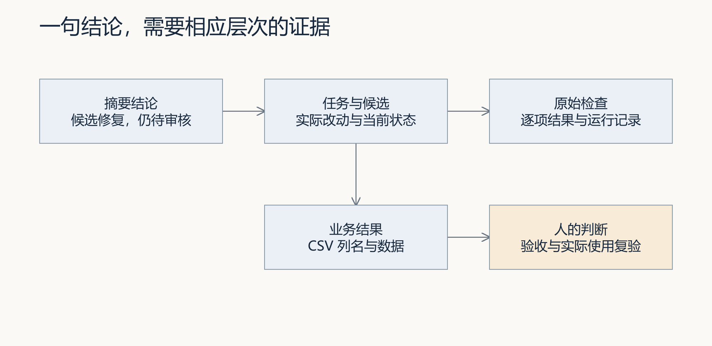

图 1：摘要中的每个完成性结论都应有对应来源。人读摘要后，可以选择关键结论继续下钻，而不必通读所有日志。

一份有用的摘要应回答：原问题是什么；本次具体改变了什么；哪些检查支持结论；任务与候选版本是什么；还缺什么；谁接着做什么。它不需要重复每条日志，但不能把会改变接受决定的限制省略掉。例如检查已通过而尚无人验收，就必须同时写出这两个事实。

### 1.2 用真实维护记录练习措辞

仓库保存过一次空库存导出的维护任务 `TASK-CF2739445D`。2026-09-06 重新核对持久记录时，该任务的执行方式为 `codex`，实际修改文件为 `flowerp/import_export.py`；执行前 3 项检查中 2 项通过，执行后 3 项通过；任务状态仍是 `review`，没有具名验收记录。本次核对没有再次运行 Codex，也没有替人审核。

因此可以写：“空库存导出的列名行为已经修复，保存的同组检查由 2/3 通过变为 3/3；候选仍待审核。”不能写：“系统已经交付上线，用户问题彻底解决。”后一句额外宣称了验收、发布和实际使用效果，现有记录并不支持。

那次复核还核对了索引中的 7 份引用文件，包括 Spec、执行前后 Eval、进程记录、CSV 和改动摘录，文件存在且 SHA-256 指纹匹配。指纹用于检查引用的字节是否变化；它不判断断言是否合理，也不能给摘要内容背书。改动摘录可能被截短，不能当作可直接应用的完整补丁。

### 1.3 周报如何汇总而不夸大

单次摘要围绕一个任务；周报围绕一个明确时间窗口。先按事项或需求去重，再列出窗口内的完成、待审核、返工和延期。一次重试产生多条日志，不应计算成多次交付；同一需求产生两个候选，也不应直接算成两个用户问题被解决。

例如某周处理 6 个事项，其中 2 个完成验收、1 个待审核、2 个返工、1 个延期，应按这些状态汇总。这里的数字是计算示例，不是课程运行成绩。若没有记录使用效果，就将效果栏写为“尚未观察”，不把验收数量改名为用户收益。好的周报让接手者知道下一步，而不是让文字显得热闹。

### 1.4 实测一 从任务导出摘要，哪些话必须保留

本轮重新读取同一维护任务，创建新的交付索引并运行配套导出示例。实际核对了 6 份引用：Spec、执行前后 Eval、执行前后进程记录、改动摘录。前面历史索引的 7 份包含另行提供的 CSV，两次索引范围不同，不能据此推断丢失了一份证据。

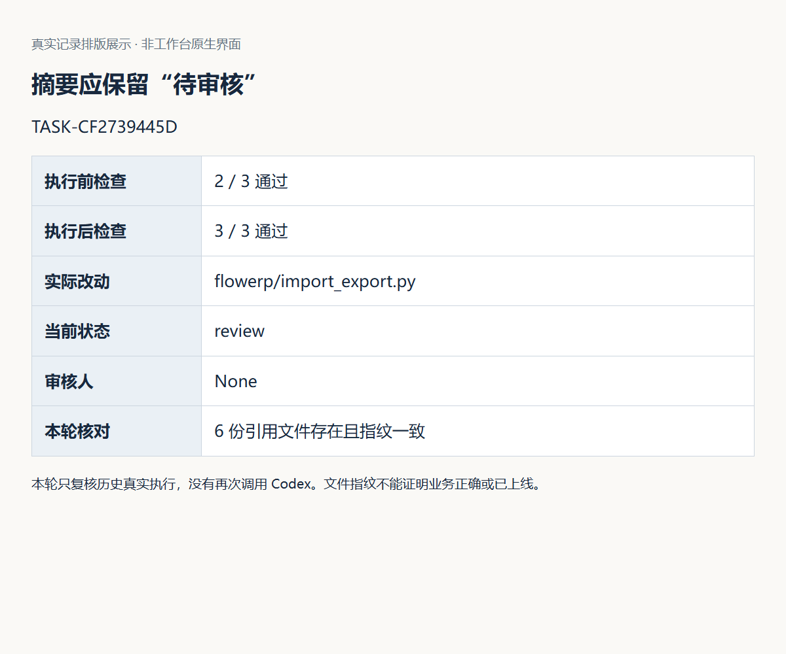

图 2：真实记录的排版展示，非原生工作台页面。最关键的组合是“3/3 通过 + review + 审核人为空”。接手者下一步要看候选并作决定，不是直接宣布上线。本轮未再次调用 Codex。

然后用相同输出路径再导出，实际收到 FileExistsError，旧摘要指纹未变化。在新建教学副本中分别制造引用不存在和指纹不符，导出都明确失败，未生成目标摘要。这里检验的是证据读取与文件保护，不是证明摘要中的业务判断正确。

## 2. 把“导出坏了”拆成原话、解释与决定

林舟保留周宁的原话，但没有把“坏了”直接写成原因。接下来每找到一条新证据，就更新解释，保留原观察。这样，陈珂才能看懂为什么从一句抱怨收窄到某个可修改的行为。

用户的原话值得保存，因为它描述了真实遭遇；但原话中的原因判断未必正确。你需要保留三个层次：原始观察、工程解释、审核决定。解释可以随着新证据修订，修订时仍应能找回原始观察。

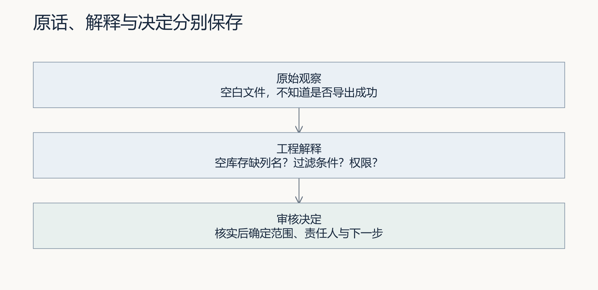

图 3：原话不被解释覆盖，解释不冒充决定。分层的价值是让后来的人知道哪些已经证实、哪些仍是假设。

“导出坏了”至少有四种解释：当前确实没有库存；查询过滤条件排除了所有记录；权限或组织边界导致看不到目标数据；导出格式丢失了列名。让 Codex 直接“修复导出”会迫使它猜测，甚至可能通过放宽权限来让文件看起来有数据。先询问时间、页面、对象、权限、过滤条件和文件内容，才可能得到范围正确的需求。

在空库存案例中，最小可观察需求是：即使数据行数为零，CSV 仍包含固定列名，让使用者能够分辨“有效空表”和“导出失败”。它不要求伪造一条库存，也不要求跨组织读取数据。这个边界来源于业务含义：没有数据是一种合法结果，权限不足则应明确拒绝。

### 2.1 接住 L14 的实际页面问题

L14 原生采购页观察中，浏览器离线后点击查询，页面仍保留“数据已同步”、旧采购状态和审批按钮。这条现场记录可以进入反馈讨论，但没有一位真实采购员说过“我因此重复审批了”，不能替他补上原话或损失。

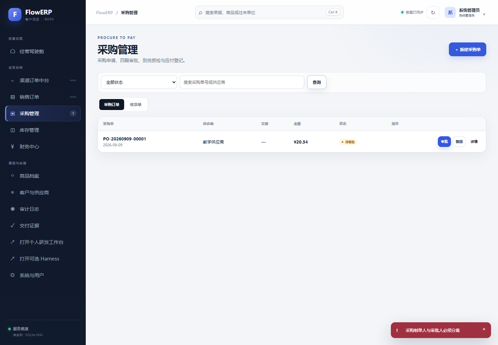

图 4：原生页面记录复用自 L14。先核对同一采购单与离线条件，再把“仍显示已同步”记为观察；“用户可能据旧数据作决定”记为待验证影响；“区分旧状态并提供原单重读”作为待确认方案。

可比较两种方案：只补一条断网提示，改动少，但旧按钮是否误导仍要测试；同时标记数据新鲜度并限制依赖最新状态的动作，范围稍大，需要明确哪些动作可以保留。选择要依据使用者要做什么，不能为了截图全绿把所有按钮一概锁死。修复后回到同单据、同离线条件验证，再请实际使用者说明下一步。

### 2.2 原问题修复后 新反馈怎样进入下一轮

上一张图保留的是旧版本失败。随后L14实际修复了采购查询：失败时隐藏旧结果和审批入口，保留查询条件，并阻止迟到的旧响应覆盖新状态。两项新增检查先失败后通过，实际浏览器恢复后仍能查回原采购单。修复来自当前Codex会话直接实现，不能写成已完成工作台反馈审核与后续任务采纳。

原生截图｜旧问题已有修复和同场景复验。摘要应写清修改与证据，同时注明没有独立人审；不要继续把旧截图描述为当前产品状态，也不要据此宣布使用效果已确认。

修复后继续在390像素视口走查，Tab能够到达右侧审批按钮，Enter可以打开确认框，Escape可以退出，单据仍待审批。但退出后的焦点没有返回原按钮。这是另一条实际工程观察：它涉及取消后的操作位置，与原来的数据新鲜度不同，应保留关联并建立独立判断，不覆盖旧问题的原始描述。

| 阶段 | 已有证据 | 下一步决定 |
|---|---|---|
| 原观察 | 离线仍显示旧状态与审批入口 | 明确失败时显示与动作边界 |
| 原问题修复 | 新增检查先红后绿，浏览器同单据恢复 | 核对候选并等待独立复验 |
| 新观察 | 退出确认框后未返回原按钮 | 确认影响，形成新的范围与接受条件 |
| 尚未完成 | 无反馈正式采纳到后续Task的记录 | 在原工作台组织审核与新任务，不补造关联 |

新需求可以约定“取消后回到仍有效的触发控件”，并补充原按钮因刷新移除时的处理。Codex帮助提出实现与用例，你判断范围，同伴观察是否能够接着操作。完成后回到同一键盘路径重验，才能说明新反馈促成了什么结果。原始证据与截图见[L14键盘与窄屏走查](../L14/examples/采购页键盘与窄屏走查.md)。

## 3. 分诊决定投入什么，而不只是打一个标签

林舟手里还有几种解释，不能同时把它们都当成缺陷。他根据对象、影响和已有证据，决定先核对空文件内容，哪些问题留待补充；这个取舍会约束下一轮修改。

收到“导出坏了”时，先确认使用者要完成的工作。如果文件结构有效，只是缺少空结果解释，小范围提示改进可能足够；如果已有数据未被导出，就要调查筛选、权限与数据读取。学生比较收益、成本和风险，与反馈者确认优先处理哪一项，再让 Codex 协助实现。延期也应有重新判断条件，不能把收集到的所有意见自动排成开发任务。

分诊是把有限时间用在值得处理且可以判断的问题上。先看影响与风险，再看是否复现，随后确定属于产品行为、界面解释、工作台控制还是新需求。频率有帮助，但一次可能破坏库存规则的反馈，通常比十次轻微文案抱怨更值得优先调查。

| 观察 | 需要补充的证据 | 可能的处置 |
|---|---|---|
| 空白导出无法识别格式 | 原文件、组织和过滤条件 | 保留列名与空表语义 |
| “每次都要审批，太慢” | 业务风险、审批责任、等待原因 | 改善解释或流程，不直接取消审批 |
| 两个入口做同一件事 | 误操作记录、实际使用路径 | 合并或隐藏重复入口 |
| 想要自动预测采购 | 数据基础、收益和误判成本 | 形成后续调研，不塞入本次导出修复 |

不要把每条意见都转成“增加一个功能”。保留、增加、合并、隐藏、删除和停止某项工作，都是产品处置。比较至少两个方案时，应说明用户收益、实现与维护成本、风险以及怎样观察效果。对信息不足的反馈，下一步可以是补充条件；对不采用的建议，保留理由比静默消失更便于协作。

重复反馈需要区分“重复提交同一次观察”和“不同使用者独立遇到同一问题”。前者应避免重复执行；后者能提供影响范围，不能简单删除。关联到同一个问题时仍保留来源与差异。当前反馈函数支持去重键，但同键不同内容会返回原记录，并未实现内容冲突拒绝；实践中应核对返回内容，修订反馈时显式建立关联，不用旧键偷偷替换原话。

## 4. 接受反馈、批准改进和接受交付是三次判断

周宁的观察值得调查，却没有自动授权所有修改。林舟先确认反馈记录，再确定改进范围；候选形成后，陈珂还要独立判断能否接受。下面沿同一条反馈看三个决定各允许推进到哪里。

当前反馈状态为 `pending_review → accepted / rejected`。接受反馈表示它值得作为经确认的输入继续处理，不等于接受用户提出的全部解决方案。仓库中的 Evolution 候选还需要自己的审核、资产登记与后续任务验证；交付任务另有 Eval 与具名验收。

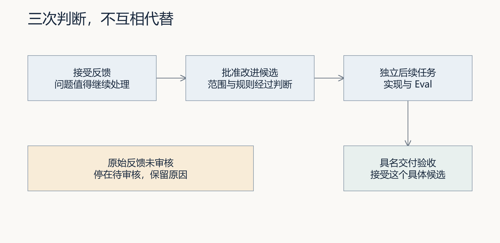

图 5：每一道判断回答不同问题。前一道通过，不会替后一道自动作出决定。

新反馈要求任务编号、来源、结论与下一步非空。自动失败观察只允许从 `rework`、`failed` 或 `dead_letter` 等失败状态产生，仍进入待审核。自动采集的价值是减少漏记，不是让系统自行决定业务规则。

2026-09-06 的隔离复核记录 `FB-92BD524B` 指出历史维护任务仍待审核，下一步是请实际审核者核对候选与报告。该记录保留在 `pending_review`；尝试直接建立 Evolution 候选被拒绝。它是维护复核观察，不是学员访谈，也没有人审采纳。这个失败请求说明了一个门槛有效，不能扩展为“所有入口的权限与并发都已验证”。

还要理解接口边界：`add_feedback` 检查字段非空，并不因此证明源任务真实存在；Evolution 建立时会检查源任务与业务引用。姓名字段也不自动证明身份认证。你应在实际入口核对调用者权限与对象关联，而不是根据一个字段名推断整个系统安全。

### 4.1 实测二 写入反馈后，为什么仍停在待审核

本轮将历史任务数据库备份到隔离目录，保存工程复核反馈 FB-04100D82：任务仍待审核，摘要不应宣称已验收。来源是维护记录复核，结论和下一步分别保存；这不是新客户反馈，也没有替实际审核者决定。

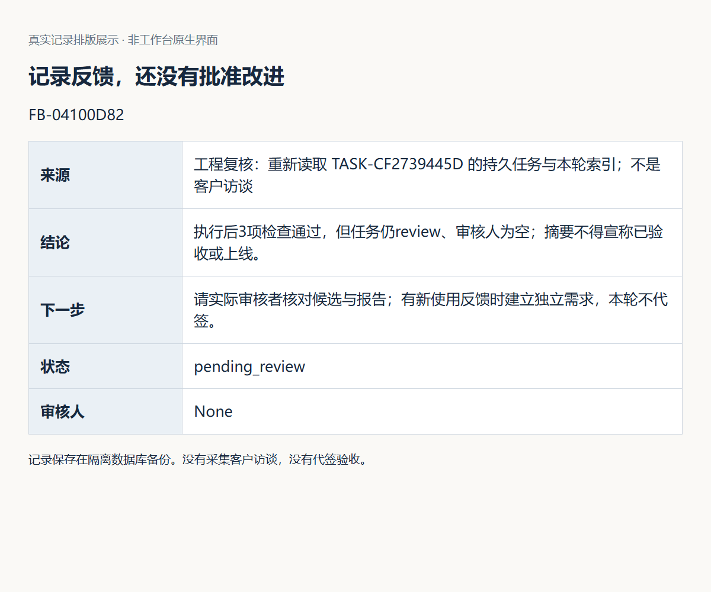

图 6：真实记录排版展示。记录含来源、结论、下一步和 pending_review 状态。再提交同一去重键，返回同一 ID；使用同键但改写结论，仍返回旧正文。这说明调用者必须核对返回内容，而不能将第二次输入当成已保存的新版本。

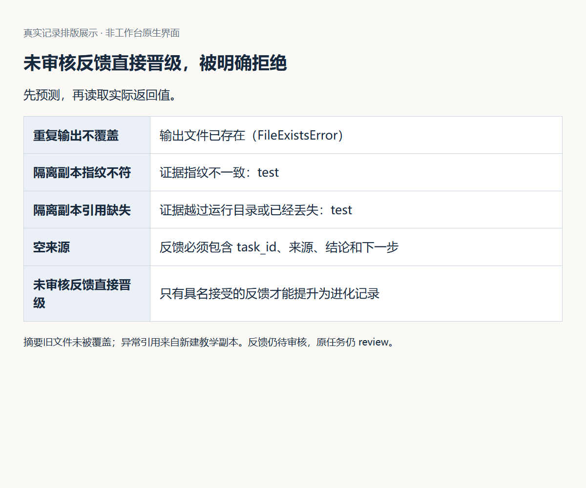

图 7：空来源被拒绝；直接从未审核反馈创建 Evolution 候选，也被明确拒绝。操作后反馈仍待审核、原任务仍 review。图中其他失败是摘要导出实验，分别检查输出保护和引用有效性。完整字段见[本轮复核记录](assets/latest/observation.json)。

这组记录证明了采集与晋级之间的边界，没有证明一次改进已经被采用。真实反馈采纳、新任务实施和使用效果，仍需要后续实际行动形成证据。

## 5. 为什么原始反馈不能直接变成阻断 Eval

前一节说明反馈何时可进入改进流程。若改进涉及检查规则，影响还会扩大到后续任务，因此需要再核对适用范围和反例。

Eval 是决定候选能否继续交付的裁判。阻断 Eval 一旦失败，会影响后续任务。因此将一条意见加入其中，等于改变以后所有适用任务的通过条件。

假设有人说：“库存为零时，导出应该报错。”如果未经核实就写成全局阻断规则，有效空表将被误判，自动化对账可能无法运行。先澄清要解决的是“格式不明”还是“不允许无库存”，再决定正确预期，才不会让裁判奖励错误实现。

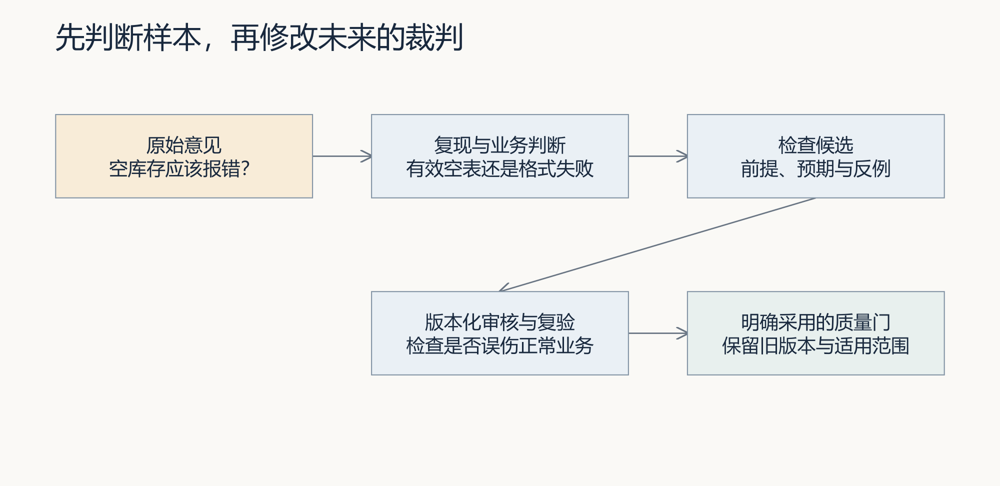

图 8：样本先经过复现与范围判断，再成为可审查候选。改变阻断规则是一项明确变更，需要独立复验。

好的候选检查包含前提、操作、期望结果和反例。空库存导出至少要检查：空表列名；非空数据数量；组织隔离；没有权限时拒绝；未知类型时拒绝；导出前后库存不变。如果只检查“文件非空”，写入一句“暂无数据”也可能通过，却破坏 CSV 合同。

原有规则继续适用时，先把新样本放入本次需求的明确用例集合。不要为了拿到绿灯降低旧规则等级。仓库的 `raw_feedback_cannot_become_blocking` 用例验证未审核反馈不能建立候选，且接受后既有入库幂等阻断项仍存在；它不是对任意代码编辑和所有潜在规则污染的穷尽证明。

## 6. 用独立后续任务证明改进，而不让源任务自证

林舟为已确认的改进建立后续任务，保留旧任务原有结论。新候选运行自己的检查，再把结果与反馈来源关联起来；不能拿改进前的绿灯证明这次修复有效。

反馈描述了源任务的不足。若仍引用源任务原来的绿报告来证明“改进有效”，证据在时间上就不成立：这份报告产生时，改进还没有发生。应建立不同的后续任务，绑定本次具体需求和候选版本，再运行相应检查。

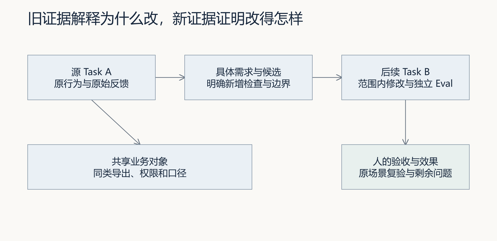

图 9：旧证据解释为什么改，新证据解释改得是否正确。两者共享业务对象，不能交换用途。

L15 的新需求起始检查区分既有合同和新增验收。既有通过、新增失败，才是这条新需求可以开始的起点；既有失败要先处理；两组都通过则应核对是不是已拿到参考终态。未知用例、依赖缺失、永远失败的断言和改名后的旧测试，都不能说明产品缺少本次能力。

空库存维护记录曾留下真实先红后绿，但当前参考代码已经修复。因此重新运行现有测试会全部通过，这是回归检查，不能再算你完成了一次新开发。你的独立任务应来自实际试用的新反馈，范围要小，但必须具有尚未实现的、可观察的结果。

实现之后，除了新的 Eval，还要核对范围内 Diff、文件来源、业务结果和人的判断。Evolution 的后续验证检查不同任务、关联业务对象、逐项阻断结果、报告快照与具名验收等条件；这些条件建立了证据关联，但仍需要人解释本次任务究竟验证了哪项改进。

## 7. Memory 管什么，RAG 又管什么

### 7.1 先分清：接着做同一件事，还是把经验用于下一件事

前面已经要求用独立后续任务证明改进。进入记忆设计之前，先区分两个问题：一次任务暂停后怎样继续，以及另一项任务怎样借鉴已有经验。

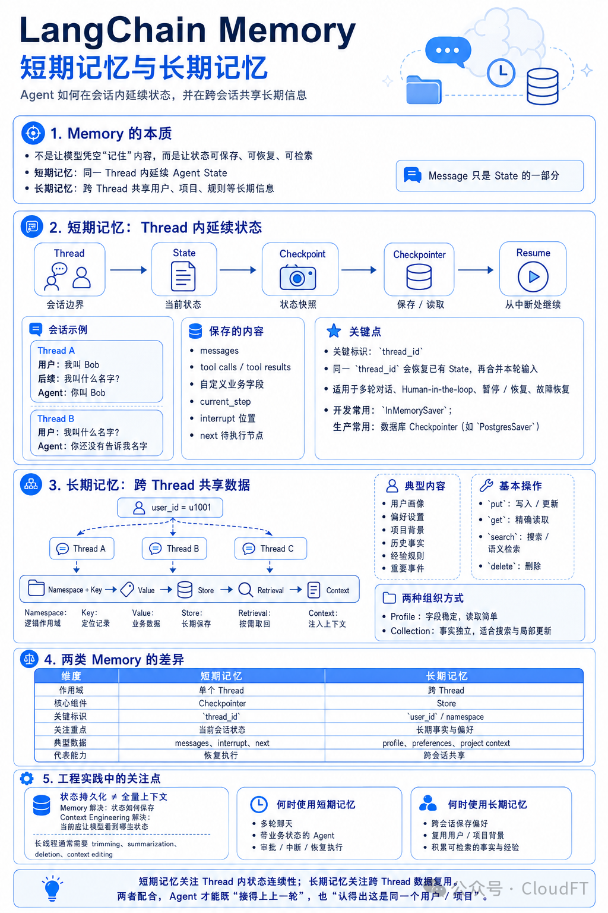

*图片由课程编写者提供，原图署名“公众号·CloudFT”，保留原图。图中的 LangChain Memory、Checkpointer、Store 等名称用于框架概念对照，不是课程新增依赖，也不是本工作台已实现能力的证明。*

先看图中第 2、3 部分，再用第 4 部分的对照表核对区别：

| 要解决的问题 | 课程中的对应场景 | 需要保留什么 | 不能据此认定什么 |
|---|---|---|---|
| 短期记忆：同一任务怎样接着做 | L12 的采购交付流程等待人工审核，稍后恢复 | 当前任务身份、执行阶段、候选版本、报告和审核状态 | 保存了状态，不等于外部动作可以安全重做，也不等于旧批准仍有效 |
| 长期记忆：新任务怎样复用旧经验 | L15 将库存导出中“空 CSV 保留列名”的经验用于新的销售导出任务 | 经验来源、项目、版本、适用边界、有效状态及采用记录 | 旧任务成功，不等于新任务已经通过自己的 Eval 与人审 |

这里的“短期”和“长期”主要帮助我们区分状态延续与跨任务复用，不能只按保存了几分钟或几天判断。图中的 Thread 是框架的会话边界，不应直接等同于课程的业务事项或 Task；设计时需要明确它们怎样关联。

再看图中第 5 部分：**保存状态与准备当前上下文是两项工作。** 即使历史材料已经落盘，本轮仍要决定哪些内容与任务有关、哪些已过期、哪些允许读取，以及有限上下文中应保留哪些来源和限制条件。

跨会话共享也要受项目、权限、适用条件与有效状态约束。存储成功不等于获准检索，检索命中不等于已经采用。课程继续使用现有 Python 标准库实验，不要求按图安装 LangChain 或数据库 Checkpointer；接下来重点建设长期经验的治理与复用链路。

### 7.2 从保存经验到治理与检索

要让另一项工作真正受益，还需要解决两个不同问题。本节的 Memory 重点讨论哪些经验可以长期保存、怎样更新和撤回；RAG 决定当前问题应检索哪些内容、怎样把它们放进本次上下文，并要求生成结果回指来源。

| 对象 | 回答的问题 | 最低可追溯字段 |
|---|---|---|
| 原始经历 | 当时实际发生了什么 | 事项、Task、候选、原始报告、时间 |
| 记忆条目 | 哪个结论值得在何种条件下复用 | `memory_id`、项目、版本、来源、适用与不适用条件、状态、审核 |
| 检索结果 | 为什么本次查询看到这些条目 | 查询、过滤条件、排序方法、分数、Top-k、未命中 |
| 上下文快照 | Agent 本次到底获得了什么 | 查询版本、条目版本、引用片段、预算、快照指纹 |
| 采用决定 | 哪些建议真正进入了本次计划 | 采用或拒绝、理由、决定人、允许范围 |
| 后续验证 | 复用后是否仍然有效 | 新 Task、Diff、Eval、业务结果、人审、修订或停用 |

工作台的 Memory 不是聊天记录堆积。日志、摘要和反馈可以成为记忆来源，但只有经过提炼、写清边界并通过审核后，才能成为默认可检索的 `active` 条目。建议使用 `candidate → active → superseded / revoked` 生命周期。`candidate` 允许讨论但不应默认注入；`superseded` 保留历史并指向替代版本；`revoked` 因错误、过期或风险被撤回，检索器必须默认排除。

例如“空 CSV 保留列名”不能只写成一句经验。它至少需要说明来源任务、适用于哪些机器可读导出、不适用于二进制报表、仍需重新确认字段和组织权限，以及哪份 Eval 支持它。若后来发现该方法会泄露受限字段，新版本不能静默覆盖旧条目，应撤回旧版本并保留受影响任务的追查入口。

## 8. RAG 是一次可检查的运行链路

RAG 是 Retrieval-Augmented Generation，即检索增强生成。它把外部、可更新且可引用的材料，在生成回答或计划之前检索出来。L15 不训练模型，也不要求学生先部署向量数据库。跟跑练习先用可解释的关键词与字符片段排序，目的是看清完整合同；向量检索是可以替换的检索实现，不是 RAG 成立的唯一条件。

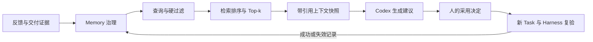

[可编辑 Draw.io 源图](assets/diagrams/07-memory-rag-delivery.drawio)

图 10：Memory 管理可复用知识，RAG 在当前事项中执行检索、上下文装配和带引用生成。人的采用决定与 Harness 复验位于生成之后，避免“检索到”被误写成“已经批准”。

一条最小 RAG 链分为六步：

1. **形成查询**。从当前 Spec、失败报告和业务对象生成可检查的问题，同时保存原始查询与必要改写。
2. **先做治理过滤**。按项目、业务对象、状态、版本、权限和时间过滤。错误项目或 `revoked` 条目即使文本相似，也不得进入默认候选集。
3. **检索与排序**。对候选条目计算相关性，返回 Top-k。排序分数只说明匹配程度，不证明内容正确，也不等于采用优先级。
4. **装配上下文**。在预算内保留条目身份、来源、适用边界、冲突提示和引用片段。不能只复制结论而丢掉限制条件。
5. **生成带引用的建议**。Codex 的每项关键建议应引用 `memory_id@version` 及来源证据；没有支持时明确写“未找到可用记忆”。
6. **人工决定并运行 Harness**。人核对引用、冲突和适用性，保存采用快照。后续任务仍按自己的 Spec、写集、Eval 和具名验收交付。

这六步说明为什么“把全部历史塞进 Prompt”不是 RAG。它没有检索选择、没有有限预算、没有可复现排序，也很难说明本次用了哪一版材料。只返回相似片段也不完整，因为尚未进入生成与引用。反过来，生成内容带了链接，也不能证明检索正确；链接可能不相关、过期或只支持句子的一半。

### 8.1 切分、元数据与检索方法怎样取舍

记忆条目应以一个可独立判断的经验为基本单元。切得过大，相关结论会被无关日志淹没；切得过小，来源、前提和例外会被拆散。L15 的最低要求是让一个条目同时保留结论、边界和来源引用，不按固定字符数机械切断语义。

林舟为“销售导出空结果怎么办”查询记忆，假设有四条教学候选：本项目有效的空表经验，另一个项目文字几乎相同的经验，已经撤回的旧方案，以及只适用于人工阅读报表的建议。后面三条即使分数更高，也不能自动成为当前任务的依据。先核对项目、权限、状态与适用条件，之后才在合格材料中比较相关性。

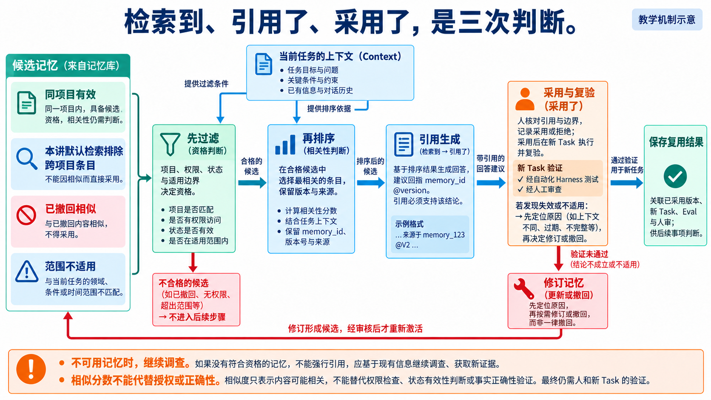

*读图：左侧先排除无资格材料，中间保留引用与边界，右侧才进入人的采用决定和新任务验证。*

这里不能用一个总分代替所有判断。若“已撤回”只扣几分，极高的文字相似度仍可能把它推到第一名；若切分时丢了“不适用于人工报表”之类的边界，生成阶段甚至看不到这个限制。元数据与语义单元应一起保留。权限、项目和状态可作为程序硬过滤；复杂适用条件还需显式展示给人判断，不能宣称关键词检索器已理解所有业务边界。

关键词检索容易解释，适合小规模、术语稳定的课程语料；向量检索擅长处理不同说法，但仍需要元数据过滤、阈值和评测。混合检索可以结合二者，并增加重排器。更复杂的方案只有在真实评测集上改善结果，且成本、延迟和可维护性可以接受时，才值得进入工作台。

### 8.2 冲突、空结果和提示注入怎样处理

检索到相互冲突的 `active` 记忆时，不应让模型自行挑一个“看起来更合理”的版本。上下文包要并列展示冲突对象、来源、版本和适用条件，交给有责任的人判断。检索为空时，应返回空集合并继续调查，而不是用模型常识补写一条伪记忆。

记忆内容也是不可信输入。历史材料中可能包含“忽略当前规则”“扩大写集”等指令。装配器应把记忆标为引用材料，不把其中的命令提升为系统规则；当前 AGENTS.md、Spec、授权写集和人的决定仍具有更高约束。涉及客户数据时，还要在索引前完成权限与最小披露检查，不能依靠生成阶段再遮掩。

## 9. RAG 怎样评测，而不是看答案像不像对

先建立小型查询集。每条查询保存当前项目、业务对象和人工确认的相关记忆集合。至少包含正常查询、改写查询、无答案查询、跨项目干扰项和已撤回高相似条目。评测集本身要有版本；新增记忆后可以重跑，但不能悄悄改相关项答案来迁就排序。

对于返回的前 k 条，可先计算两个容易解释的指标：

- `Precision@k = Top-k 中相关条目数 / k`，回答取回的内容有多少真正相关。
- `Recall@k = Top-k 中相关条目数 / 已知相关条目总数`，回答应找的内容找回了多少。

用一组教学数值看两者的区别：人工确认共有三条相关记忆，Top-2 返回两条且都相关，则 Precision@2 为 2/2，Recall@2 为 2/3。答案看起来很干净，却可能漏掉第三条关键权限限制；若 Top-4 中有三条相关、一条无关，则 Precision@4 为 3/4，Recall@4 为 3/3。召回更完整，同时增加了一条噪声。选择 k 应回到漏掉什么、引入什么和上下文成本，而不是单追一个高分。

以上按固定 k 槽位计算 Precision；若实际只返回 m 条且 m 小于 k，应注明分母仍为 k，或另报“返回结果精度”为相关数除以 m，两种口径不能混用。无已知相关项时不硬算 Recall，应观察是否如实返回空。检索到了正确材料之后，还要逐句核对引用：一条仅支持“空表保留表头”的来源，不能支持“可绕过组织权限导出全部数据”。有引用与引用支持结论，是两次不同检查。

检索指标还不够。上下文与生成阶段至少检查四项：引用是否覆盖关键建议，引用内容是否真正支持该建议，使用的条目版本是否与快照一致，回答是否泄露未授权材料。最后再看任务结果：采用记忆后的新候选是否通过自己的 Eval，业务对象状态是否正确，具名审核者是否接受。生成看起来合理，只能作为待验证建议。

| 失败 | 表面现象 | 应定位的层次 |
|---|---|---|
| 相关记忆未返回 | 回答漏掉已知边界 | 查询、切分、过滤、召回或 k 值 |
| 撤回条目进入上下文 | 回答引用旧错误做法 | 状态治理和硬过滤 |
| 返回正确条目但建议错误 | 引用存在，推理仍越界 | 上下文装配、提示与生成 |
| 建议正确但执行越权 | 方案合理，Diff 超出范围 | Harness、授权写集和执行控制 |
| Eval 通过但使用困难仍在 | 技术行为满足，现场问题未解决 | 需求判断和效果回收 |

## 10. 用一个可执行实验看清完整链路

本讲提供[最小 Memory/RAG 实验](examples/memory_rag_lab.py)和[教学记忆集](examples/memory_rag_fixture.json)。脚本只使用 Python 标准库，先按项目与状态过滤，再用透明的词项和中文字符片段计算排序，输出 Top-k、上下文快照和 Precision@k/Recall@k。它用于理解合同，不代表生产级中文检索质量，也没有接入工作台首页。

学生先运行无治理过滤的反例，观察高相似的 `revoked` 条目可能进入候选；再启用项目和状态过滤，检查撤回项与跨项目项被排除。随后检查一个改写查询是否仍召回同一有效记忆，以及无答案查询是否如实返回空。最后把上下文包交给 Codex，要求每项建议引用 `memory_id@version`，并由学生决定采用或拒绝。

实验通过只证明这个固定语料和查询集下的最小检索合同。它不能证明生产检索已完成、向量方案更优、答案事实一定正确，或工作台已具备跨事项闭环。学生自己的课内增量要绑定真实反馈、真实记忆和另一事项的新验证。

## 11. 从召回到采用，再回到使用效果

从空库存案例可以提炼“导出空结果也保留格式，并核对权限与只读性质”的记忆。迁移到销售导出时，RAG 可以找到这条经验，但学生仍应重新判断字段、组织权限和数据口径。若采用，工作台保存查询、命中条目版本、采用理由和上下文指纹；若不采用，也保存原因。这样才能区分“系统没有找到”“找到了但不适用”和“已采用但执行失败”。

后续任务按照采用快照形成自己的 Spec 和新增 Eval，经 Harness 执行并接受具名审核。复用成功时，记录适用边界得到支持；复用失败时，回到来源判断是检索错、记忆错、边界漏写还是执行错，再修订或撤回相应条目。不能因为来源事项曾成功，就把后一事项标记为成功。

方法已经保存、检查已经通过，仍不能说明使用者的困难消失了。修复后应让原反馈者在相同条件下再次操作，记录角色、版本、场景和实际判断。测试通过回答约定行为是否满足；用户复验回答原先的操作困难是否消除。同伴试用、维护者复核和真实业务观察分别注明来源，不互相冒名。

项目驱动的主链仍是业务问题、PRD、技术方案、开发、测试和使用效果回收。Memory 与 RAG 帮助新任务取得有来源的候选知识，不能替代这条主链。本讲最终提交的是一条跨事项因果链：反馈怎样产生记忆，查询为何召回它，学生为何采用，后续任务怎样执行，业务与人审结果怎样反过来修订记忆。

当前生产工作台仍将跨事项经验召回、采用快照、流程版本选择和失效治理列为待建设。L15 的标准库实验是可执行教学支架，不得据此宣称首页、服务、持久化和生产权限链已经贯通。L16 将在干净环境中检验整套系统，并现场处理此前未实现的小需求。

## 离开这一讲之前

林舟把经审核的经验送入另一事项，记录检索到什么、采用哪一版、复验是否有效。若下一次没有实际采用，就仍只是待复用材料。课程最后，陈珂将从新的环境接手，并提出一个没有陪林舟预演过的小需求，检验这些能力能否继续工作。

## 课程合同与配套材料

- **核心内容**：文档和周报导出、运行反馈、可治理 Memory、RAG 检索与引用评测、失败样本回流，以及记忆采用和自动改代码之间的人工边界。
- **演示结果**：生成交付摘要与结构化反馈；将审核后的经验登记为记忆，在另一事项中检索，输出带引用的上下文包并解释采用决定。
- **课内增量**：实现摘要、反馈记录和最小 Memory/RAG 练习链：记忆版本与状态、元数据过滤、可解释排序、Top-k 上下文包和采用快照；不增加新的 Agent 编排。
- **通过标准**：摘要可追溯；记忆保留来源、版本、边界和状态；撤回或跨项目记忆不会默认进入上下文；检索评测与引用完整性可复验；原始反馈和检索结果都不能未经人审直接改写阻断 Eval。

继续阅读[实践操作手册](实践操作手册.md)，用[行动卡](行动卡.md)核对任务，按[提交模板](SUBMISSION.md)整理证据。[摘要导出示例](examples/export_digest.py)是可阅读的教学支架，不替代你的实现。

实现核对日期：2026-09-12。依据为 `workbench/feedback.py`、`workbench/evolution.py`、`workbench/release_index.py`、`eval/cases.py`、`tests/test_inventory_empty_export.py` 与本讲标准库实验。RAG 概念参考 Lewis 等人的[原始论文](https://arxiv.org/abs/2005.11401)；向量检索的当前产品形态可参阅 [OpenAI Vector Store Search](https://developers.openai.com/api/reference/python/resources/vector_stores/methods/search)，它只作为可选扩展，不属于跟跑依赖。相关背景见[维护案例](../../reference/L15空库存导出维护案例.md)、[新增需求起始检查](../../reference/L15-L16新增需求起始检查.md)、[工作台范式与闭环建设](../../architecture/工作台范式与闭环建设.md)。架构中的建设计划不作为已实现事实。
