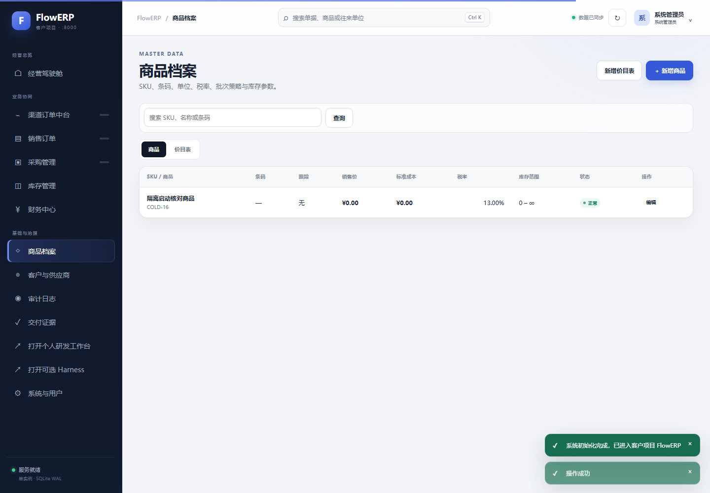
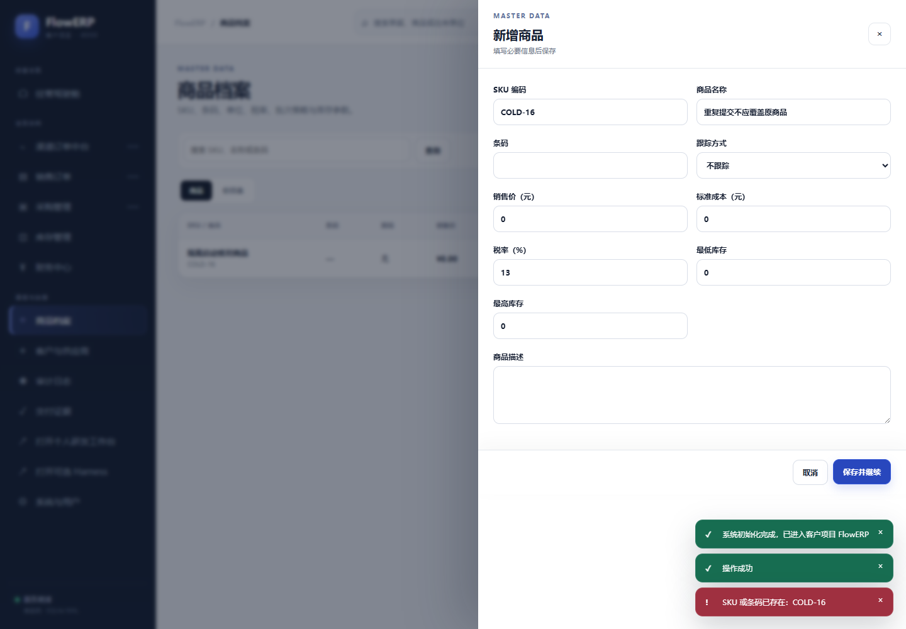

# 从首次初始化到业务可用：商品建档复验

健康接口通过之后，接手者仍可能无法办理业务：组织和管理员尚未创建，或者写入成功提示没有对应的持久记录。本例沿着“进入组织 → 建立商品 → 拒绝重复 → 回查原记录 → 重新登录”完成一次最小业务观察。

这是本机隔离参考实验：使用新的源码快照、虚拟环境、ERP 运行目录和工作台运行目录，仍共用 Windows 主机及基础 Python。操作由浏览器自动化完成，没有模拟同伴签字，也没有进行容器构建。本例验证既有商品建档能力，不是结业要求中的现场新需求。

## 1. 为什么先建立一件商品

商品档案是采购、库存与订单引用的基础对象。用唯一 SKU 建档，可以检查页面、登录会话、组织归属、业务写入与重新读取是否贯通。这里还没有发生入库，商品建档成功不能被解释为已有库存。

先在首次初始化表单填写教学组织名称和管理员账号。密码只在本机输入，不放进截图、报告或课程文件。成功后进入“商品档案”，点击“新增商品”，填写 SKU `COLD-16`、名称“隔离启动核对商品”，其他参数保持本例默认值并保存。

图 1｜实际原生页面：商品列表出现 COLD-16。该结果只证明本次建档路径，尚未覆盖采购审批或库存变化。

## 2. 为什么还要故意重复建档

如果重复点击或重复录入能生成两个同 SKU 商品，后续采购和库存引用就可能混乱。因此，成功保存之后还要再次新建同一 SKU，并把名称改为“重复提交不应覆盖原商品”。本次应拒绝新建，也不应悄悄改写原名称。

图 2｜实际原生页面：接口返回 409，页面提示“SKU 或条码已存在：COLD-16”。截图中的其他成功提示属于前序操作，判断本次结果要看本次响应与对应错误信息。

## 3. 错误提示之后还要检查什么

关闭表单并刷新商品列表，核对 COLD-16 仍只有一条，名称仍为“隔离启动核对商品”。随后退出登录，使用同一组织和账号重新登录，再次查看商品。这样才能排除仅靠页面临时显示造成的成功印象。

| 操作 | 预期 | 本次实际观察 |
|---|---|---|
| 首次初始化 | 建立组织及管理员 | HTTP 201 |
| 新建 COLD-16 | 成功创建一条商品 | HTTP 201 |
| 重复 SKU、改用另一名称 | 拒绝创建 | HTTP 409，SKU 或条码已存在 |
| 失败后刷新 | 原条数与原名称不变 | 一条，仍为原名称 |
| 退出并重新登录 | 同一组织能够回查商品 | COLD-16 可见 |

原始观察见[业务复验记录](../assets/latest/business-observation.json)。如果截图尚未显示错误、仍处于加载动画，不能把它当作清楚的失败证明；应等待实际提示和稳定页面后再采集，保留此前不充分的记录。

## 4. 怎样用于自己的结业交付

将本例的对象换成你实际交付的业务对象，写清正常操作、应拒绝的输入、失败后必须保持的状态，再由复验者操作同一候选。既有建档能力通过不代表新增需求通过；采购审批、库存保护、结果导出、反馈、工作台任务及具名审核仍要按各自要求验证。

本次服务在采集完成后关闭；运行数据库与临时登录材料不作为课程附件发布。
