# L16｜冷启动发布与工程答辩

> 本资料由 AI 辅助整理，为课程赠送资料，用来辅助你理解课程内容，可作为查询手册使用，非必读资料。

## 本讲总览图

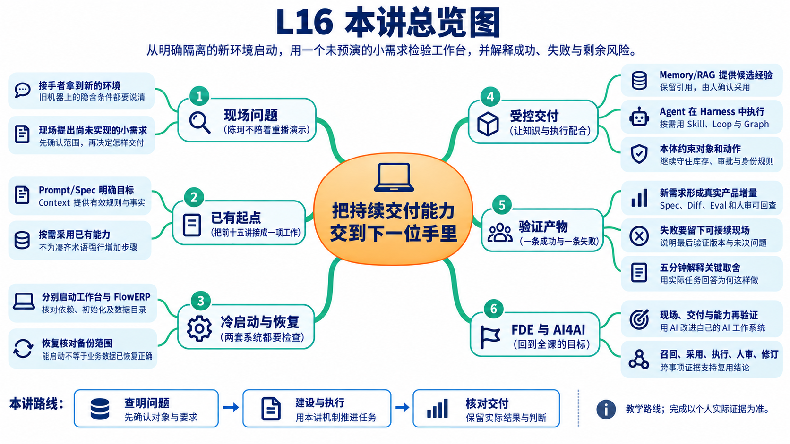

## 本讲总览

本讲先定义干净环境的实际隔离范围，启动工作台与 FlowERP，再核对初始化、备份与恢复；随后现场确认并交付一个此前未实现的受控小需求。你负责范围和取舍，Codex 协助实现，同伴独立复验。答辩用成功、失败和未解决问题解释判断；原有参考实验不替代本人的冷启动与现场新交付。

## 回看全课能力图

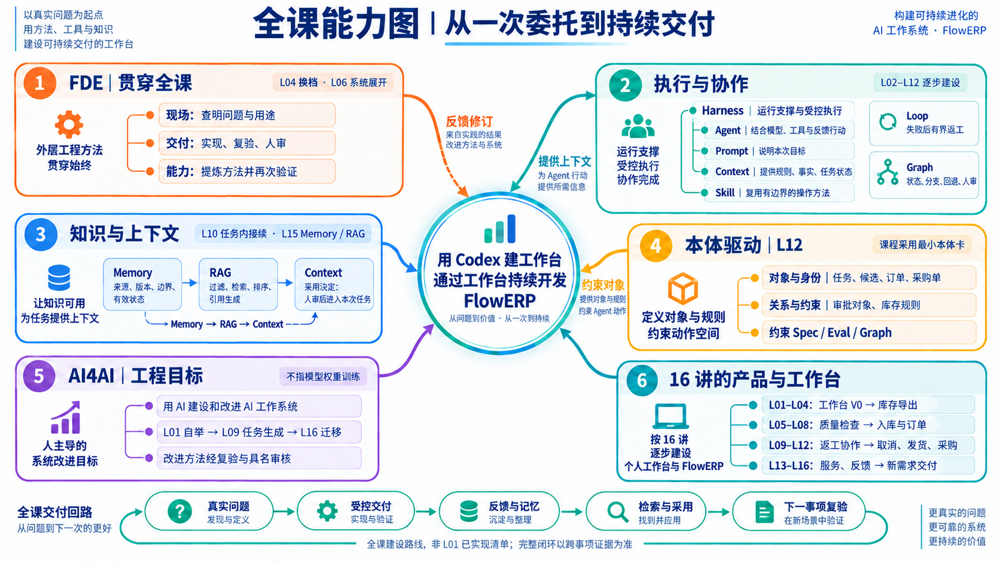

结业时沿同一张图回查实际任务：Prompt 和 Spec 是否说清范围，Context 是否带入有效事实，L15 的 Memory / RAG 是否提供有来源的候选经验，人为何采用；Codex 的 Agent 执行是否受 Harness 约束，Skill、Loop 或 Graph 在需要的环节是否实际发挥作用，本体中的对象和规则是否仍被遵守。按需求选择能力，不为凑齐术语强行增加步骤。

如果林舟借助 Codex 改进了工作台，又在后续事项中采用并复验这项改进，才有依据说明本课程所说的 AI4AI 发生了什么。请用“召回 → 采用 → 受控执行 → 人审 → 修订或保留”的实际记录解释这一点；仅有记忆文件或一次成功演示，还不能证明跨事项闭环。

## 林舟的项目手记

林舟准备结课展示，陈珂却合上了他的演示稿：“今天用新的目录启动，再做一个以前没实现的小需求。”周宁也带来一项范围不大的使用要求，等系统启动后再一起确认。

林舟需要交出的已经不只是一组页面。陈珂要能找到安装条件、两套数据、恢复办法和当前风险，还要从工作台开始下一次交付。前十五讲留下的规则、检查、返工和审核，今天都要在接手者的操作中派上用场。

人物与开场对话为虚构教学情境；实测材料按原注释辨认来源。人物关系与连续路线见[讲义阅读导航](../讲义阅读导航.md)。

## 从客户业务理解结业任务

FlowERP承接电商的采购、库存、订单与财务业务。采购入库增加实物库存，订单预占影响还能承诺的数量，出库和退货又会改变账本。结业发布时，这些已经发生的业务事实不能因换一版程序而丢失。现场新增的筛选或导出需求，也必须继续遵守原有权限、库存和审批规则。

个人工作台保存需求、授权、候选、检查和人的决定，组织学生与Codex继续开发FlowERP。它不是客户的员工门户。L16要让接手者既能运行客户产品，又能理解怎样从工作台首页“事项与决策”开始下一次研发；两套页面、两套数据和两类验收须分别核对。

本讲沿一条交接线展开：接手者拿到代码，首先发现一个服务能开、另一个却退出；补齐环境条件后，两页都能打开，但业务尚未初始化；随后发现旧备份虽能恢复，却不包含最新入库；最后用一个此前未实现的小需求，验证工作台能否继续组织交付。启动、初始化建档与恢复均有实际参考实验；现场新需求与具名复验仍须由学员完成。

## 本章学习地图

先定义冷启动成功，再建立发布与恢复依据，随后通过工作台交付一个此前未实现、范围受控的 ERP 小需求，最后用证据解释关键决策。

工作台与 FlowERP 都是本讲交付物：前者应能组织新任务，后者必须产生真实新变化。Codex 协助调查和实现，学生控制范围与资源，独立审核者复验并作具名人审。

## 1. 干净环境能揭示什么？

开发者机器可能隐藏了未记录的依赖、初始化数据、环境变量或手工修正。服务在原机器能启动，说明这些条件共同成立；并不能说明他人能按交付说明重建它们。

**冷启动**指从没有现成运行状态的环境，按说明建立依赖、初始化必要数据并启动服务。课程可以使用新的隔离目录或约定容器环境；应记录实际隔离了哪些条件，不把“换一个终端”称为干净环境。

启动成功至少包括工作台与 FlowERP 服务可访问、数据目录正确、关键操作可用。健康检查只能说明其检查的项目，不能自动证明备份可恢复或整条交付流程能执行。

### 1.1 实际失败：客户页打开了，工作台却退出

本轮复制139个源码文件，在新的目录建立虚拟环境并安装项目，又为两套服务指定新的运行目录。FlowERP进程启动后，工作台却报错“目标项目必须是独立Git工作区”并退出。作者的原仓库一直带有Git信息，这个条件直到源码快照重建时才暴露。

工作台需要登记默认项目；只复制Python与页面文件没有包含仓库元数据。修订是在独立源码目录执行Git初始化，再用全新环境复验。镜像构建配置也补上了这一步，但初始化空仓库没有导入课程标签、提交历史或执行授权，不能因此认为现场代码交付已经具备全部条件。

该次本机接口探测还受到代理影响返回502。排查时必须同时读服务日志：代理错误不能替代工作台退出的应用原因。修订后的本机探测不经过代理，并用浏览器交叉核对。完整步骤见[本机隔离启动案例](examples/cold-start-observation.md)。

### 1.2 修订后的页面，分别证明了什么


原生截图｜新的FlowERP首页显示初始化表单，健康接口返回ready。这证明页面和探针条件可用；组织、管理员和实际业务仍待初始化。表单中的“工作空间”属于客户产品，不是个人研发工作台。


原生截图｜个人工作台首页显示零事项，健康结果指向本轮客户服务地址。下一步从“事项与决策”提出需求；本轮没有创建交付事项，也没有授权Codex执行或代填审核人。

这次实验隔离了源码目录、虚拟环境和两套运行目录，但仍共用Windows主机、基础Python与网络。两套首页HTTP200不能扩大为陌生机器或容器验证；没有Docker引擎，镜像实际构建仍待验证。这样的边界能帮助接手者知道下一步该检查哪里。

### 1.3 从初始化继续到一次可回查的业务操作

上一组截图停在初始化页面。随后在另一套全新隔离环境中，我们继续填写教学组织和管理员，进入商品档案并创建 SKU 为 `COLD-16`、名称为“隔离启动核对商品”的记录。商品档案是采购、库存与订单引用的基础对象；选择它，可以检查登录会话、组织归属、页面写入与重新读取是否贯通。建档尚未产生入库，不能把这一步说成库存已可用。


原生截图｜初始化和商品建档分别返回201，商品列表出现COLD-16。本例由浏览器自动操作完成，密码只存在于本次运行内存中，不作为教学附件。

成功之后，再用相同SKU新建商品，故意改用另一名称。接口返回409，提示“SKU或条码已存在”。这一步检验重复输入是否会产生第二条记录或覆盖原记录。不能只看错误消息，还要关闭表单刷新列表：本次仍只有一条COLD-16，名称保持“隔离启动核对商品”；退出后重新登录同一组织，也能回查该商品。


原生截图｜红色提示对应本次重复提交；绿色提示属于前序成功操作。多个消息同时出现时，要用本次请求和结果判断，不能把绿色提示当作所有操作均成功。

这段过程把“页面能打开”推进为“本次商品建档及重复保护可用”。它仍不证明采购审批、库存保护、现场新增需求和独立人审已经完成。完整输入、响应和回查步骤见[初始化与商品建档复验](examples/初始化与商品建档复验.md)。接手者应换用自己的业务对象，分别记录正常输入、应拒绝输入以及失败后必须保持的状态。

## 2. 发布说明需要提供哪些可重建条件？

陈珂按说明接手时，需要找到源码版本、依赖安装、启动命令、两套服务与数据目录、初始化办法及出错后的诊断入口。林舟逐项补齐可重建条件，把运行数据库、密钥和本机缓存留在源码交付之外。

本仓库使用项目虚拟环境与本地安装。依赖版本和初始化方式应来自实际项目文件，而不是按个人机器经验补一句“装个 Python 就行”。若确实存在操作系统差异，应分别说明并验证。

备份与恢复也要分开。存在备份文件只证明生成过一个文件；恢复到独立位置并核对关键业务记录，才能说明该备份在本次条件下可用。不要为了演示恢复覆盖唯一一份业务数据。


要把刚才缺失的启动条件写进可执行说明，还需分清哪些内容可以重建、哪些必须独立保存。下面先区分代码、配置与数据，再讨论健康和恢复，避免一份打包说明掩盖不同责任。

### 2.1 同一份交付包含三种不同状态

把项目打包时，先区分代码、配置和数据。代码决定允许发生的行为；配置决定这一实例的地址、资源与安全边界；数据保存已经发生的业务事实。代码可以从版本库重建，账户密码应由接手者在实际环境中设置，运行数据则需要独立迁移或初始化。把三者一起复制虽然容易启动，却可能把作者账户、旧库和本机路径一起带过去。

容器镜像封装运行程序及其依赖。容器是镜像启动后的实例，数据卷用于保留需要持续存在的数据。这种分离使替换程序与保留账本可以分别进行，但不自动解决版本兼容和数据恢复。当前 Dockerfile 的 Python 基础镜像标签仍可变化，依赖安装也需要可用的软件来源；要提高重建确定性，应记录实际镜像 ID、构建时间和安装结果。一个写着相同标签的镜像，未必包含同一份字节。

本课程有两套独立数据：工作台保存事项、任务、检查和人的决定；FlowERP 保存组织、库存、订单等业务事实。Compose 中两个服务都使用容器内路径 `/app/.runtime`，但分别挂载不同的数据卷。路径字符串相同不代表数据相同。交付时既要核对卷的实际名称，也要通过一条业务记录和一条任务记录确认各自归属。

**判断例子**：新容器启动后出现昨天的订单。可能是重新挂载了原数据卷，不能仅凭容器创建时间宣称完成空库冷启动。反过来，页面没有订单也不能证明使用了新卷，还可能是登录了另一组织或查询条件不同。应把项目名、卷名、初始化记录与业务对象一起核对。

当前 Compose 用只读镜像运行双服务，不携带本机 Codex 登录信息及课程 Git 历史。它验证交付包运行；真实代码建设仍在具备授权执行器、课程基线和可写候选目录的研发环境完成。工作台网页负责组织事项，执行器可以调用 Codex CLI，因此交付链不以桌面 App 为唯一入口；但页面可见和执行器可用是两项需要分别验证的事实。

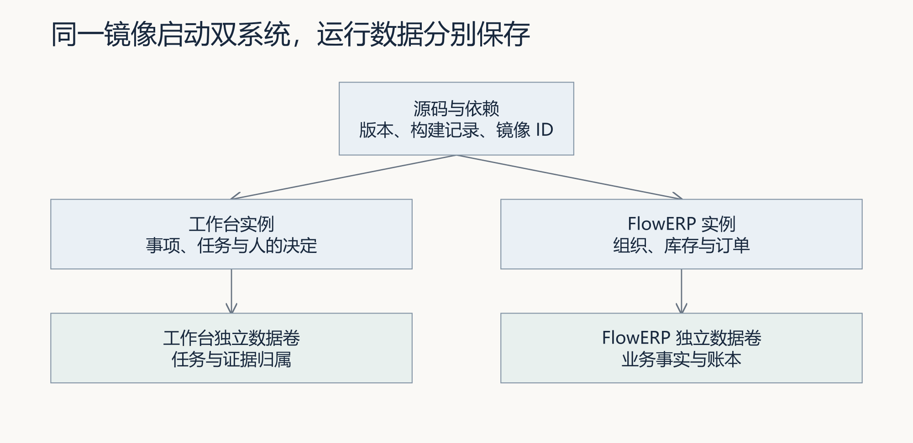

图 1：当前 Compose 的双系统与数据边界示意。运行环境可以共用镜像，两套数据卷分别保存；这张架构图不代表本机已完成容器构建。

### 2.2 健康检查分层，结论也要分层

| 观察 | 可以说明 | 仍需另行验证 |
|---|---|---|
| 进程与端口存在 | 程序正在运行并监听 | 请求能否完成、是否连对数据 |
| 健康接口返回成功 | 探针检查的条件成立 | 账户权限、业务不变量与新需求 |
| 用户完成一次业务操作 | 该角色和输入下功能可用 | 失败恢复、其他组织、其他输入 |
| 新需求复验及具名接受 | 同一候选满足本次接受条件 | 生产运行效果和长期可靠性 |

例如 FlowERP 的就绪接口与工作台的健康接口都成功，但工作台链接可能指向旧客户实例。两个健康结果各自是真的，交付链仍然连错了。让接手者从工作台进入目标实例，核对版本、组织和指定记录，才补上这一层证据。Docker 的容器运行状态也不等于依赖已经就绪；健康条件需要明确配置和解释。[Docker 启动顺序说明](https://docs.docker.com/compose/how-tos/startup-order/)

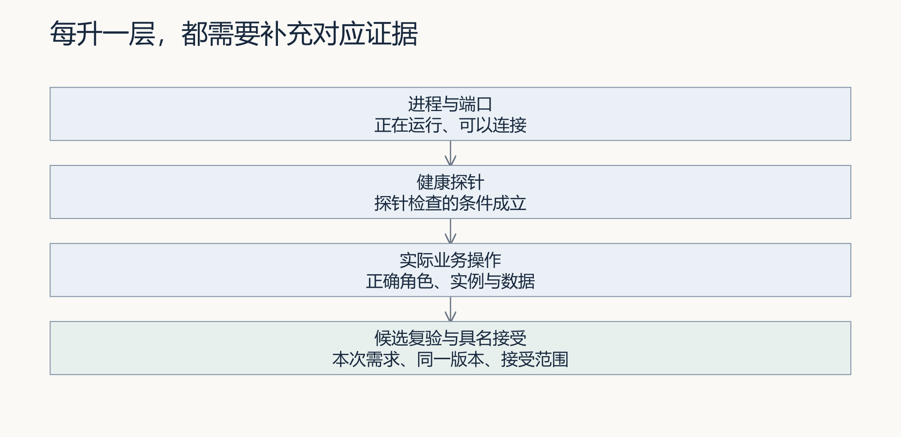

图 2：证据由低到高补充。下层成立是继续检查的条件，不会自动推出上层已经完成。

### 2.3 回滚不是把标签改回去

回滚是让系统退回一个经过验证、可继续服务的状态。它至少涉及程序版本、配置与数据兼容三件事。假设新版增加了字段，而旧版无法读取新数据，单独换回旧镜像可能再次故障。又如新版已经产生了真实出库记录，直接恢复昨天的库会丢掉今天的业务事实。是否恢复数据必须另作业务判断，不能把软件回滚理解为无条件“撤销一切”。

发布前记录上一版镜像 ID、当前数据备份、兼容条件和触发回退的现象。实验先在独立位置恢复备份，再核对组织、库存数量、订单状态和关联记录；文件能打开或数据库结构检查通过，都不足以证明账本正确。正在写入的 SQLite 库不能用随手复制主文件替代一致性备份。

恢复的损失与时间也是需要判断的约束。恢复点目标描述最多可接受丢失多长时间的数据；恢复时间目标描述最多可接受多久不可用。课程可以设置教学目标，例如“恢复到本次实验备份点、十分钟内恢复测试操作”，但实际耗时要实测，不能把目标值写成成绩。

当新版发生错误，先限制进一步写入并保存现场，再判断能否安全切回旧版。若数据兼容未知，停止进一步发布、保留证据并请求负责人的决定，是合理的安全退出。操作结果要记录为“已回退”“回退失败”或“未执行”，而不是统一写成“有回滚方案”。

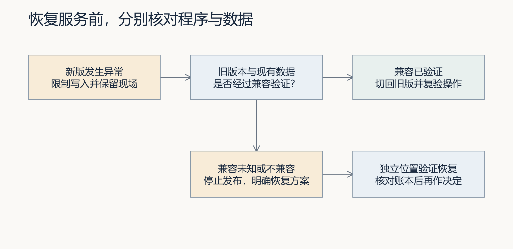

图 3：先判断版本与数据兼容，再决定回退或独立恢复验证。恢复方案仍须考虑新增业务事实与可接受损失。

### 2.4 实际恢复：8件、10件与8件为何都正确

假设商品先入库8件并备份，随后又入库2件。此时源库为10件，把旧备份恢复到独立目录后，副本应该有多少件？本轮[恢复实验](examples/README.md)调用真实备份服务，得到恢复副本8件。源库有两笔入库事件，副本只有备份前的第一笔。

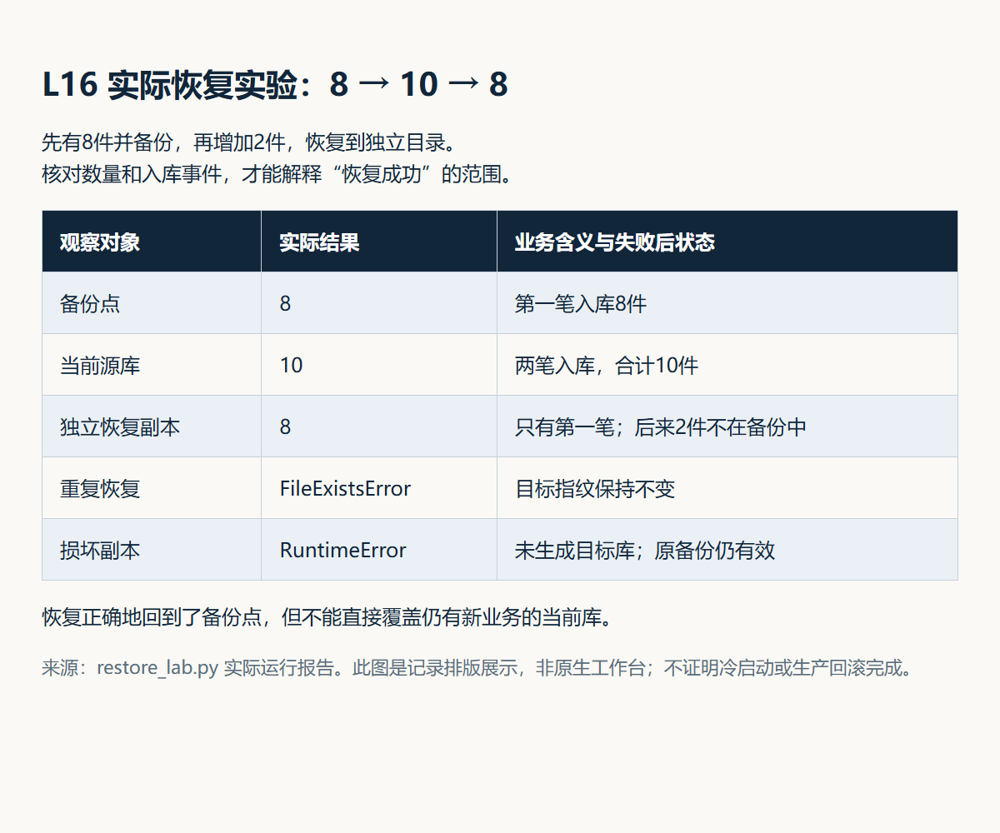

实际记录排版图｜这是程序运行结果的可读展示，不是工作台原生页面。源库、恢复副本和两种拒绝后的状态都来自同一次隔离实验，没有操作客户账本。

数据库完整性检查通过，说明这份副本结构可读且符合所查约束；数量8也正确地对应了备份点。但如果直接替换10件的当前库，后来2件的入库事实就会丢失。因此，恢复是否成功与是否接受这个恢复点，是两次不同判断。接手者还要比较事件、组织和关联记录，并由业务负责人决定如何处理备份之后的新事实。

实验又验证两种失败：向已经存在的恢复目标再次写入，返回FileExistsError，目标指纹保持不变；损坏备份副本被拒绝，没有生成目标库，原备份仍有效。只有异常消息不够，失败后的目标和原材料也必须核对。这些局部结果不证明生产恢复时限或整套数据兼容已经通过。

## 3. 用现场新需求检验工作台

两套服务启动以后，陈珂才交出现场小题。林舟先核对这项能力确实尚未实现，再与需求提出者确认范围。下面的步骤检验他能否用已有工作台继续交付，而不是再次播放旧任务。

新需求应足够小，能在答辩时间内完成，又必须触及真实业务行为。只改标题颜色不足以验证全链路；一次性重写整个采购系统则无法在有限时间内形成可解释的对照。


**动态 Eval**指针对现场新需求新增的检查。它应在实现前因为缺少目标能力而失败，修复后通过，并与既有阻断检查一起运行。不能仅运行仓库原来的固定测试，因为那些测试可能从未观察新需求。

环境与恢复依据明确后，下一步才是检验持续开发能力。下面按起点、具体合同与真实过程逐层核对：先确定失败来自新能力缺口，再确认Codex收到正确委托，最后检查候选行为。

### 3.1 新需求不能借旧失败起跑

陈珂发出现场题以后，林舟先分别运行既有检查和新增检查。既有检查证明起点没有已知回归，新增检查说明本次目标尚未满足。两组结果必须分开看：如果旧功能已经失败，就无法把后来的变化全部归因于新需求；如果新增检查一开始就通过，则应调查能力是否已有，或检查是否根本没观察目标行为。

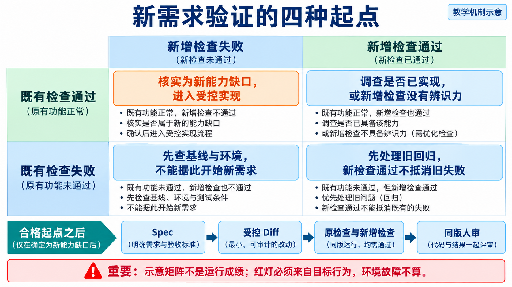

*读图：先定位既有检查和新增检查的交叉格，再决定进入实现还是返回调查。图中颜色是教学判定，不是学员成绩。*

本课要求既有合同通过，至少一项新增用例因真实能力缺口失败，才进入受控执行。例如要求“跨分页查找商品”，检查只搜索当前已加载列表，得到通过也没有验证新要求；模块找不到导致失败，同样没有观察搜索范围。先让同伴解释输入如何触发目标，再核对实际失败。两组都失败、两组都通过或既有失败新增通过，都应保留原因并暂停本次新需求执行。具体对照见[新增需求起始检查](../../reference/L15-L16新增需求起始检查.md)。

### 3.2 本次需求必须进入执行合同

抽到“快速查找库存”时，先问使用者要查已加载列表还是全库，是否涉及分页和权限，何种结果足以完成当前工作。若原请求过大，应与需求确认者缩小到此前未实现且可检验的一部分，再确定新验收；不能为适配现成代码把原要求悄悄换掉。Codex 可以比较实现方案，学生须解释为什么选择这一范围，并由同伴提出一个改变条件的反例。

先将本次已审核需求保存为 `.runtime/l16-requirement.md`，使用来源、目标、非目标、约束、验收用例、完成定义六段结构；验收段明确列出本次新增 case。`course-spec` 生成的通用课程合同仅作范围参考，不能原样替代具体需求。提交时用 `--requirement-spec` 指向该文件。网页从已决定事项进入 L15/L16 时会绑定事项版本并直接生成合同。保存的任务目标应与本次需求一致；核对任务记录中的合同指纹、来源事项及真实 ERP 结果。详见[新增需求起始检查](../../reference/L15-L16新增需求起始检查.md)。

### 3.3 真实执行案例：库存余额快速查找

2026-09-06，用户委托从工作台交付一项此前没有的库存余额筛选功能。过程留下了两版需求、四文件写集、真实 Codex CLI 调用、21 项前端测试、16 项 HTTP 测试与工作台独立 blocking Eval 29/29 的记录。候选仍处于等待用户具名验收状态。

[完整案例与 20 张原始过程截图](../cases/L16-库存余额筛选真实执行案例.md)从库存页没有筛选入口讲起，保留了两个实际发现：首版合同混淆了“调研不写代码”与交付非目标；自动检查通过后，内嵌预览仍被安全策略拦截。随后还通过明确的候选服务故障注入，核对旧余额不会在失败后重新出现。

先阅读首版方案截图并指出矛盾，再核对修订、执行和候选操作。ERP 增量是只读筛选及失败状态；工作台验证了版本确认、范围执行、独立复验，并修复候选验收入口。二者的因果关系是：真实产品验收揭示了绿色报告无法覆盖的工作台交互缺口。

案例中的运行与修改是真实的，库存记录是独立候选库的演示账套。它没有证明陌生环境冷启动、评审者随机抽题、实现前新增测试红灯、独立人审或线上效果，因此只是本讲现场交付环节的分析材料。学生应提交自己的初始判断、反证、修订及同伴复验，不能用参考截图替代本人迁移证据。

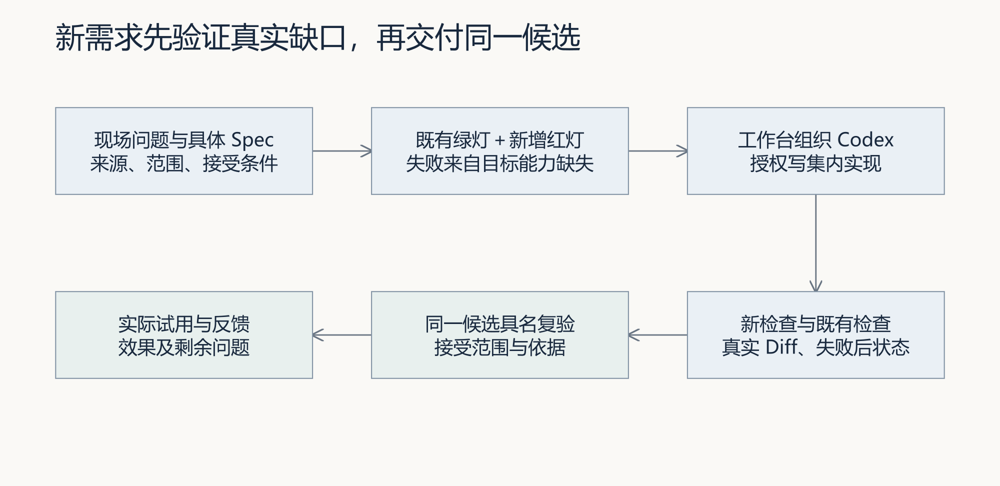

图 4：完整现场交付链。新增验收的实现前失败必须真实采集，不能从后来的绿灯倒推。

## 4. 一条成功链与一条失败链

**正常路径**应从需求来源一直走到真实业务结果：工作台保存 Spec，Codex 按范围修改，检查结果关联同一版本，审核者复验后接受，FlowERP 展示可观察增量。

还要完成一条**失败路径**。可以使用未审批入库、非法订单操作或新需求的边界输入，确认请求被拒绝且状态一致。也可以验证交付检查失败时任务如何返工，但要区分业务拒绝和研发失败。

合理的**失败后状态**包括相关业务数据未被部分改变、失败记录仍在、页面显示与后端一致，以及没有沿用旧审核。修复后产生新结果，原失败仍是理解过程的必要部分。

最终演示不要求每次尝试都成功。面对真实失败，能准确定位、保留事实并作出有边界的决定，比隐藏失败更能说明工程判断能力。

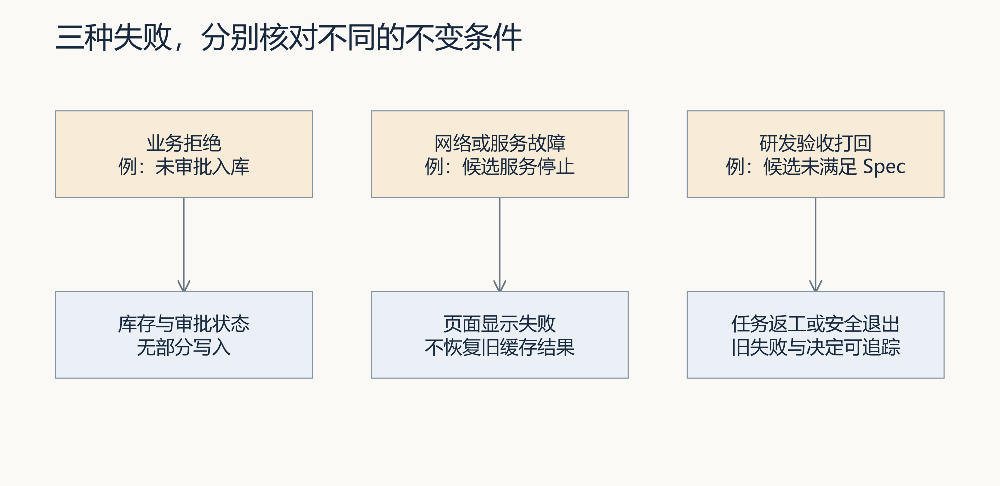

图 5：业务拒绝、服务故障和研发打回分别观察不同对象。网络故障截图不能替代合同要求的失败打回。

要判断失败是否得到正确处理，需要从抽象的“失败”回到页面和数据。下面比较三个看起来都没有记录的画面，说明输入、计数和提示怎样改变下一步决定。

### 4.1 看起来都没有记录，判断却不同

以下三张原始画面来自库存筛选参考案例的独立候选库。比较计数、输入和提示，再判断下一步操作。截图没有补绘，不作为本轮新执行或学员完成证据。

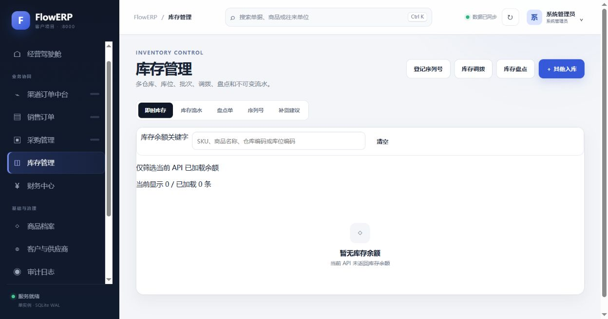

图 6：输入为空，当前显示 0 / 已加载 0。该画面说明当前接口没有返回余额；还要检查组织与数据来源，不能只凭空表推断全系统无库存。

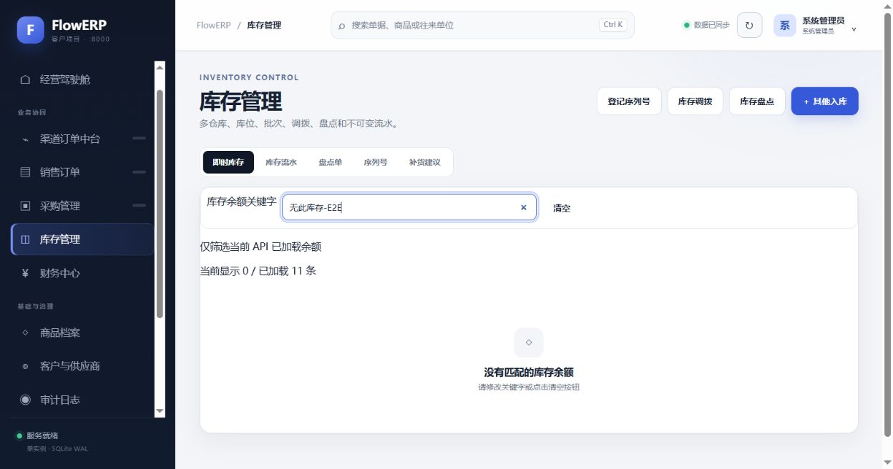

图 7：输入了不存在的关键字，显示 0 / 已加载 11。数据已取得，只是筛选没有命中。清空后应恢复原列表；它不是空库，也不是请求失败。

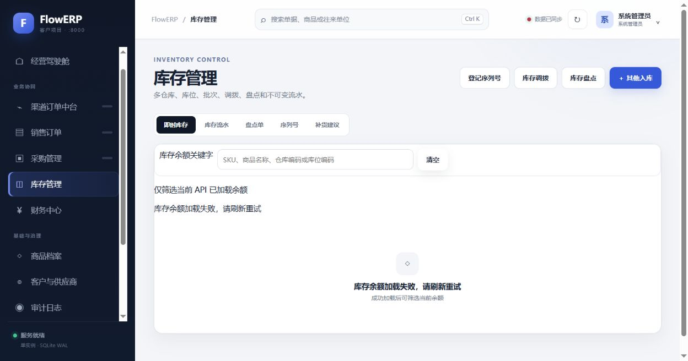

图 8：受控停止候选服务后，刷新显示加载失败；旧余额不应通过清空按钮重新出现。页面顶端仍有“数据已同步”静态标识，说明局部错误提示与全局状态还有一致性风险。复验不能只挑支持成功的区域观察。

请先预测三种情况下“清空”应产生什么结果，再看[完整案例](../cases/L16-库存余额筛选真实执行案例.md)的操作记录。现场答辩若将完整列表改为分页数据，还须重写“已加载”与“全库”的范围约定。

## 5. 实践：检查入口与验收含义

先按实践手册在独立环境安装并启动两套服务，再在项目虚拟环境运行基线检查：

```bash
python -X utf8 -m unittest discover -s tests -v
python -X utf8 -m eval.harness --suite blocking
python -X utf8 -m workbench.cli demo
```

前两条检查代码与阻断约定。第三条会运行演示账本、写入演示审核和反馈；不指定目录时使用临时目录并在结束后清理。若要保留结果，必须指定全新的演示专用目录，因为演示会重置该目录中的演示场景。`demo-reviewer` 与 `demo-day` 是程序提供的演示记录，不能作为学生独立人审和真实反馈。

随后核对流程与反馈入口：

```bash
python -X utf8 -m agent.loop --max-rounds 3
python -X utf8 -m agent.graph --max-rounds 3 --require-human-review --state-file .runtime/l16-review.json
python -X utf8 -m workbench.feedback summary
```

默认 Loop 不调用 Codex 修改；默认 Graph 使用自动演示审批，真实交付应等待独立审核；反馈摘要只呈现所读取目录的已有记录。这些命令用于验证入口可用，现场交付仍须通过实际授权的执行链完成，并留下新需求的红灯、Diff、绿灯和具名人审。

每条命令分别记录结果。等待审核的退出码不能被解释为完成；前一条失败也不能被后一条通过覆盖。若环境不具备某项外部条件，明确记录未验证范围，不把缺失材料补写成成功。

逐条检查得到的是分散记录。为了让接手者复验同一版本，接下来把它们按任务关联，并保留未补齐的项目，而不是把所有文件存在当作验收结论。

### 新环境实测 命令成功与记录连续是两件事

本轮将选定源码复制到新目录，初始化Git，创建新虚拟环境并安装，依次执行上面五条命令，均退出0。阻断检查29项通过；Loop首轮已达标、Token使用为0，没有执行一次修复；Graph轨迹明确写着“本地演示审批策略自动通过”。这些观察证明参考入口可运行，没有证明现场新需求或真实人审完成。

最容易误读的是反馈：demo已经写入演示反馈，随后的默认summary却返回0条。原因是demo默认使用并清理临时目录，summary读取当前目录的默认反馈库。两个命令没有读取同一份库，不能把0条直接解释为写入失败。

| 读取路径 | 实际结果 | 判断 |
|---|---|---|
| 默认demo临时目录 → 默认summary目录 | 0条 | 不同目录，不能追溯前次演示 |
| 显式新目录demo → 同目录cli feedback | 1条 | 演示记录可以回查 |
| 真实事项 → 同候选报告 → 独立审核 | 本轮未完成 | 仍需真实交付证据 |

对照实验显式指定同一个全新演示目录，实际回查到1条。它来自脚本中的demo-day来源和demo-reviewer审核策略，不是客户原话或真人接受。答辩时应先指出对象与目录，再解释状态和审核来源。具体命令与实测结果见[五条命令与同目录反馈对照](examples/五条命令与同目录反馈对照.md)。

### 5.1 从任务记录生成发布证据索引

任务建立后使用 `course-release-index` 生成草稿，提交前用实际冷启动、产品对账和风险文件补充，见[发布证据索引操作说明](../../reference/发布证据索引.md)。复验者按相对路径查原文件，并核对指纹、实际内容与人审状态。生成命令退出 0 只表示索引已生成，不代表本讲通过；缺项必须如实保留。

## 6. 答辩：解释判断，而非背诵名词

轮到林舟说明方案时，陈珂追问三个决定：为什么只做这个范围，检查怎样支持本次接受，哪条实际观察改变了最初想法。你的答辩也从具体任务和版本回答，再说明仍未解决的风险。

**第二次签字**由独立复验者在同一候选版本上完成。对方应能重建一项关键结果，检查失败状态，并说明接受范围；姓名记录本身不能替代实际复验。

迁移问题可以现场改变一个条件，例如数据为空、请求重复或审核被打回。说明哪些工作台能力仍然可复用，哪些业务预期必须重新确认。

课程最终建立的是持续交付能力：现场问题成为明确需求，工作台组织人与 Codex 协作，FlowERP 的结果接受检查与使用反馈，再推动下一次改进。它是否成立，取决于你能否在新问题上重复这一过程。

课程名称中的 **FDE（Forward-Deployed Engineering）**，在这里落实为现场、交付、能力三个循环：进入使用现场识别问题，形成可验证的产品交付，再把反复出现的工程问题沉淀为工作台能力。它描述人与工具在实际需求中的持续改进，不表示模型会自行改变业务目标或自动进化。


前面已经建立了要解释的证据，现在要决定如何在有限时间内呈现。先分配五分钟，再用一个改变条件的问题检验方法能否迁移，避免答辩只剩成果介绍。

### 6.1 五分钟答辩怎样分配

答辩稿不是把日志念一遍，而是带复验者走过一条可核对的因果链。下面是时间分配示例，可按现场要求调整。

| 时间 | 展示内容 | 要回答的判断 |
|---|---|---|
| 0:00–0:40 | 问题、角色与范围 | 为什么值得做，为什么只做这些 |
| 0:40–1:20 | 新环境、版本及双系统 | 哪些条件重建了，哪些仍依赖外部准备 |
| 1:20–2:20 | 新验收前后结果、范围内修改 | 失败来自什么能力缺口，修改怎样改变行为 |
| 2:20–3:20 | 一条成功与一条失败路径 | 谁的操作、什么输入，失败后什么必须不变 |
| 3:20–4:20 | 具名复验、导出与反馈 | 接受的是哪一候选，反馈怎样影响下一步 |
| 4:20–5:00 | 恢复依据、技术债与迁移 | 哪些风险仍在，换条件后怎样重新判断 |

技术债要帮助接手者判断何时必须再做决定。比如本次只筛选已加载列表，在数据全部加载的前提下可以满足确认范围；后来接口改成分页，未加载页里的商品就可能被漏掉。交接时写明这个触发条件，关联当前实现与检查，指定后续负责人与验证入口。这样“尚不支持全库搜索”是一个有依据的边界，不是一句含糊的“以后优化”。

答辩也可以由这个变化收尾：哪些能力原样复用，哪些必须重建？需求澄清、受控执行、独立复验和人审仍可用；搜索范围、接口、权限和测试数据需要重新确认。能把旧经验用到哪里、停在哪里说清楚，比依次背出 Prompt、RAG、Graph 更能证明你掌握了整条建设主线。

### 6.2 从一次完成到持续交付

Harness 在本次任务中约束修改范围、运行检查并等待具名决定；记忆系统应把有来源、条件与有效状态的经验送进下一事项；工作流蒸馏把反复验证过的步骤提炼成版本化流程。若只是把本次总结存进文件，后续没有召回和采用，还不能说工作台已经形成复用闭环。

可以用一次迁移提问来检验：下一需求从“已加载列表筛选”变成“跨分页查找”时，哪些过程保留，哪些预期重写？需求澄清、范围控制、独立复验与人审流程可继续采用；搜索范围、接口行为和测试数据则要更新。采用时记录经验来源、选用版本和改变理由。新任务复验失败后，修订或停用不再适用的经验。这种蒸馏是工程流程提炼，不是模型权重训练。

个人工作台解决的核心问题，是交付不再依赖某一轮聊天和作者临时记忆。结业要证明你能把业务问题推进到 PRD、技术方案、开发、测试和实际效果回收，并能向接手者解释每次决定的依据。参考系统尚未贯通的跨事项召回与采用能力，应按实际状态说明，不能靠答辩措辞补齐实现。

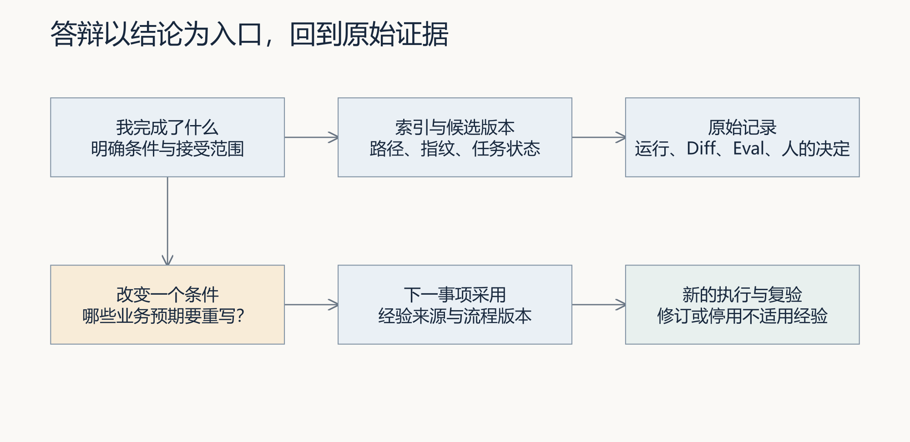

图 9：答辩从一条结论回到原始证据，再通过改变条件检验迁移；经验登记与后续实际采用分别判断。

结业时用自己的证据回答 FDE 三问：现场的哪项判断改变了交付范围；哪次失败改变了实施方案；哪条旧经验在新任务中被采用、修订或放弃。把答案关联到原需求、同一候选和实际复验。已完成的技术检查、尚待人的接受及未验证的使用效果分别陈述，才能让下一位接手者继续工作。

## 离开这一讲之前

故事停在林舟把下一项工作交到陈珂手里的时刻：对方能够找到要求、继续执行、检查结果，并把未解决的问题留下。你的结业材料也应支持这样的接手。能启动、能完成一项新需求、能解释失败与风险，分别交出实际依据；后续开发才有可靠起点。

## 配套实践与阅读

[行动卡](行动卡.md) · [实践操作手册](实践操作手册.md) · [实践提示词](prompts/README.md) · [提交模板](SUBMISSION.md) · [结业证据审查 Skill](skills/release-evidence-review/SKILL.md)

## 附录 A：本讲课程大纲合同

以下保留课程大纲的四项约定，供完成学习后核对。本讲对应 CLO-6：交付、反馈与迁移；L16 同时综合检验 CLO-1～CLO-5。

- **核心内容**：容器化、健康检查、回滚意识、演示叙事和技术债说明。
- **演示结果**：从干净环境启动系统，展示一次成功任务、一次失败打回、一次结果导出和一次反馈写入。
- **课内增量**：完成结业检查表与五分钟答辩稿。
- **通过标准**：需求能生成 Spec 和代码；阻断级 Eval 全部通过；Loop 收敛或如实安全退出；Graph 审核结论可追踪；摘要和反馈能够正确生成；干净环境可启动且仓库无密钥。

## 本讲一手来源

> 核验日期：2026-09-04。来源用于解释机制，不改写课表主题、课程大纲合同或 FlowERP 通过标准。

- [Google SRE：Release Engineering](https://sre.google/sre-book/release-engineering/)
- [OpenAI：Evaluation best practices](https://developers.openai.com/api/docs/guides/evaluation-best-practices)
- [Docker：Storage](https://docs.docker.com/engine/storage/)
- [CMU：Active Learning](https://www.cmu.edu/teaching/resources/instructionalstrategies/activelearningstrategies/index.html)
