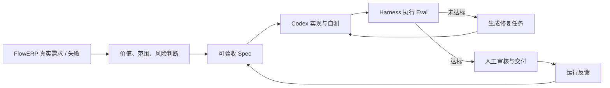

# 课程大纲｜Codex AI 工程交付行动营

> 四周行动营版：L00 课前准备 + 16 节精讲 + 4 场项目诊所。用 Codex 搭建个人 AI 研发工作台，再通过工作台组织人与 AI 协同，持续开发电商 FlowERP，形成可复用、可验证、可持续改进的 AI 软件交付系统。对外课程名与 16 讲标题以 [`课表｜Codex AI 工程交付行动营`](./课表｜Codex AI 工程交付行动营.md) 的「主题」列为准，必须逐字一致。

## 开课第一分钟先说清三者关系

> **建设主线**：用 Codex，搭建个人工作台；通过个人工作台，协同开发 FlowERP。
>
> **第一阶段：利用 Codex 搭建个人 AI 研发工作台。第二阶段：通过个人工作台 + Codex 协同开发 FlowERP。**

| 对象 | 在课程中的角色 | 形成的结果 |
|---|---|---|
| Codex | AI 开发伙伴：理解仓库、提出方案、修改代码、运行工具并报告结果 | 帮助学生先建设工作台，再在工作台边界内参与 FlowERP 开发 |
| 个人 AI 研发工作台 | 第一个建设成果，也是后续人与 AI 的协同开发阵地 | 组织需求、规则、任务、权限、执行、Eval、人审、证据和反馈 |
| FlowERP | 最终持续开发的客户产品、事故现场和验收场 | 业务能力逐讲增长，并用真实后果检验工作台是否有效 |

三者不是三个并列入口。课程讲的是一条建设链，而不是三套产品介绍：

```text
第一阶段：学生 + Codex
          └─ 开发 ──> 个人 AI 研发工作台

第二阶段：学生 + 个人工作台 + Codex
          └─ 协同开发 ──> FlowERP（进货、销售、库存、财务）
                              │
          <── 事故、证据与反馈继续推动工作台升级 ──┘
```

开课时**没有个人工作台，也没有现成的 `WORKBENCH_SPEC.md` 和验收测试**。学生从一句模糊诉求和自己的真实痛点出发，先让 Codex 进行需求访谈，由学生作出范围、证据、失败语义和数据边界决定，再把访谈结论签署为首份人工可读的 `WORKBENCH_SPEC.md`；随后让 Codex 将验收项转成实现前必红的测试，最后开发出工作台的第一块可执行能力。`WORKBENCH_SPEC.md`、失败测试、`workbench-init`、项目登记、任务账和命令证据账都是 L01 的课内产物，而不是教师预置答案。完成后，学生用刚开发的工作台登记“工作台自身”，留下第一次自举证据。L02 补齐跨会话规则；L03 再把 L01 手工形成 Spec 的过程升级为可复用的结构化模板与解析能力；L04 完成 Workbench V0，届时才把 FlowERP 登记为目标项目，并第一次通过“个人工作台 + Codex”交付 ERP 增量。L05～L16 都遵循“FlowERP 现场问题 → 工作台升级 → 个人工作台 + Codex 协同交付 → 证据和反馈回流”。课程中的个人工作台是**独立的研发协同与交付系统**，不是 FlowERP 的业务门户；FlowERP 是包含进货、销售、库存与财务管理的客户产品，其客户操作界面、业务数据库必须与工作台 Web、工作台数据库保持身份、数据和责任边界。

**课程载体合同**：课件引导决策，Markdown 承载教材，VS Code 完成行动。未来 PPT 必须按 16 讲分别制作，每讲 22～24 页、线上精讲不超过 30 分钟；三个载体按“现场证据 → 首次判断 → 方法查证 → 仓库行动 → 复验证据 → 修订判断”协作，不得复制同一份内容。逐页安排见 [`课程蓝图`](./courses/课程蓝图.md)，行动入口见 [`FlowERP-AI研发工作台.code-workspace`](./courses/FlowERP-AI研发工作台.code-workspace)。

## L00｜课前准备：装好工具，跑通第一次环境自检

L00 面向基础较弱或环境尚未统一的学员，是正式 L01～L16 之前的准备讲，不改变 16 讲课程合同，不产生工作台或 FlowERP 产品增量。学生安装 Python 3.11、Git、VS Code、Codex 桌面入口与 Codex CLI，克隆仓库、创建 `.venv`、打开课程工作区、运行最小环境自检，并完成一次“Codex 给证据—学生核验文件”的只读练习。

- **必须产物**：`lesson-00-submission/L00-环境自检.md`，记录真实版本、解释器路径、仓库路径、冒烟结果、失败与未知项；不得把 `serve` / `demo` / `course-status` 当作通过证据；
- **硬性边界**：不要求 GPU、本地大模型、Docker、Node.js、前端框架或独立数据库服务；不提交账号、API Key、Cookie、公司凭据和客户数据；
- **通过标准**：仓库内 `.venv` 可运行、Git 可识别仓库、VS Code 可选择课程解释器、Codex 可登录且 CLI 可执行、学生人工核验至少两个 Codex 引用文件；
- **详细入口**：[`L00 详细讲义`](./courses/L00/L00｜课前准备：装好工具，跑通第一次环境自检.md)与[`L00 行动卡`](courses/L00/L00｜课前准备：装好工具，跑通第一次环境自检.md)。

## 一、选题信息

| 字段 | 内容 |
|---|---|
| 暂定名称 | Codex AI 工程交付行动营 |
| 作者 | 袁从德 |
| 交付形态 | 极客时间训练营 / 行动营 / 企业内训 |
| 预计体量 | 开篇词 + L00 课前准备 + 16 节精讲视频（30 分钟/节）+ 4 场项目诊所直播（每周 1 场）+ 结束语 |
| 配套仓库 | `https://github.com/congde/CodexFDE.git` |
| 关联图书 | 《Codex：AI 驱动的智能编程时代》（人民邮电出版社） |
| 主线项目 | **工作台驱动的 FlowERP 持续交付系统**：工作台是可复用方法系统，FlowERP 是持续增长的客户项目、实验场与验收场 |

**一句话定位**：面向零基础或只有少量编程经验的学员，借助 L00 入门补学、分步示范与有提示练习，围绕真实 FlowERP 需求，学习判断“该不该做、做什么、谁一起做、有什么风险、怎样证明有效”；先用 Codex 在 L01～L04 建成 Workbench V0，再通过工作台组织人与 Codex 协同开发 FlowERP，并反向升级 Spec、Eval、Harness、Loop、Graph、API、Web 与反馈能力。学员可委托 Codex 编写代码，但必须亲自决定范围、核对证据并解释验收理由。

课程最终形成两个不可拆分的可运行成果和一条学习证据线：

- **工作台成果**：能够接收 Spec、限制写入、执行 Eval、保留失败、组织返工、支持人审并导出证据；
- **FlowERP 成果**：进货、销售、库存、财务和操作界面逐讲增长，关键业务规则可由权威状态和自动化 Eval 复验；
- **学生证据**：保留首次判断、失败、修订、同伴反证、独立迁移与答辩，证明能力来自学生本人而非参考仓库或模型自述。

## 二、为什么选择“个人研发自动化工作台”

本训练营以 **Codex + FDE 双驱动**为核心方法论，并用**一条从零到可运营的真实主线项目**贯穿全程。选择“个人研发自动化工作台”，是因为需求澄清、实现、验证、评审和文档并不只属于程序员，而是广泛存在于技术交付工作的重复链路中——场景覆盖广、缺陷样本充足、多 Agent 分工贴合真实协作、结业作品可以直接复用。

- **Codex**：以 CLI / IDE / App 完成仓库理解、代码修改和验证，以原生 Subagents 委托边界清晰的并行任务；需要程序化调用时使用 Codex SDK，需要连接外部系统时使用 MCP——**课程中的核心代码均在 Codex 协助下完成并由可重复命令验收**；
- **FDE（Forward-Deployed Engineering）**：研发负责人贴近用户、业务数据和运行后果，在现场完成“判断是否值得做 → 交付可观察结果 → 把重复问题沉淀为能力”。本课程不训练或微调模型，所谓进化指 Spec、规则、Eval、Harness、Loop、Graph、API、Web 与反馈资产的版本化升级，不得写成未经证据的“模型自动进化”。

课程不按 Codex 产品功能逐项讲解，也不把 16 讲写成 ERP 功能目录。学员沿着同一条真实交付链路完成训练：

```text
FlowERP 真实需求或失败 → 判断价值与风险 → 可验收 Spec → 受控实现
→ Eval/Harness 复验 → 人工审核与跨角色协作 → 产品交付 → 反馈升级工作台
```

**一个系统、三条同步增长线**：方法线从 Workbench V0 发展为可运营的交付系统；产品线让 FlowERP 从库存导出增长到订单、采购、API/Web 和现场新需求；学习线持续记录学生的判断、失败、修订和迁移。三条线必须互相引用，任何一条都不能单独充当课程成果。



### Codex 怎样先造工作台，再被工作台约束

课程不是从一套已经完成的工作台开始。它必须明确解决“用尚未完成的工作台开发工作台”的自举问题：

```text
外循环（L01～L04）
学生直接监督 Codex + Git + 终端 + 人工审查
  → 建规则、Spec 解析器、受控执行、写集检查、最小 Eval 和摘要
  → Workbench V0

内循环（L04～L16）
FlowERP 现场需求/失败
  → 工作台生成或校验 Spec、限定权限和写集
  → 工作台调用 Codex 在隔离候选中实现
  → Eval/Harness 独立复验 → 具名人审
  → FlowERP 新状态与反馈 → 反向升级工作台
```

在外循环中，Codex 是**工作台共同建造者**，但学生决定范围、审查 Diff 并承担验证责任；在内循环中，Codex 是**工作台中的受控执行者**，不能自行改写业务口径、扩大权限或给自己签收。L04 是换挡点：同一讲先证明 V0 具备“消费 Spec、显式授权、限制写集、保存 Diff/命令/最小 Eval、人审”的能力，再由它完成库存导出的首次真实交付。缺少任一项，只能称为直接让 Codex 写代码，不能称为工作台驱动交付。

FDE 在课程中由三个嵌套循环落地：

| 循环 | 要回答的问题 | 直接证据 |
|---|---|---|
| 现场循环 | FlowERP 的真实问题是什么，为什么现在做，何时不做或先实验 | 来源、首次判断、具名决定、ERP 前后状态 |
| 交付循环 | 怎样让 Codex 在边界内把事情做对 | Spec、写集、前红、Diff、后绿、人工审核 |
| 能力循环 | 哪个重复失败值得升级为工作台能力，并能否在后续任务复用 | 工作台能力 Diff、失败前后对照、跨需求迁移 |

完整的逐讲角色、换挡点和发布审计见 [`课程蓝图`](./courses/课程蓝图.md)。详细讲义与任务卡不得只并列“工作台增量”和“ERP 增量”，还必须说清本讲是**直接监督 Codex 造工作台**，还是**通过工作台授权 Codex 交付 FlowERP**，以及二者怎样由现场证据连接。

## 三、学员画像与前置要求

| 维度 | 要求 |
|---|---|
| 适合人群 | 希望借助 Codex 完成可验证工程交付的零基础与少量编程经验学员，包括学生、产品与业务人员、技术学习者和独立开发者 |
| 技术基础 | 不要求入课前独立编写程序。L00 补学后，应能在提示下找到文件、区分对话与终端输入、运行命令并保存输出、核对改动清单；未通过者先补练，不把安装成功当作能力达成 |
| 必备环境 | L00 统一使用 Python 3.11.x 的仓库内 `.venv`（仓库最低 3.10）、Git、VS Code、可登录的 Codex 桌面入口与可执行的 Codex CLI；跟跑线默认使用 GitHub Actions，企业环境可替换为现有 CI |
| 建议经验 | 完成过一个小型开发、测试、数据处理或流程自动化任务；工作岗位和年限不作为门槛 |
| 环境边界 | 课程提供 Windows 与 macOS 的基线说明；Linux 可参考 macOS 命令，企业代理和私有 CI 在诊所中按个案处理 |

入课不按年级或工作年限假定能力。L00 通过安装、自检和只读仓库核验消除环境差异；L01 再通过需求访谈、首份 Spec、失败测试和工作台自举形成诊断画像。对命令行、测试设计、业务建模三个维度分别提供基础支架，已经具备能力的学生进入反证、迁移和性能比较任务。分层只改变支架与挑战，不降低业务规则、证据真实性和工程诚信要求。

### 课程学习成果

结课时，学生应能完成以下可观察行为；课程目标与专业毕业要求的正式对应关系由开课学校审批，不由仓库代填。

| 编号 | 可观察学习成果 | 主要直接证据 |
|---|---|---|
| CLO-1 | 接手陌生仓库，识别结构、约束、验证入口和责任边界，并拒绝越权或伪造成功 | 接手报告、规则判决、风险说明 |
| CLO-2 | 将模糊业务请求判断并压缩为可验收 Spec，完成范围受控的最小变更 | 需求判定、Spec、用例矩阵、Diff |
| CLO-3 | 从业务损失与不变量设计反例 Eval，借助 Harness、Hook、CI 形成可信质量证据 | 红绿记录、报告、退出码、失败后状态 |
| CLO-4 | 把失败压缩为修复任务，控制自动返工诚实收敛或安全停止 | Repair Task、Loop History、停止原因 |
| CLO-5 | 依据读写集和责任边界组织跨角色协作，保留冲突处理和具名人工审核 | 子任务合同、Graph Trace、人审决定 |
| CLO-6 | 在陌生环境运行、解释、交付并改进工作台驱动的 FlowERP 系统 | API/Web 对账、反馈闭环、冷启动、答辩 |

## 四、四周项目路线

| 周次 | 工作台版本 | Codex 角色 / FDE 换挡 | FlowERP 产品状态 | 本周核心问题 | 退出门槛 |
|---|---|---|---|---|---|
| 第一周 | V0：项目登记、证据账、规则、Spec、受控执行、最小 Eval | 开课时没有工作台；L01～L04 由学生直接监督 Codex 编写工作台代码；L01 从需求访谈、首份 Spec 和红灯测试开始完成最小自举，L04 才首次把 Codex 放入完整工作台边界 | L01～L03 不开发 ERP；L04 登记 FlowERP 并真实交付库存导出 | 怎样把模糊痛点经人机访谈变成可签署合同和失败测试，再从无到有造出个人工作台 | 每项需求可追溯到学生决定；同一测试由红转绿；工作台能记录自身建设任务和命令证据；Diff 不越界 |
| 第二周 | V1：失败优先 Eval、Harness、Hook、CI | FlowERP 事故触发工作台升级；升级后的裁判约束 Codex 修复与交付 | 幂等入库、可用库存、订单创建、原子预占 | 怎样让关键业务不变量在本地与远程诚实复验 | 红灯稳定、修复后同命令转绿；假绿可被识别；阻断结论与退出码一致 |
| 第三周 | V2：Repair、Loop、Subagents、Graph/HITL | 工作台组织学生、Codex、复验者与审核者协作，并控制返工、并行和停止；具名人员保留最终责任 | 取消释放、订单状态、采购申请、审批后入库 | 怎样跨角色返工和协作，同时控制写冲突、预算与审批责任 | 失败可压缩；循环有界；并行读写集无冲突；采购未经具名审批不能入库 |
| 第四周 | V3：Task API、Web、Feedback、冷启动发布 | 工作台成为可操作产品；真实使用反馈进入下一轮能力升级 | 进销存与财务通过 API/Web 对账，反馈驱动改进并交付现场新需求 | 怎样让交付可查询、可操作、可反馈并能由陌生人复现 | DOM/API/SQLite/ERP 状态一致；进销存与财务对象不混账；反馈经过治理；陌生环境完成未预演小需求 |

### 16 讲三线课程合同

下表与后文的“核心内容、演示结果、课内增量、通过标准”共同构成唯一课程合同。每讲备课和验收必须先回答四问：ERP 产品状态怎样变化；暴露了什么可重复工程问题；工作台新增或验证了什么能力；什么证据证明学生本人能够迁移。

详细讲义、任务卡、实验、逐页课件安排和外部一手资料由 [`课程蓝图`](./courses/课程蓝图.md) 统一投影。蓝图是本大纲与机器主线的派生教学设计，不新增或改变课程合同；冲突时必须回到本大纲修订。

L01～L05 与后续讲义统一使用学生教材结构：合同、术语、现场、机制、代码、正反路径、证据、迁移和来源；该结构只改变表达与阅读顺序，不改变课程基础线、机器 Eval 或通过标准。

| 讲 | 主要 CLO | FlowERP 产品状态 | 重复工程问题 → 工作台能力 | 学生最低证据 |
|---:|---|---|---|---|
| L01 | CLO-1 | FlowERP 尚未接入工作台，ERP 业务账不变 | 没有工作台 → 利用 Codex 开发初始化、项目登记、任务账、命令证据账与状态检查 | 实现前红灯、范围内 Diff、实现后绿灯、工作台自举任务与命令证据 |
| L02 | CLO-1 | 固化库存、订单、采购和审批边界 | 会话遗忘与越权 → `AGENTS.md`、证据层级与 DoD | 规则补丁、越界请求判决、合法替代 |
| L03 | CLO-2 | 签字确认库存导出合同 | 模糊需求无法判定 → Spec Schema、来源与用例矩阵 | 初稿、同伴歧义标注、修订稿 |
| L04 | CLO-2 | 交付库存导出 | AI 易扩范围且自报完成 → 能力信封、受控执行、最小 Eval | 执行前红灯、范围内 Diff、独立绿灯 |
| L05 | CLO-3 | 交付幂等入库 | 正常示例掩盖重复入账 → 失败优先 Eval | 连续两次红灯、失败后状态、同命令绿灯 |
| L06 | CLO-3 | 统一可用库存口径 | 多个检查无统一结论 → Harness、分级与机器报告 | JSON、退出码对照、分级理由 |
| L07 | CLO-3 | 交付销售订单创建 | 权威检查易被忘记 → 复用 Harness 的本地 Hook | 订单正反路径、Hook 消息、前后状态 |
| L08 | CLO-3 | 独立复验并交付原子预占，不另扩第二业务功能 | 远程流水线可能假绿 → 同入口 CI 与证据信封 | A 假绿、B 可信红、C 可信绿及同伴法证 |
| L09 | CLO-4 | 修复取消订单释放预占 | 失败报告过宽且不可授权 → Repair Task | 报告来源、最小写集、修复前后复验 |
| L10 | CLO-4 | 修复订单合法状态迁移 | 自动返工可能振荡或假成功 → 有界 Loop | 收敛与未收敛 History、停止理由 |
| L11 | CLO-5 | 交付采购申请 | 跨团队并行会写冲突或失真 → 子任务合同与读写集 | 冲突图、原始子报告、主 Agent 结论 |
| L12 | CLO-5 | 交付具名审批后入库 | 自动化无法承担审批责任 → 可恢复 Graph 与 HITL | 非法路径、Graph Trace、具名决定、ERP 对账 |
| L13 | CLO-6 | 通过 API 提交补货并完成交付 | 本地流程不可协作与恢复 → 持久化 Task API | Task ID、状态事件、重启与并发证据 |
| L14 | CLO-6 | 交付覆盖进货、销售、库存与财务入口的真实 ERP 操作页 | 页面容易静态造假或显示旧绿灯 → Web 证据下钻与四方对账 | DOM/API/SQLite/ERP 对账、失败态、业务对象边界 |
| L15 | CLO-6 | 交付一项真实反馈驱动的进销存或财务小改进 | 原始反馈直接进裁判会污染质量门 → 反馈分诊与资产晋级 | 原文、判定、Spec/Eval Diff、独立任务 |
| L16 | CLO-1～6 | 现场交付此前未实现的受控小需求 | 成功依赖作者记忆与预演 → 冷启动、发布证据索引 | 随机抽题全链证据、风险答辩、迁移说明 |

每讲的最低证据必须包含可复现输入、预期、实际、退出码或权威状态、稳定身份以及修订前后版本。参考仓库终态、模型总结、最终截图和组内口头说明均不能单独证明学生达成。

三大热点在课程中的职责保持简单一致：

| 热点 | 核心问题 | 项目落点 |
|---|---|---|
| Harness | 怎么验 | 执行 Eval、评分、生成报告、阻断不合格变更 |
| Loop | 怎么改 | 把失败用例翻译成修复任务，并限制迭代轮数 |
| Graph | 怎么协作 | 编排角色、状态、分支、回退和人工审核节点；跟跑线使用最小 Python 状态图，挑战线可替换为 LangGraph |

## 五、详细课表

### 第一周｜从对话式写代码到 Spec 驱动交付

**周目标**：建立仓库约束，完成结构化 Spec 和 Codex 本地执行入口，跑通 V0 首条可验证交付链路。

#### 前五讲连续学习弧

前五讲必须作为一个连续案例授课，不能把补货、低库存提醒或原子预占临时换成基础任务。每讲只解决上一讲留下的一个断点：

| 讲次 | 上一状态 | 本讲唯一认知冲突 | 学生关键行动 | 离场时新增的权威状态 |
|---:|---|---|---|---|
| L01 | 个人工作台、工作台 Spec 和验收测试均不存在，只有一句模糊诉求、真实痛点和最小代码骨架 | `WORKBENCH_SPEC.md` 是谁决定、怎样形成的，测试又怎样从合同长出来 | 让 Codex 进行需求访谈，由学生作范围决定并签署首份 Spec；再由验收项生成红灯测试、实现工作台，并让工作台记录自身建设任务 | 学生亲手形成首份需求合同和红灯测试，开发出 Workbench V0.1；同一测试由红转绿；形成第一次自举证据；FlowERP 尚未接入 |
| L02 | 风险只存在于一次会话 | 下一次会话会不会再次接受越界请求 | 用危险/合法请求对照检验仓库规则 | 业务账不变；长期边界与 DoD 跨会话生效 |
| L03 | 长期禁区已清楚，本次终点仍含糊 | “增加导出”为什么可以产生多种互相冲突的正确答案 | 先判断是否 Build，再谈判并签署库存导出 Spec | 库存导出成为唯一、可解析、可反驳合同 |
| L04 | 合同能判对错，但尚无产品变化 | Codex 改得多、测试绿，是否就能签收 | 设计能力信封、受控执行、审查 Diff、独立复验 | Workbench V0 真实交付库存导出 |
| L05 | 首个交付已绿，但裁判可能没见过错误版本 | 一个只在正确代码上通过的检查是否有辨识力 | 对重复入库先红两次，冻结 Eval，再做最小修复 | 交付幂等入库；形成第一份红→绿质量资产 |

讲师若要使用缺货—补货、低库存标记或原子预占，只能放在课后迁移或后续对应讲次，不能替换上表的基础产物。L01～L05 的共同业务对象、需求编号、代码基线和证据 ID 必须可以连续回指。

#### 第 1 讲｜以终为始：一次可验证的 AI 交付怎样完成？

- **核心内容**：开课时没有个人工作台、`WORKBENCH_SPEC.md` 或验收测试；学生从一句模糊诉求和真实痛点出发，利用 Codex 完成需求访谈，由学生决定范围并签署首份 Spec，再把验收项转成红灯测试，开发初始化、项目登记、任务账、命令证据账和状态检查。
- **演示结果**：`“帮我搭建个人 AI 研发工作台”` 经历“原始诉求 → Codex 追问 → 学生取舍 → `WORKBENCH_SPEC.md` → 验收测试红灯 → Codex 实现 → 同一测试绿灯”，最后由新工作台记录自己的建设证据。
- **课内增量**：学生亲手形成并签署首份 `WORKBENCH_SPEC.md`、从验收项生成失败测试、开发出可运行的 Workbench V0.1，并完成第一次自举记录；本讲不接入、不开发 FlowERP。
- **通过标准**：Spec 每项关键要求能回指原始痛点、Codex 建议和学生决定；测试能回指验收项；必须保留实现前红灯、范围内 Diff 和实现后绿灯；学生能用自己开发的命令完成自举，并说明 L04 才会通过“个人工作台 + Codex”开发 FlowERP。

#### 第 2 讲｜把仓库规则写进 `AGENTS.md`

- **核心内容**：Prompt、`AGENTS.md`、Skill、Hook、MCP 的职责边界；最小而有效的项目约束。
- **演示结果**：同一任务在缺少约束与加入约束后产生不同结果。
- **课内增量**：补齐目录结构、禁止事项、验证命令和 Definition of Done。
- **通过标准**：新会话能够读取约束；错误命令或越界修改能被明确拒绝或纠正。
- **挑战任务**：为子目录增加更具体的 `AGENTS.md`，验证就近规则生效。

#### 第 3 讲｜把模糊需求变成可验收 Spec

- **核心内容**：目标与非目标、正常与错误路径、边界条件、可执行验收项、最小变更原则。
- **演示结果**：把“增加导出功能”拆成结构化 `FDE_SPEC.md`。
- **课内增量**：由学生在外循环直接监督 Codex 实现 Spec 模板与最小解析器，只生成和校验合同结构，不执行 FlowERP 业务编码。
- **通过标准**：Spec 至少包含目标、非目标、约束、验收用例和来源；缺失必要字段时返回明确错误。
- **挑战任务**：从 Issue 或需求文档导入并保留来源追踪信息。

#### 第 4 讲｜委托 Codex 执行一次最小变更

- **核心内容**：非交互执行、工作目录、权限边界、结果采集与人工确认点。
- **演示结果**：读取第 3 讲 Spec，委托 Codex 完成一个小型代码变更并运行测试。
- **课内增量**：先由学生直接监督 Codex 补齐并独立验收 Workbench V0 的执行入口、写集检查、最小 Eval 和结果摘要，再由 V0 在授权工作区调用 Codex 交付库存导出；不额外包装为文件读写 MCP。
- **通过标准**：变更能够运行；基础测试通过；摘要包含修改文件、验证命令和剩余风险；密钥和环境文件未提交。

**项目诊所 1｜环境与 Spec 门诊**：处理 Windows 编码、路径、依赖安装、约束未生效和验收项不可执行。诊所输出第一周常见错误清单与 V0 基线标签。

### 第二周｜用 Harness 建立可量化的质量门禁

**周目标**：完成 V1 自动质量流水线，让每项阻断级要求都有可重复执行的证据。

#### 第 5 讲｜先设计失败，再编写 Eval

- **核心内容**：示例测试与 Eval 的区别；逻辑错误、边界缺失、规范违规和危险修改四类失败模式。
- **演示结果**：一个故意带缺陷的基线稳定触发失败。
- **课内增量**：编写一个业务结果 Eval 和一个工程约束 Eval。
- **通过标准**：缺陷基线连续运行两次均失败；失败信息能够定位到具体要求。

#### 第 6 讲｜用 Harness 汇总证据和等级

- **核心内容**：用例发现、统一退出码、阻断级与观察级指标、机器可读报告。
- **演示结果**：Harness 输出分项结果、阻断结论和 JSON 报告。
- **课内增量**：实现最小 Harness，将第 5 讲用例纳入统一执行。
- **通过标准**：阻断用例失败时返回非零退出码；观察项失败只记录告警；报告保留运行时间和失败原因。
- **挑战任务**：增加跨项目回归用例并说明其适用边界。

#### 第 7 讲｜用 Codex Hooks 建立本地护栏

- **核心内容**：生命周期 Hook、信任边界、超时、失败策略，以及 Hook 与 Git Hook 的区别。
- **演示结果**：Codex 在关键生命周期节点运行质量检查并反馈失败。
- **课内增量**：配置一个项目级质量 Hook，调用统一 Harness，而不是复制另一套质量逻辑。
- **通过标准**：Hook 来源可检查；故意引入违规时流程被阻断；恢复后重新通过。

#### 第 8 讲｜把同一套 Eval 接入 CI

- **核心内容**：本地快速反馈与远程可信复验；候选分支、报告归档和人工合并。
- **演示结果**：不合格变更在 CI 中失败，修复后生成通过报告。
- **课内增量**：配置 CI 工作流并上传 Harness 报告。
- **通过标准**：本地与 CI 使用同一入口；非零退出码阻断候选变更；自动修复不直接合并主分支。
- **挑战任务**：失败后只创建候选分支或草稿 PR，并附上失败证据。

**项目诊所 2｜Eval 设计评审**：检查学员用例是否验证业务结果而非仅验证函数调用；标记哪些指标可以阻断、哪些只能观察。诊所输出 V1 基线标签。

### 第三周｜用 Loop、Subagents 与 Graph 编排协作

**周目标**：完成 V2 可控协作闭环，明确什么时候循环修复、什么时候并行委托、什么时候必须人工介入。

#### 第 9 讲｜把失败报告翻译成修复任务

- **核心内容**：从失败证据提取范围、复现命令、目标状态和禁止变更。
- **演示结果**：Harness 失败报告生成一个只针对失败项的修复任务。
- **课内增量**：实现失败报告到修复任务的映射器。
- **通过标准**：任务包含复现步骤和验收命令；不把观察级告警误判为阻断任务。

#### 第 10 讲｜建立有停止条件的修复 Loop

- **核心内容**：最大轮数、达标即停、无进展检测、时间与 Token 预算、安全退出。
- **演示结果**：修复循环成功收敛一次，并展示一次未收敛退出。
- **课内增量**：串联“执行 → Eval → 生成修复任务 → 再执行”。
- **验收命令**：`python -X utf8 -m agent.loop --max-rounds 3`
- **通过标准**：最多三轮；达标即停止；无进展或预算耗尽时输出剩余失败，不宣称成功。

#### 第 11 讲｜用 Codex 原生 Subagents 并行处理独立任务

- **核心内容**：可并行任务识别、上下文隔离、结果汇总、冲突风险与额外 Token 成本。
- **演示结果**：测试补全与风险审查并行执行，由主 Agent 汇总结论。
- **课内增量**：为两个无文件写入冲突的任务定义清晰输入、输出和验收标准。
- **通过标准**：子任务边界清晰；主 Agent 能追溯每个结论；有写入冲突的任务不强行并行。
- **挑战任务**：比较单 Agent 与 Subagents 在耗时、Token 和结果质量上的差异。

#### 第 12 讲｜用 Graph 显式表达状态、回退和人工审核

- **核心内容**：共享状态、条件分支、审核打回、异常路径和人工介入；原生 Subagents 与外部编排框架的边界。
- **演示结果**：开发 → 测试 → 审核；审核失败回到开发，关键决策等待人工确认。
- **课内增量**：用最小 Python 状态图实现移交、回退、状态保存和审核结论。
- **验收命令**：`python -X utf8 -m agent.graph --max-rounds 3`
- **通过标准**：状态变化可追踪；审核结果来自 Eval；循环有上限；异常不会被静默忽略。
- **挑战任务**：用 LangGraph 替换最小状态图，同时保持相同输入、输出与验收命令。

**项目诊所 3｜多 Agent 设计评审**：排查角色重叠、无限循环、共享状态污染、并行写冲突和“多个 Agent 只是多个提示词”。诊所输出 V2 基线标签。

### 第四周｜从代码仓库到可运行的演示产品

**周目标**：完成 V3 服务化、可视化和反馈闭环，并用可重复证据完成结业答辩。

#### 第 13 讲｜把执行链路封装成任务 API

- **核心内容**：任务模型、异步执行边界、状态机、持久化和最小权限。
- **演示结果**：提交任务后获得 ID，并查询 Spec、执行阶段和最终结果。
- **课内增量**：实现任务提交与状态查询两个最小接口。
- **通过标准**：状态只按合法路径变化；失败原因可查询；已完成任务在服务重启后仍可读取。

#### 第 14 讲｜让交付状态在 Web 面板可见

- **核心内容**：面板信息层级、轮询或推送、失败重试、结果下载和密钥边界。
- **演示结果**：从 Web 提交需求并查看阶段状态、Eval 报告和产出文件。
- **课内增量**：完成只覆盖一个任务主路径的最小面板。
- **通过标准**：状态与后端一致；失败路径明确；结果可追踪；前端和仓库中没有密钥。
- **挑战任务**：增加任务队列或多仓库隔离，不作为跟跑线结业要求。

#### 第 15 讲｜生成交付摘要并采集真实反馈

- **核心内容**：文档和周报导出、运行反馈、可治理 Memory、RAG 检索与引用评测、失败样本回流，以及记忆采用和自动改代码之间的人工边界。
- **演示结果**：生成交付摘要与结构化反馈；将审核后的经验登记为记忆，在另一事项中检索，输出带引用的上下文包并解释采用决定。
- **课内增量**：实现摘要、反馈记录和最小 Memory/RAG 练习链：记忆版本与状态、元数据过滤、可解释排序、Top-k 上下文包和采用快照；不增加新的 Agent 编排。
- **通过标准**：摘要可追溯；记忆保留来源、版本、边界和状态；撤回或跨项目记忆不会默认进入上下文；检索评测与引用完整性可复验；原始反馈和检索结果都不能未经人审直接改写阻断 Eval。
- **挑战任务**：增加仓库问答 Bot 或脚手架生成器，作为独立扩展而非结业必做项。

#### 第 16 讲｜冷启动发布与工程答辩

- **核心内容**：容器化、健康检查、回滚意识、演示叙事和技术债说明。
- **演示结果**：从干净环境启动系统，展示一次成功任务、一次失败打回、一次结果导出和一次反馈写入。
- **课内增量**：完成结业检查表与五分钟答辩稿。
- **最终验收命令**：

  ```bash
  python -X utf8 -m workbench.cli demo
  python -X utf8 -m eval.harness --suite blocking
  python -X utf8 -m agent.loop --max-rounds 3
  python -X utf8 -m agent.graph --max-rounds 3
  python -X utf8 -m workbench.feedback summary
  ```

- **通过标准**：需求能生成 Spec 和代码；阻断级 Eval 全部通过；Loop 收敛或如实安全退出；Graph 审核结论可追踪；摘要和反馈能够正确生成；干净环境可启动且仓库无密钥。
- **挑战任务**：部署到个人测试环境，提交健康检查、资源上限和回滚说明。

**项目诊所 4 / Demo Day｜成果展示**：随机抽取冷启动演示；学员展示完整交付链路，并说明一个失败案例、一次纠偏和一个仍未解决的技术债。

## 六、技术路线与术语边界

| 能力 | 课程中的用法 |
|---|---|
| Codex CLI / IDE / App | 交互式理解仓库、修改代码、运行验证和审查结果 |
| AGENTS.md | 保存仓库级约束、命令、目录结构和交付要求 |
| Codex Hooks | 在生命周期节点运行校验、日志或安全检查 |
| Codex Subagents | 并行处理边界清晰的探索、测试或审查子任务 |
| Codex SDK | 以编程方式启动、继续和管理 Codex 编码任务；作为扩展内容 |
| OpenAI Agents SDK | 当 Codex 作为更大业务工作流中的专业节点时用于编排；不与 Codex SDK 混称 |
| MCP | 连接需要授权或独立运行的外部工具与数据源，不把本地文件读写强行包装成 MCP |
| Python 状态图 / LangGraph | 跟跑线用最小 Python 状态图理解 Graph 语义；挑战线再用 LangGraph 替换实现，保持验收接口不变 |
| Eval Harness | 执行题库、汇总结果并为交付提供一致的质量门槛 |

课程主仓库使用 Python 3.10+。跟跑线的核心执行链路保持依赖可控，第三周先使用最小 Python 状态图；LangGraph 作为挑战线实现，避免框架安装或版本问题阻断主线学习。

### 易变能力的核验规则（核验：2026-09-04）

Codex 的具体模型、界面和功能会持续变化，但课程标题、业务不变量和通过标准不随营销名称漂移。开课前只用官方文档复核 AGENTS.md、Hooks、Subagents、MCP、权限和非交互执行；任何新能力先在同一 Spec、写集与 Eval 下形成候选证据，再由具名评审者决定 `go / hold / rollback`。厂商 Benchmark、超长上下文或模型自述都不能替代 FlowERP 权威状态和 blocking Harness。

## 七、配套交付物

- `AGENTS.md`：项目记忆、编码规范、禁止事项和验证命令；
- `FDE_SPEC.md`：目标、非目标、功能需求和验收标准；
- `workbench/`：Spec 解析、Codex 执行、任务调度、反馈与服务接口；
- `eval/`：Harness 与工作台 Eval 题库；
- `agent/`：Loop、Graph 与多角色协作逻辑；
- `hooks/`：本地质量门禁；
- `.github/workflows/`：远程自动复验；
- `web/`：管理面板；
- `deploy/`：Docker、Compose、健康检查与回滚示例；
- 每讲目标卡、命令卡、验收卡和常见错误清单。
- 每周可继续学习的 V0～V3 基线标签，以及对应的升级说明和常见失败样本。
